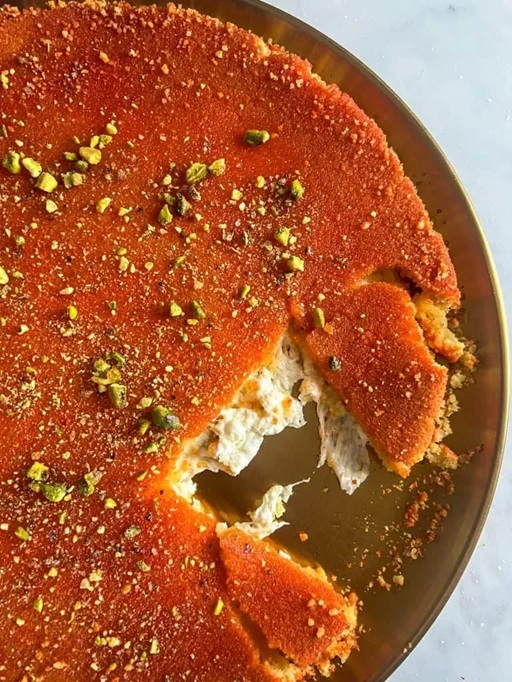

# Knafeh Naameh

*The Lebanese smooth knafeh: a fine semolina dough layered with melted akkawi cheese, baked dome-up, drenched in rose-and-orange-blossom syrup, pistachio-topped.*

**Serves:** 6

**Prep Time:** 25 minutes

**Cook Time:** 35 minutes

## Overview
A fine semolina dough mixes with melted butter (and milk/water). Half spreads in a wide round tin; topped with a thick layer of melted akkawi cheese (desalted); the other half of the dough spreads on top to seal. Baked at 200°C 30 minutes until the bottom is deep gold. Inverted onto a serving plate; drenched in a rose-and-orange-blossom syrup; topped with crushed pistachios. Cut hot.

## Ingredients

### Base dough
- 400 g fine semolina
- 80 g plain flour
- 200 g unsalted butter (melted)
- 80 ml warm milk
- 2 tablespoons caster sugar
- ½ teaspoon salt

### Cheese filling
- 400 g low-moisture mozzarella 
- 100 g halloumi blend
- 1 tablespoon caster sugar (to balance any residual salt)

### Sugar syrup (atter)
- 300 g caster sugar
- 200 ml water
- 1 tablespoon lemon juice
- 1 tablespoon rose water
- 1 tablespoon orange blossom water

### Garnish
- 80 g unsalted pistachios (lightly toasted, finely chopped)
- 1 tablespoon dried rose petals (optional)

## Method

### Stage 1 - Syrup
1. Combine sugar, water and lemon juice in a pan.
1. Bring to a boil; simmer 8-10 minutes until slightly thickened (coats the back of a spoon).
1. Off heat; stir in rose water and orange blossom water.
1. Cool to room temperature (cold syrup over hot pastry is essential).

### Stage 2 - Cheese prep
1. If using akkawi: soak in cold water 1 hour (changing the water twice) to desalt. Drain and grate.
1. If using mozzarella + halloumi: grate both.
1. Toss with the 1 tablespoon caster sugar.

### Stage 3 - Dough
1. In a wide bowl, combine semolina, flour, sugar and salt.
1. Pour in melted butter and warm milk; mix to a soft, crumb-like dough that just holds together when squeezed.

### Stage 4 - Layer
1. Generously butter a 28 cm round oven dish or pan.
1. Press half the semolina dough firmly into the base (1 cm thick).
1. Spread the grated cheese mixture evenly over the dough.
1. Top with the remaining semolina dough, pressing firmly to seal the cheese.

### Stage 5 - Bake
1. Heat oven to 200°C (180°C fan).
1. Bake 30-35 minutes until the top is deep gold and the bottom (peek with a knife at the edge) is well-bronzed.

### Stage 6 - Invert
1. Run a knife around the edge.
1. Place a wide flat serving plate over the dish; carefully invert.
1. The dome should release as a single round.

### Stage 7 - Drench
1. Slowly pour the cool syrup over the hot pastry - it should soak in.
1. Use about three-quarters of the syrup; keep the rest for the table.

### Stage 8 - Garnish and serve
1. Scatter chopped pistachios densely across the top.
1. Add rose petals if using.
1. Cut into wedges. Eat hot - the cheese should stretch.

## Notes
- **Naameh vs khishneh:** Naameh = smooth (semolina base); khishneh = rough (shredded kataifi base, as in Palestinian Nabulsiya). Both are knafeh; this is the Lebanese smooth version.
- **Cool syrup, hot pastry:** Always cold syrup poured over hot pastry. Hot-on-hot makes a soggy mess.
- **Akkawi desalting:** Akkawi is brined for preservation. Without desalting, the knafeh is inedibly salty. An hour with two water changes is right.

## Storage
- Best eaten warm same day.
- Refrigerate 2 days; gently warm individual slices in a microwave 20 seconds.
- Doesn't freeze well.
