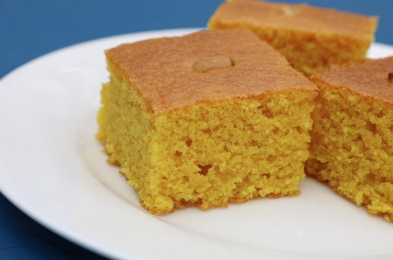

# Sfouf

*Lebanon's vivid yellow turmeric semolina cake: a dense, nutty loaf leavened with baking powder and scattered with pine nuts. Eaten with afternoon tea.*

**Serves:** 8 (makes 1 round cake)

**Prep Time:** 15 minutes

**Cook Time:** 40 minutes

## Overview
Dry ingredients (semolina, flour, sugar, turmeric, baking powder, anise/fennel optional) whisk together. Wet ingredients (melted butter or olive oil, milk) whisk in to a thick batter. Tip into a buttered round tin, smooth the top, scatter pine nuts (and sesame if you like). Bake at 180°C 35-40 minutes until the top is golden and a skewer comes out clean. Cool in the tin; slice into squares or wedges.

## Ingredients

- 250 g fine semolina
- 100 g plain flour
- 200 g caster sugar
- 1 teaspoon ground turmeric
- 1 tablespoon baking powder
- 1 teaspoon ground anise (optional, traditional)
- ½ teaspoon ground mahleb (optional, traditional)
- ½ teaspoon salt
- 120 g unsalted butter (melted, or 120 ml olive oil for the Lenten vegan version)
- 250 ml whole milk (or plant milk for vegan)
- 1 teaspoon vanilla extract (optional)

### Topping
- 3 tablespoons pine nuts
- 1 tablespoon sesame seeds (optional)
- 1 tablespoon tahini (for greasing the tin - traditional, gives a nutty edge to the bottom; or use butter)

## Method

### Stage 1 - Heat oven
1. Heat oven to 180°C (160°C fan).
1. Grease a 22 cm round cake tin with tahini (or butter); line the base with baking paper.

### Stage 2 - Dry ingredients
1. Whisk semolina, flour, sugar, turmeric, baking powder, anise, mahleb and salt in a wide bowl.

### Stage 3 - Wet ingredients
1. In a measuring jug, whisk melted butter (or olive oil), milk and vanilla.

### Stage 4 - Combine
1. Pour the wet into the dry; fold to a thick batter - like a stiff pancake batter.
1. Don't overmix.

### Stage 5 - Tin
1. Tip the batter into the prepared tin; smooth the top.
1. Scatter pine nuts and sesame seeds evenly across the surface.

### Stage 6 - Bake
1. Bake 35-40 minutes until the top is deeply golden, the cake has pulled slightly from the sides, and a skewer inserted in the centre comes out clean.

### Stage 7 - Cool and slice
1. Cool 15 minutes in the tin.
1. Run a knife around the edge; invert onto a wire rack; peel off the paper.
1. Cut into squares (cut while still slightly warm - easier).

### Stage 8 - Serve
1. Eat with strong Arabic coffee or sweet black tea.

## Notes
- **Turmeric is the colour AND the flavour:** A teaspoon is right. Less and the cake is pale and uninteresting; more and it tastes medicinal.
- **Anise and mahleb:** Traditional Lebanese sfouf often includes these. Mahleb is ground from cherry-pit kernels and gives a faint almond-cherry note. Both are optional but elevate the cake.
- **Olive oil version is vegan:** Common during Lent. The result is denser and slightly fruitier than the butter version. Equally good.

## Storage
- Keeps 5 days in a tin at room temperature.
- Freezes 2 months.
