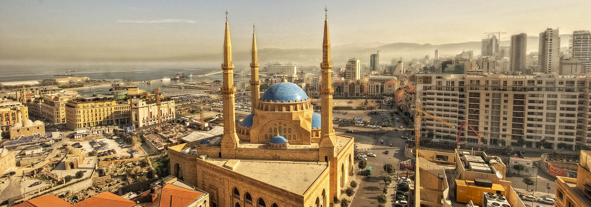

# Lebanese Cuisine

Lebanon's mezze culture runs all the way through: small plates, generous oils, abundant herbs. Hummus, baba ganoush, tabbouleh, fattoush, kibbeh, sambousek and kafta share the table; man'oushe (za'atar flatbread) starts the day; mahalabia and baklava end it. Olive oil, lemon, garlic, parsley, mint and the seven-spice blend (allspice, cinnamon, cloves, cumin, ginger, nutmeg, fenugreek) shape the kitchen; charcoal grilling, slow simmers and patient meze building define the table.
