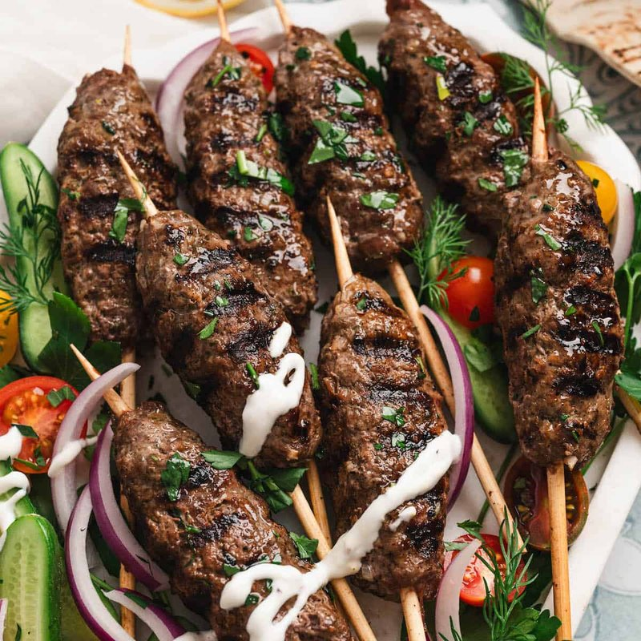

# Kafta Mishweeyeh

*Lebanese grilled kafta skewers: lamb-and-beef mince mixed with finely chopped parsley, onion, allspice and cinnamon, shaped around flat metal skewers, grilled over charcoal until crusted outside and just-juicy inside. Eaten wrapped in saj or pita with garlic toum, hummus, pickled turnips and a green salad. The mezze-table grill staple.*

**Serves:** 4

**Prep Time:** 25 minutes (plus 30 minutes resting)

**Cook Time:** 12 minutes

## Overview
Mince combines with grated onion, very-finely chopped parsley, garlic, allspice, cinnamon, salt and a pinch of cayenne. The mixture rests 30 minutes to firm up. Wet hands shape portions around flat metal skewers into long sausage-like cylinders pressed firmly so they don't drop. Grilled hot, turned once, 4-5 minutes per side. Sliced or pulled off the skewers; wrapped in warm bread with the trimmings.

## Ingredients

### Kafta
- 500 g lamb mince (slightly fatty - shoulder)
- 300 g beef mince
- 1 large onion (very finely chopped - grate then squeeze out and chop the pulp)
- 4 tablespoons fresh parsley (very finely chopped)
- 4 garlic cloves (crushed)
- 1 ½ teaspoons ground allspice
- ½ teaspoon ground cinnamon
- ½ teaspoon ground black pepper
- 1 ½ teaspoons salt
- ¼ teaspoon cayenne (optional)

### To grill
- 8 cherry tomatoes (on skewers)
- 1 green bell pepper (chunks, on skewers)

### To serve
- 4 large pita or saj breads (warmed)
- Garlic toum (lebanese garlic emulsion)
- Hummus
- Pickled turnips (pink)
- Sliced raw onion + sumac
- Fresh parsley sprigs
- Lemon wedges

## Method

### Stage 1 - Mix
1. Combine all kafta ingredients in a wide bowl. Mix thoroughly with hands.
1. Cover; rest 30 minutes in the fridge - the meat firms up and seasons through.

### Stage 2 - Shape
1. Wet your hands.
1. Take a fistful of mince (about 120 g); shape into a long sausage 12-15 cm long around a flat metal skewer.
1. Press firmly so the mince adheres to the skewer.
1. Repeat - 8 skewers.

### Stage 3 - Pre-heat grill
1. Heat charcoal until coals are ashed over (or gas grill / oven grill on highest).

### Stage 4 - Grill
1. Place kafta skewers on the grate, 8 cm above the coals.
1. Grill 3-4 minutes; turn 90°; grill 2 minutes; turn 90°; grill 2 minutes.
1. Test: the surface should be deeply crusted and the inside just cooked.
1. Grill tomato/pepper skewers alongside, 2-3 minutes per side.

### Stage 5 - Serve
1. Slide kafta off skewers onto warm bread.
1. Lay out toum, hummus, pickled turnips, sliced onion, parsley.
1. Wrap kafta with hummus, toum, pickles, herbs.
1. Lemon wedge alongside.

## Notes
- **Finely chop the parsley:** Big pieces of parsley fall off as the kafta turns. A very fine chop binds into the meat.
- **Rest the mince:** 30 minutes refrigerated firms the mince so it doesn't slide off the skewer. Skipping leads to skewer-failure.
- **Flat metal skewers:** Wide flat skewers grip the meat and let you rotate the kafta cleanly. Wooden skewers should be soaked 30 minutes; round skewers spin when you try to turn.

## Storage
- Refrigerate raw shaped skewers 24 hours.
- Cooked kafta refrigerates 2 days; reheat briefly in a hot pan.
