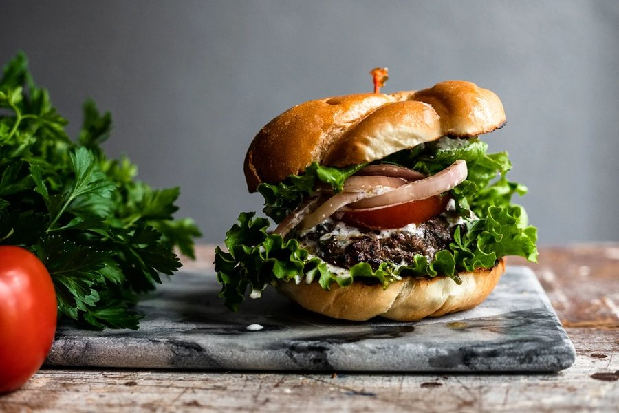

# Kofta Burger

*Charred lamb fragrant with allspice, cinnamon and black pepper, the inside still juicy from grated onion. The smell is unmistakable: a Beirut street grill at dusk, parsley and smoke and toasted flatbread.*

**Serves:** 4

**Prep Time:** 25 minutes

**Cook Time:** 10 minutes

## Overview
Lebanese kofta, sometimes spelled kafta, is minced lamb (often with a little beef) seasoned with grated onion, parsley and the warm spice blend known variously as baharat, sabaa baharat or seven-spice: allspice, black pepper, cinnamon, cloves, nutmeg, cumin and coriander. Traditionally it is moulded around flat metal skewers and grilled over charcoal at a mangal, where it sears fast and stays juicy. Shaping the same mince into a patty for a flatbread sandwich is a natural extension and one you will find in Beirut bakeries and Levantine takeaways from Sydney to Detroit. What makes this burger taste authentic and not just a "Middle-Eastern-spiced lamb burger" is the grated onion: pulled across a box grater so it dissolves into the mince and seasons every gram from the inside, releasing moisture as it cooks. Squeezing out the excess liquid first keeps the patty from falling apart. The sauce is a loosened tahini-yoghurt, tart with lemon and garlic, and the contrast comes from sumac-dusted onions whose sharp, almost berry-like sourness cuts through the lamb's richness. Wrap it in toasted khobz or a soft brioche, depending on the occasion. Difficulty is low. The only skill is restraint with the mince: knead just enough to bind, no more.

## Ingredients

### Patties
- 500 g lamb shoulder mince
- 150 g beef mince, 20% fat
- 1 onion (medium), finely grated and squeezed
- 4 garlic cloves, finely grated
- 30 g flat-leaf parsley, very finely chopped
- 2 tsp Lebanese seven-spice (baharat)
- 1 tsp ground cumin
- 1 tsp salt
- ½ tsp mild chilli flakes
- ¼ tsp ground cinnamon

### Tahini yoghurt sauce
- 3 tbsp tahini
- 150 g Greek yoghurt
- 2 tbsp lemon juice
- 1 garlic clove, grated
- 2 tbsp cold water
- Salt to taste

### Sumac onions
- 1 red onion (small), very thinly sliced
- 1 tbsp sumac
- 1 tsp lemon juice
- Pinch of salt
- 2 tbsp chopped parsley

### To assemble
- 4 khobz (large), naan or flatbreads, or 4 brioche buns
- Sliced tomato
- Pickles (pickled turnip or cucumber)
- Olive oil for grilling

## Method

### Stage 1 - Sumac onions
1. Toss the sliced onion with sumac, lemon juice and salt. Set aside to soften for 20 minutes, then stir through the parsley.

### Stage 2 - Tahini sauce
1. Whisk the tahini with lemon juice until it seizes and goes pale.
2. Whisk in the yoghurt, garlic and cold water until smooth and pourable. Season with salt and chill.

### Stage 3 - Patties
1. Grate the onion onto a clean cloth and wring out the liquid hard.
2. Combine lamb, beef, squeezed onion, garlic, parsley, seven-spice, cumin, salt, chilli flakes and cinnamon in a wide bowl.
3. Knead gently with one hand for about a minute, just until the mixture binds and looks slightly tacky. Do not overwork.
4. Divide into 4, shape into patties about 1 ½ cm thick. Dimple the centres. Chill 15 minutes.

### Stage 4 - Cook
1. Heat a charcoal grill or heavy griddle to high. Brush patties with olive oil.
2. Grill 3 to 4 minutes per side for medium, until well charred and just cooked through.
3. Warm the flatbreads on the cooler edge of the grill for 30 seconds per side.

### Stage 5 - Build
1. Smear tahini-yoghurt sauce across the warm bread or bun base.
2. Lay on the patty, then tomato, sumac onions and pickles.
3. Finish with another drizzle of sauce and fold or cap. Serve at once.

## Notes
- **Grate, do not chop:** grated onion seasons evenly. Chopped onion leaves wet pockets and can split the patty.
- **Seven-spice:** Lebanese seven-spice varies by family. If unavailable, mix 2 parts allspice, 1 part black pepper, 1 part cinnamon, ½ part each of cloves, nutmeg, cumin and coriander.
- **Tahini seizing:** when tahini meets lemon it stiffens and pales. Push through; the water then loosens it to a sauce consistency.
- **Charcoal preferred:** the spice blend really sings over live fire. A gas grill is fine; a cast-iron pan indoors is a distant third.

## Storage
- Uncooked patties keep 24 hours in the fridge. Tahini sauce keeps 4 days. Sumac onions are best within 6 hours, before they go limp.
