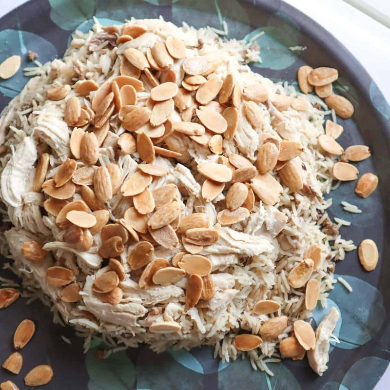

# Riz a Djej

*Lebanon's Sunday lunch: poached chicken pulled off the bone, served over basmati cooked in the chicken stock with baharat, pine nuts and slivered almonds.*

**Serves:** 4

**Prep Time:** 20 minutes

**Cook Time:** 1 hour 15 minutes

## Overview
A whole chicken poaches with onion, cinnamon, cardamom and bay 45 minutes; chicken comes out, stock is strained. Mince (lamb or beef) browns hard with onion, baharat, cinnamon and allspice. Basmati rice toasts in ghee with the mince, then cooks absorption-style in the chicken stock for 18 minutes. Plated with the rice on the bottom, the mince mixed through, shredded poached chicken on top, and toasted pine nuts, almonds and raisins scattered over.

## Ingredients

### Chicken and stock
- 1 whole chicken (about 1.4 kg, or 6 bone-in thighs/drumsticks)
- 1 onion (large, halved)
- 1 cinnamon stick
- 6 cardamom pods (bruised)
- 2 bay leaves
- 1 teaspoon black peppercorns
- 1 ½ teaspoons salt
- 2 litres water

### Mince and rice
- 300 g lamb (or beef mince)
- 1 onion (medium, chopped)
- 3 tablespoons ghee (or olive oil)
- 1 ½ tablespoons baharat
- ½ teaspoon ground cinnamon
- ½ teaspoon ground allspice
- 400 g basmati rice (rinsed; soaked 20 minutes; drained)
- 800 ml chicken stock (from above)
- 1 teaspoon salt (to taste)

### Nuts and fruit
- 40 g pine nuts
- 40 g flaked almonds
- 40 g raisins
- 2 tablespoons ghee (or oil, for toasting)

### To finish
- 3 tablespoons fresh parsley (chopped)
- 1 lemon (cut into wedges)
- Plain Greek yogurt, on the side

## Method

### Stage 1 - Poach chicken
1. Place chicken (or thighs) in a wide pot with onion, cinnamon stick, cardamom, bay, peppercorns, salt and water.
1. Bring to a simmer; skim scum.
1. Cover; simmer 45 minutes (whole chicken) or 35 minutes (thighs) until tender.
1. Lift the chicken onto a plate; strain the stock; reserve 800 ml.
1. When the chicken is cool enough, pull the meat off the bones in large pieces; discard skin and bones.

### Stage 2 - Mince
1. Heat 3 tablespoons ghee in a wide heavy pot over medium-high.
1. Brown the mince hard 5 minutes, breaking up clumps.
1. Add chopped onion; cook 8 minutes until soft.
1. Stir in baharat, cinnamon and allspice; cook 1 minute.

### Stage 3 - Rice
1. Add the drained rice to the pot with the mince; toast 1 minute, stirring.
1. Pour in 800 ml of reserved chicken stock; add salt; bring to a boil.
1. Stir once; reduce to lowest heat; cover tightly; cook 18 minutes.

### Stage 4 - Rest
1. Remove from heat (lid on); rest 5 minutes.
1. Fluff gently with a fork - the mince should be distributed through the rice.

### Stage 5 - Nuts and fruit
1. While the rice rests, heat 2 tablespoons ghee in a small pan.
1. Add pine nuts, almonds and raisins; toast 3-4 minutes, stirring, until nuts are deep gold and raisins are plump. Watch - pine nuts burn fast.

### Stage 6 - Plate
1. Tip rice onto a wide warm platter.
1. Arrange the pulled chicken on top.
1. Scatter the nut-and-raisin mixture (with any ghee) over the chicken.
1. Sprinkle parsley.

### Stage 7 - Serve
1. Lemon wedges and yogurt on the side.
1. Eat from the shared platter.

## Notes
- **Whole chicken vs thighs:** Whole gives a deeper stock and the dramatic platter; thighs are faster and still very good.
- **Toast nuts at the end:** Pine nuts go from gold to black in 30 seconds. Last-minute toasting keeps them right.
- **Stock quantity:** 800 ml for 400 g basmati is the right ratio. Top up with hot water if you fell short on stock.

## Storage
- Refrigerate 4 days; reheat covered with a splash of stock.
- Freezes 3 months.
