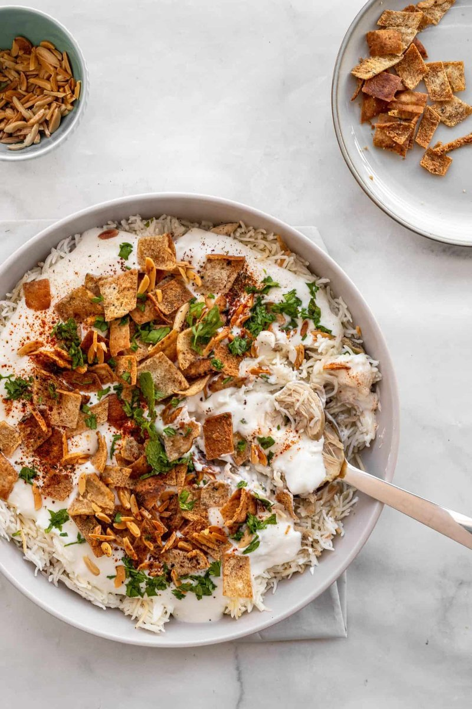

# Fatteh Djaj

*Lebanon's layered fatteh: crisp toasted pita beneath chickpeas and shredded chicken, blanketed in garlic-yogurt-tahini and finished with cumin butter.*

**Serves:** 4

**Prep Time:** 20 minutes

**Cook Time:** 50 minutes

## Overview
Chicken poaches with onion, cardamom and bay 35 minutes; shredded off the bone. Chickpeas warm in the strained chicken stock. Pita pieces toast crisp under the grill. Yogurt-tahini-garlic sauce whisks together. Plated with pita on the bottom, chickpeas and chicken on top, yogurt sauce poured over, taqliya (butter, cumin and sliced garlic sizzled hot) drizzled on top, and pine nuts scattered.

## Ingredients

### Chicken
- 4 bone-in skin-on chicken thighs
- 1 onion (small, halved)
- 4 cardamom pods (bruised)
- 1 cinnamon stick
- 2 bay leaves
- 1 teaspoon salt
- 1.4 litres water

### Chickpeas
- 1 (400 g) tin chickpeas (drained and rinsed, or 200 g dried, soaked and cooked)

### Pita
- 2 pita breads (large, split open and torn into 3-4 cm pieces)
- 2 tablespoons olive oil

### Yogurt sauce
- 500 g Greek yogurt
- 3 tablespoons tahini
- 4 garlic cloves (crushed to a paste with ½ tsp salt)
- 1 lemon (juice)
- 100 ml warm chicken stock (to loosen)

### Taqliya (sizzle)
- 4 tablespoons unsalted butter (or ghee)
- 4 garlic cloves (sliced)
- 1 teaspoon ground cumin
- 1 teaspoon chilli flakes

### Garnish
- 4 tablespoons pine nuts (toasted)
- 2 tablespoons fresh parsley (chopped)
- 1 teaspoon paprika
- Pomegranate seeds (optional)

## Method

### Stage 1 - Chicken
1. Place chicken in a pot with onion, cardamom, cinnamon, bay, salt and water.
1. Bring to a simmer; skim.
1. Cover; cook 35 minutes until tender.
1. Lift the chicken onto a plate; cool slightly. Pull the meat off in shreds; discard skin and bones.
1. Strain the stock; reserve 100 ml for the yogurt sauce.

### Stage 2 - Toast the pita
1. Heat oven to 200°C (180°C fan).
1. Toss pita pieces with olive oil and a pinch of salt; spread on a tray.
1. Bake 8-10 minutes until deep gold and crisp.

### Stage 3 - Yogurt sauce
1. Whisk yogurt, tahini, garlic-salt paste, lemon juice and warm stock in a wide bowl to a smooth pourable sauce.
1. Taste; adjust salt.

### Stage 4 - Warm chickpeas
1. Tip drained chickpeas into a small pan with 4-5 tablespoons of strained chicken stock.
1. Warm through 3 minutes; season with a pinch of salt and cumin.

### Stage 5 - Taqliya
1. Heat butter in a small pan over medium.
1. Add sliced garlic; cook 60 seconds until just gold.
1. Stir in cumin and Aleppo pepper; sizzle 10 seconds.
1. Off heat.

### Stage 6 - Plate
1. Spread the toasted pita pieces in the bottom of a wide shallow serving dish.
1. Spoon over the warm chickpeas and shredded chicken.
1. Pour the yogurt sauce evenly over the top.
1. Drizzle the warm taqliya across the surface.
1. Scatter toasted pine nuts, parsley, paprika and pomegranate seeds.

### Stage 7 - Serve
1. Eat immediately, scooping down through the layers. The crisp pita softens within minutes - assembled-and-eaten is the key.

## Notes
- **Eat fast:** Fatteh is layered fresh and eaten within 5-10 minutes. Beyond that the pita softens entirely. Don't pre-assemble.
- **Taqliya is the finish:** Pour it on while still sizzling - the sizzle of hot butter on cool yogurt is part of the experience.
- **Variations:** Fatteh hummus (chickpeas only, no chicken - vegetarian); fatteh makdous (with stuffed aubergine); fatteh laham (with lamb).

## Storage
- Components keep separately 3 days. Assemble fresh.
