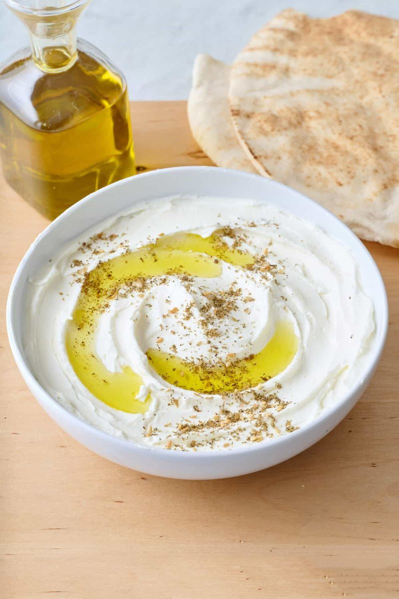

# Labneh

*Lebanon's strained-yogurt cheese: natural yogurt salted and drained overnight into a soft, tangy spread. Drizzled with olive oil and dusted with za'atar.*

**Serves:** 4 as a mezze

**Prep Time:** 5 minutes (plus 12-24 hours straining)

**Cook Time:** 0 minutes

## Overview
Full-fat natural yogurt salts; strains through a fine sieve lined with cheesecloth (or a thin tea towel) over a bowl for 12-24 hours. The result is a thick, soft cheese (looser than cream cheese, firmer than thick yogurt). Spread on a plate; swirl; drizzle olive oil; scatter za'atar, dried mint, sumac, and chopped fresh mint. Eaten with warm pita.

## Ingredients

### Labneh
- 1 kg full-fat natural yogurt (Greek or Lebanese strained yogurt won't work - needs to be regular yogurt that hasn't already been strained)
- 1 ½ teaspoons salt

### To finish
- 3 tablespoons olive oil (extra-virgin)
- 1 tablespoon za'atar
- 1 teaspoon dried mint
- 1 teaspoon sumac
- 1 tablespoon fresh mint (chopped, optional)

### To serve
- Warm pita
- A small dish of black olives
- Sliced cucumber, tomato, radish (optional)

## Method

### Stage 1 - Salt
1. Whisk the yogurt and salt in a wide bowl until smooth.

### Stage 2 - Strain
1. Set a fine-mesh sieve over a deep bowl.
1. Line the sieve with a piece of cheesecloth (folded double) or a clean thin tea towel.
1. Tip the salted yogurt into the cloth.
1. Gather the corners of the cloth; tie with a piece of string to make a bundle.
1. Sit the bundle on the sieve. (Or hang it from a hook over the sink with a bowl underneath.)

### Stage 3 - Drain
1. Refrigerate 12 hours for a soft labneh, 24 hours for a firmer one, 48 hours for the firm balls version.
1. Discard the whey that collects in the bowl below.

### Stage 4 - Plate
1. Unwrap the labneh; tip onto a wide shallow plate.
1. Spread with the back of a spoon, creating ridges and swirls.
1. Drizzle olive oil into the ridges.
1. Scatter za'atar, dried mint, sumac and fresh mint.

### Stage 5 - Serve
1. Eat with warm pita as part of mezze, breakfast or any savoury Lebanese meal.

## Notes
- **Yogurt quality:** Full-fat is essential. Low-fat yogurt strains to a dry, grainy labneh.
- **Strain time = thickness:** 12 hours gives a soft spreadable labneh (closest to the everyday Lebanese version). 24 hours gives a thick scoopable cheese. 48 hours gives a firm cheese you can roll into balls.
- **Labneh balls:** Strain 48 hours; roll into walnut-sized balls; pack into a jar; cover with olive oil. Keeps a month refrigerated.

## Storage
- Refrigerate the labneh 1 week in a sealed container.
- Labneh balls in oil keep 3-4 weeks refrigerated.
