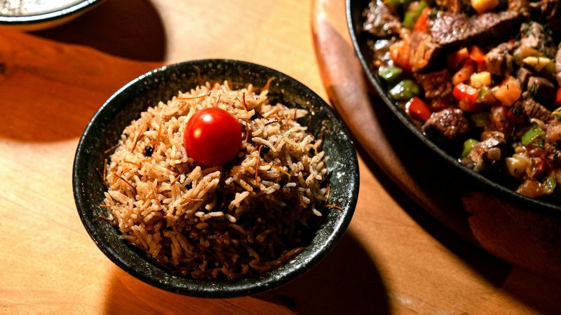

# Mujadara

*Lebanon's poor-man's-feast: brown lentils and rice cooked together with deeply caramelised onion folded through, crisp fried onions piled on top.*

**Serves:** 4

**Prep Time:** 15 minutes

**Cook Time:** 1 hour 10 minutes

## Overview
Lebanon's everyday rice-and-lentils dish, the kind of one-pot supper that anchors a weekday meal with a small dish of cucumber-yogurt salad on the side: brown lentils and basmati cooked together with two batches of onion, the first cooked deep mahogany and folded through for the sweetness, the second crisped separately and piled on top for texture. You simmer brown or green lentils (not red; red dissolves and mujadara needs lentils that hold shape) till just tender, draining and reserving 700 ml of the cooking liquid. In a wide heavy pot, fry two of three sliced onions in olive oil for 25 to 30 minutes till deeply mahogany brown, past golden and almost into burnt at the edges (this dark caramelisation is the dish's character; pale onion gives bland mujadara). Bloom cumin, allspice and pepper in for 30 seconds, then add the drained lentils and rinsed soaked rice to toast briefly. Pour in the 700 ml of lentil water with salt, lid down tight on the lowest heat for 18 to 20 minutes, rest 10 more covered. Meanwhile, fry the third onion in a separate pan till crispy and dark at the edges, drain on paper. Tip the mujadara onto a wide warm platter (or invert from a domed bowl for the traditional shape), scatter the crispy onion across the top, serve with cucumber-yogurt salad whisked with dried mint on the side.

## Ingredients

- 250 g brown lentils (or green lentils, rinsed)
- 1 litre water (for cooking lentils)
- 100 ml olive oil
- 3 onions (large, sliced thin)
- 300 g basmati rice (rinsed; soaked 15 minutes; drained)
- 1 ½ teaspoons ground cumin
- 1 teaspoon ground allspice
- 1 teaspoon ground black pepper
- 1 ½ teaspoons salt (to taste)
- 700 ml lentil cooking water (from above; top up with hot water if short)

### To serve
- 200 g Greek yogurt
- 1 cucumber (small, diced)
- 1 tablespoon dried mint
- A pinch of salt

## Method

### Stage 1 - Lentils
1. Place lentils in a pot with the 1 litre of water.
1. Bring to a boil; reduce to a simmer; cover partially.
1. Cook 20-25 minutes until just tender but still holding shape.
1. Drain, reserving 700 ml of the cooking liquid. Set lentils aside.

### Stage 2 - First onion (deep brown, for the body)
1. Heat 70 ml of olive oil in a wide heavy pot over medium heat.
1. Add 2 of the 3 onions (sliced).
1. Cook 25-30 minutes, stirring often, until deeply mahogany brown - past golden, almost into burnt at the edges. This dark caramelisation is the dish's character.

### Stage 3 - Spices and rice
1. Add cumin, allspice, pepper to the brown onion; toast 30 seconds.
1. Add the drained lentils; stir.
1. Add the rinsed rice; toast 1 minute.

### Stage 4 - Cook
1. Pour in 700 ml of reserved lentil water (top up with hot water if you have less); add salt.
1. Bring to a boil; stir once; reduce to lowest heat.
1. Cover tightly; cook 18-20 minutes.

### Stage 5 - Rest
1. Remove from heat (lid on); rest 10 minutes.
1. Fluff gently with a fork.

### Stage 6 - Second onion (crispy, for the top)
1. Heat the remaining 30 ml of olive oil in a frying pan over medium-high.
1. Add the third onion (sliced).
1. Fry 10-12 minutes, stirring often, until crispy and very dark brown at the edges.
1. Lift onto kitchen paper.

### Stage 7 - Yogurt-cucumber salad
1. Combine yogurt, cucumber, dried mint and a pinch of salt.

### Stage 8 - Plate
1. Tip mujadara onto a wide warm platter (or invert from a domed bowl for the traditional shape).
1. Scatter the crispy onion over the top.
1. Serve with the cucumber-yogurt salad on the side.

## Notes
- **Two onion stages:** The first batch goes deep into the rice for sweetness; the second batch crisps on top for texture. Both matter.
- **Brown lentils, not red:** Red lentils dissolve. Mujadara needs lentils that hold their shape - brown, green or French lentils.
- **Patience with the onion:** Pale onion gives bland mujadara. Push to deep mahogany; let some bits scorch slightly.

## Storage
- Refrigerate 4 days; reheats well.
- The crispy onion topping should be made fresh.
