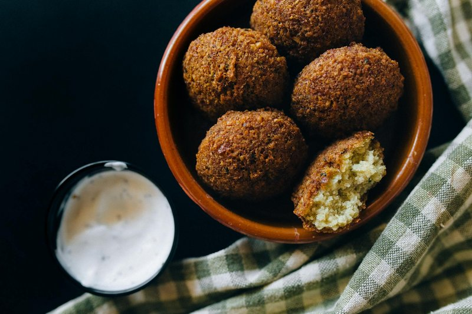

# Falafel Lebnani

*Lebanon's street-corner fritter: a herb-flecked chickpea ball fried golden and tucked into warm pita with tahini and pickled turnip.*

**Serves:** 4 (makes 20 patties)

**Prep Time:** 25 minutes (plus overnight bean soak)

**Cook Time:** 12 minutes

## Overview
Lebanon's street-corner fritter and the answer to "what do you eat fast at lunch": herb-flecked chickpea balls fried golden and tucked into warm pita with tahini sauce, pickled pink turnip and salad. The Lebanese version is green inside (the test of a proper falafel), packed with parsley and coriander so a big bunch of each is non-negotiable. Soak dried chickpeas in cold water with a teaspoon of bicarbonate for twelve to eighteen hours till they're soft enough to crush with a fingernail but not cooked; cooked chickpeas make mushy falafel that falls apart in the fryer. Drain, blitz in a food processor with onion, garlic, big bunches of parsley and coriander, cumin, ground coriander, salt, Aleppo pepper and black pepper to a coarse green paste. Rest thirty minutes. Stir baking soda in just before frying. Shape into small patties, press into sesame seeds, deep-fry at 175 °C till deep amber-gold. Stuff warm pita with tahini, four or five falafel, tomato, cucumber, red onion, romaine, pickled turnips and sumac.

## Ingredients

### Beans
- 250 g dried chickpeas (OR 200 g dried chickpeas + 50 g dried split fava beans for a Lebanese-classic chickpea-fava blend)
- 1 teaspoon bicarbonate of soda (for the soak)
- Cold water (for the soak)

### Blender
- 1 onion (medium, rough chunks)
- 5 garlic cloves
- 1 large bunch fresh parsley (about 40 g)
- 1 small bunch fresh coriander (about 20 g)
- 1 ½ teaspoons salt
- 2 teaspoons ground cumin
- 1 teaspoon ground coriander
- 1 teaspoonchilli flakes
- ½ teaspoon black pepper

### Just before frying
- 1 teaspoon baking soda

### Optional coating
- 4 tablespoons sesame seeds

### For frying
- 1 litre vegetable oil

### To serve
- 4 pita breads (large, warmed)
- Tahini sauce (4 tablespoons tahini + 4 tablespoons water + juice of 1 lemon + 2 crushed garlic + ½ teaspoon salt; whisked smooth)
- Sliced tomato, cucumber, red onion, romaine lettuce
- Pickled turnips (Lebanese pink turnips - sold at Middle Eastern shops)
- A sprinkle of sumac
- Hot sauce (optional)

## Method

### Stage 1 - Soak
1. Place dried chickpeas (and fava if using) in a deep bowl with bicarbonate of soda and 1 ½ litres cold water.
1. Soak 12-18 hours; the chickpeas should be soft enough to crush with a fingernail but not cooked.
1. Drain; rinse.

### Stage 2 - Blitz
1. In a food processor, combine drained chickpeas, onion chunks, garlic, parsley, coriander, salt, cumin, ground coriander, Aleppo pepper and pepper.
1. Pulse repeatedly to a coarse green paste - fine grainy texture, not smooth puree. Don't process to hummus consistency.
1. Tip into a bowl; cover; rest 30 minutes (lets the flavours integrate).

### Stage 3 - Tahini sauce
1. Whisk tahini, water, lemon juice, garlic and salt in a small bowl to a thick pourable consistency.

### Stage 4 - Shape and (optional) coat
1. Just before frying, stir baking soda into the chickpea mixture thoroughly.
1. Take 1 tablespoon of mixture; shape into a small disc 3 cm across, 1 ½ cm thick (a falafel scoop / zalabia gives the cleanest shape).
1. Optional: press one side firmly into sesame seeds.

### Stage 5 - Fry
1. Heat oil to 175°C.
1. Fry 6-8 falafel at a time, 2-3 minutes per side, until deep amber-gold.
1. Lift onto kitchen paper.

### Stage 6 - Stuff
1. Cut pita in half; warm briefly.
1. Spread the inside with tahini sauce.
1. Pile 4-5 falafel per pocket.
1. Add tomato, cucumber, onion, lettuce, pickled turnip.
1. Drizzle with more tahini; scatter sumac.
1. Optional: hot sauce.

## Notes
- **Soaked chickpeas, never cooked:** Cooked chickpeas make mushy falafel that falls apart. Raw soaked chickpeas - soft enough to crush, not soft enough to mash - give the crisp-outside, soft-green-inside texture.
- **Lots of herbs:** Lebanese falafel is GREEN inside. A big bunch of parsley + smaller bunch of coriander is the right ratio. If your falafel comes out beige, you needed more herbs.
- **Baking soda last:** Activates with moisture; if added at the blitz stage, the falafel will be flat. Add right before frying.

## Storage
- Best within 30 minutes of frying.
- Cooked falafel: refrigerate 2 days; re-crisp at 200°C oven 4 minutes.
- The raw mixture (without baking soda) refrigerates 24 hours OR freezes 2 months; defrost, add soda, shape, fry.
