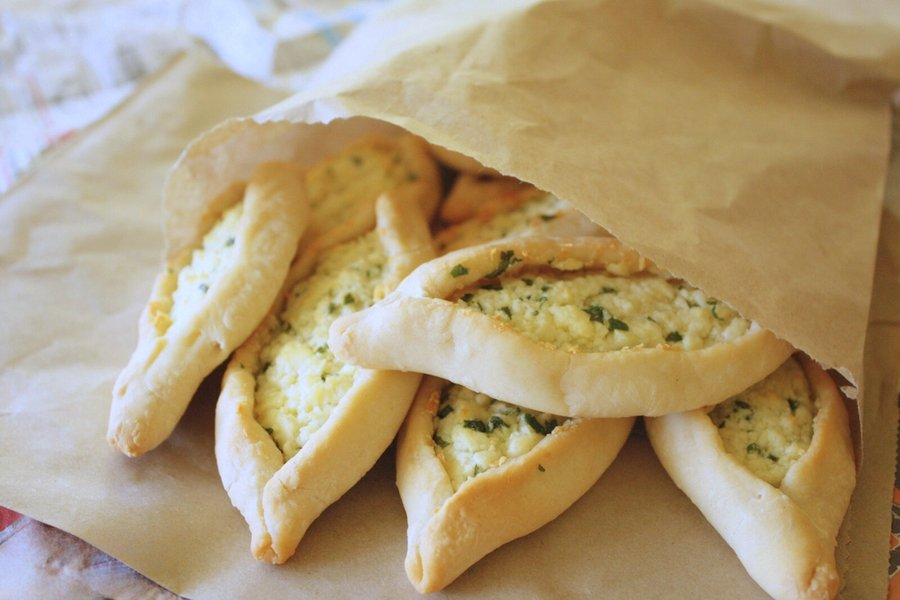

# Fatayer Jibneh

*Lebanon's cheese hand-pies: small tricorn pastries stuffed with melty akkawi, halloumi and feta with parsley and mint. Baked till golden.*

**Serves:** 4 (makes 16 fatayer)

**Prep Time:** 40 minutes (plus 45 min dough rise)

**Cook Time:** 18 minutes

## Overview
Lebanon's cheese hand-pies, the small tricorn pastries that turn up at iftar tables and church suppers: a soft yeasted olive-oil dough stuffed with melty cheese (akkawi, halloumi and feta) brightened with parsley, mint and a pinch of nigella. The three-cheese blend gives the dish its character; akkawi and mozzarella for the stretchy melt, halloumi for body, feta for tang, where a single cheese gives a flatter result. Halloumi rinsed to reduce salt is the detail home cooks miss; unrinsed makes the filling too salty, and no extra salt goes in because the cheeses are already plenty. The tricorn fold (three edges pinched into a sealed three-pointed star) is the Lebanese signature, and a poorly-sealed fatayer opens in the oven and the cheese leaks into a sad crater on the tray. An egg yolk through the filling binds the cheeses so they don't separate in the bake. Brushed with olive oil, baked till deep gold, dusted with sumac, served warm with mint tea.

## Ingredients

### Dough
- 400 g plain flour
- 1 sachet (7 g) fast-action yeast
- 1 teaspoon salt
- 1 teaspoon caster sugar
- 250 ml warm water
- 4 tablespoons olive oil

### Filling
- 120 g low-moisture mozzarella 
- 30 g halloumi (rinsed and grated)
- 80 g feta cheese (crumbled)
- 3 tablespoons fresh flat-leaf parsley (chopped fine)
- 2 tablespoons fresh mint (chopped) or 1 teaspoon dried mint
- 1 spring onion (sliced thin, optional)
- 1 egg yolk (large, helps the binding)
- ½ teaspoon black pepper
- ½ teaspoon nigella seeds

### To finish
- 2 tablespoons olive oil (for brushing)
- 1 tablespoon sesame seeds (optional, sprinkle)
- A pinch of sumac

## Method

### Stage 1 - Dough
1. Whisk flour, yeast, salt and sugar.
1. Pour in warm water and olive oil; mix to a soft dough.
1. Knead 8 minutes until smooth and elastic.
1. Cover; rise 45 minutes until doubled.

### Stage 2 - Filling
1. In a bowl, combine grated akkawi (or mozzarella-halloumi), crumbled feta, parsley, mint, spring onion (if using), egg yolk, black pepper and nigella seeds.
1. Mix thoroughly. Don't add salt, the cheeses are salty enough.

### Stage 3 - Shape
1. Heat oven to 220°C (200°C fan).
1. Line baking trays with paper.
1. Knock back the dough; divide into 16 balls.
1. Rest 5 minutes.
1. Roll each ball into a thin 10 cm disc.

### Stage 4 - Fill and fold
1. Place 1 heaped tablespoon of filling in the centre of each disc.
1. Brush the edge of the disc with water.
1. Lift three sides of the disc up over the filling, left, right and one side at the bottom, pinching each pair of edges where they meet, into a tricorn (three corners).
1. Pinch firmly to seal, leaks during baking ruin them.
1. Transfer to the baking trays.

### Stage 5 - Glaze
1. Brush each fatayer with olive oil.
1. Sprinkle with sesame seeds if using.

### Stage 6 - Bake
1. Bake 15-18 minutes until deep golden brown.

### Stage 7 - Serve
1. Sprinkle with a pinch of sumac.
1. Eat warm or at room temperature.
1. Pair with mint tea or a Lebanese rosé.

## Notes
- **Desalt the akkawi:** Akkawi is brined and very salty straight from the packet. A 30-minute soak in cold water (changing once) is essential; without it, the filling is inedibly salty.
- **Seal the tricorn firmly:** Pinch each pair of edges with floured fingers. A poorly-sealed fatayer opens during baking and the cheese leaks; the result is a flat pastry with a sad crater of dried cheese.
- **Bake hot:** 220°C is right. Lower temperatures give pale pastry and weep more cheese.

## Storage
- Best within 4 hours.
- Refrigerate 3 days; reheat at 200°C 4 minutes.
- Freeze cooked 2 months; reheat from frozen at 200°C 8 minutes.
