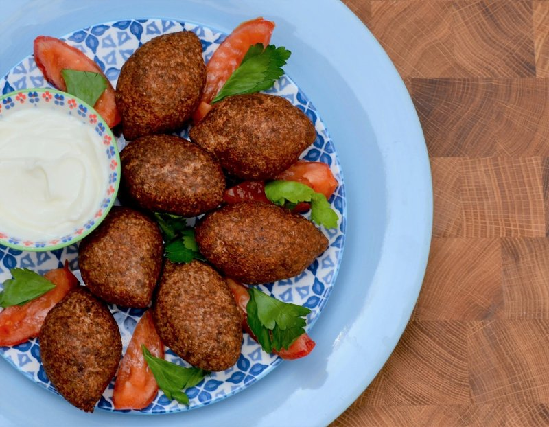

# Kibbeh Mqliyeh

*Lebanon's fried kibbeh: small bulgur-and-lamb footballs wrapped around a spiced mince and pine-nut filling, deep-fried amber-crisp.*

**Serves:** 4 (makes 18 footballs)

**Prep Time:** 1 hour

**Cook Time:** 12 minutes

## Overview
Lebanon's fried kibbeh, sibling to the Jordanian and Syrian versions across the Levant: small bulgur-and-lamb footballs wrapped around a spiced mince and pine-nut filling, deep-fried amber-crisp. The Lebanese marker here is a spoon of pomegranate molasses folded through the filling, the sweet-sour note that distinguishes it from the cousins. Soak fine bulgur, squeeze it bone-dry, then blitz very lean lamb (fat in the dough bursts in the fryer) with onion, baharat, allspice, salt, pepper, cinnamon and ice water to a smooth paste; fold in the squeezed bulgur. Refrigerate fifteen minutes. The filling cooks separately: chopped onion sautéed in olive oil, fattier lamb mince browned with baharat, allspice, cinnamon and pine nuts, then chopped parsley and pomegranate molasses folded in off the heat. Cool fully. Wet hands constantly (bulgur dough sticks to dry hands), take a piece of dough, hollow on a finger, drop in cool filling, seal and roll into a pointed football. Deep-fry at 175 °C till amber-gold. Pile warm on a platter with yogurt-mint sauce and lemon wedges.

## Ingredients

### Outer dough
- 200 g fine bulgur (#1)
- 300 ml cold water (for soaking)
- 400 g very lean lamb (leg, trimmed)
- 1 onion (small, rough chunks)
- 1 ½ teaspoons [Baharat](../../../base-ingredients/spices/baharat.md)
- 1 teaspoon ground allspice
- 1 ½ teaspoons salt
- ½ teaspoon black pepper
- ¼ teaspoon ground cinnamon
- 60 ml ice water

### Filling
- 2 tablespoons olive oil
- 1 onion (medium, finely diced)
- 300 g fattier lamb mince (20% fat)
- 1 ½ teaspoons [Baharat](../../../base-ingredients/spices/baharat.md)
- 1 teaspoon ground allspice
- ½ teaspoon ground cinnamon
- 1 teaspoon salt
- ½ teaspoon black pepper
- 60 g pine nuts (toasted in a dry pan 3 min)
- 2 tablespoons fresh parsley (chopped)
- 1 tablespoon pomegranate molasses (optional, Lebanese-classic note)

### For frying
- 1 litre vegetable oil

### Yogurt-mint sauce
- 250 g Greek yogurt
- 2 garlic cloves (crushed to a paste with ¼ teaspoon salt)
- 2 tablespoons fresh mint (chopped)
- ½ lemon (juice)
- 1 tablespoon olive oil

### To serve
- Lemon wedges
- Sumac (sprinkle)
- A small bunch of fresh parsley

## Method

### Stage 1 - Soak bulgur
1. Pour cold water over bulgur; soak 15 minutes; drain; squeeze handfuls dry.

### Stage 2 - Filling
1. Heat olive oil; sauté onion 6 minutes.
1. Add fattier mince; brown 6 minutes.
1. Stir in baharat, allspice, cinnamon, salt and pepper; cook 1 minute.
1. Off heat; stir in pine nuts, parsley and pomegranate molasses.
1. Cool fully.

### Stage 3 - Outer dough
1. Blitz lean lamb, onion, baharat, allspice, salt, pepper and cinnamon in a food processor for 30 seconds to a smooth paste.
1. Add squeezed bulgur; pulse, adding ice water 1 tablespoon at a time, until you have a smooth slightly tacky dough.
1. Refrigerate 15 minutes.

### Stage 4 - Shape
1. Wet hands with cold water.
1. Take 35 g of dough; roll into a ball.
1. Hollow with finger to a cup with thin walls.
1. Fill with 1 ½ teaspoons cool filling.
1. Seal; roll into a pointed football (6 cm, pointed tips).
1. Repeat for all 18.

### Stage 5 - Fry
1. Heat oil to 175°C.
1. Fry 4-5 at a time, 3-4 minutes, until amber-gold.
1. Drain on paper.

### Stage 6 - Yogurt sauce
1. Whisk yogurt with garlic-salt paste, mint, lemon and olive oil.

### Stage 7 - Serve
1. Plate the warm kibbeh on a platter with a small bowl of yogurt-mint sauce.
1. Scatter parsley; sprinkle sumac; lemon wedges alongside.

## Notes
- **Lean meat for the dough:** Fatty meat makes a wet dough that bursts in the fryer. Leg, trimmed.
- **Wet hands, smooth surface:** Bulgur dough sticks to dry hands.
- **Pomegranate molasses in the filling:** Lebanese-classic addition that distinguishes from Jordanian / Syrian versions. Optional but characteristic.

## Storage
- Best within 30 minutes of frying.
- Raw shaped kibbeh freeze 2 months on a tray; fry from frozen at 170°C 5-6 minutes.
- Cooked: refrigerate 2 days; re-crisp at 200°C 4 minutes.
