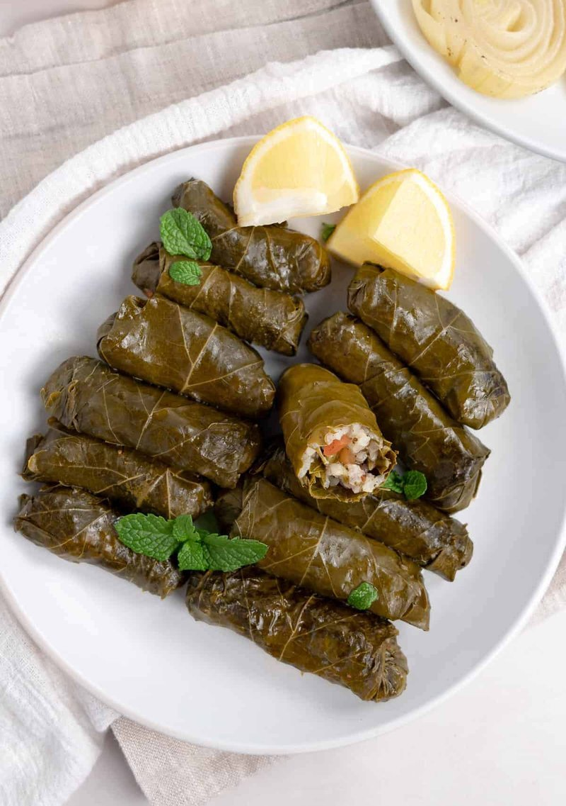

# Warak Enab

*Lebanon's stuffed vine leaves: leaves rolled around a spiced lamb-and-rice filling, packed tight in a pot and slow-braised in lemon and stock.*

**Serves:** 6

**Prep Time:** 1 hour

**Cook Time:** 1 hour 30 minutes

## Overview
Lebanon's stuffed vine leaves, the Sunday-afternoon project that yields a platter of fifty small cylinders for a feast: leaves rolled around a spiced lamb-and-rice filling, packed tight in a wide pot lined with sliced potato, weighted with a plate, slow-braised in lemon and stock till the rice is tender and the leaves are soft. Blanch fresh leaves briefly, or rinse jarred ones in three changes of cold water to remove the brine; trim the central vein. The raw filling: short-grain rice, lamb mince, diced tomato, onion, parsley, mint, garlic, tomato puree, allspice, cinnamon and olive oil. Roll each leaf vein-side-up with a teaspoon of filling near the stem, fold the stem end up, fold the sides, roll into a tight cylinder. Line the pot with sliced potato and a few lamb bones for depth, pack the rolls seam-down in tight concentric circles. Pour over lemon-stock-olive-oil-garlic to just cover, weight with a plate, lid down, simmer the lowest heat seventy-five to ninety minutes. Invert onto a platter, serve with yogurt and lemon wedges.

## Ingredients

### Vine leaves
- 60 fresh vine leaves (or 1 jar 500 g brined leaves - rinsed)

### Filling
- 300 g short-grain rice (rinsed, not pre-cooked)
- 400 g lamb mince
- 2 tomatoes (medium, very finely diced)
- 1 onion (medium, very finely chopped)
- 4 tablespoons fresh parsley (chopped)
- 3 tablespoons fresh mint (chopped)
- 4 garlic cloves (crushed)
- 2 tablespoons tomato puree
- 1 ½ teaspoons ground allspice
- ½ teaspoon ground cinnamon
- ½ teaspoon ground black pepper
- 1 ½ teaspoons salt
- 80 ml olive oil

### Base layer (prevents scorching)
- 2 potatoes (medium, sliced 5 mm)
- A few lamb bones (or rib pieces, optional - add depth to the liquid)

### Cooking liquid
- 3 lemons (juice)
- 4 tablespoons olive oil
- 2 garlic cloves (smashed)
- 1 ½ teaspoons salt
- 1 litre hot chicken stock (or water)

### To serve
- 200 g Greek yogurt
- 1 lemon (cut into wedges)

## Method

### Stage 1 - Vine leaves
1. If fresh: blanch in boiling water 1 minute; drain.
1. If jarred: rinse in 3 changes of cold water to remove brine.
1. Trim the stem and any thick central vein from each leaf.

### Stage 2 - Filling
1. Combine all filling ingredients in a wide bowl. Mix thoroughly with hands. Cover; rest 15 minutes.

### Stage 3 - Roll
1. Lay a vine leaf flat, vein side up, stem end towards you.
1. Place 1 generous teaspoon of filling in a line near the stem end.
1. Fold the stem end up over the filling, fold the two side flaps in over the filling, then roll up away from you into a tight cylinder 6-7 cm long.
1. Repeat for all leaves (50-55 rolls).

### Stage 4 - Pack
1. Line the bottom of a wide heavy pot with sliced potato (and lamb bones if using).
1. Arrange the rolls seam-side down in tight concentric circles. Pack snugly.
1. Stack rows if needed.

### Stage 5 - Liquid
1. Whisk lemon juice, olive oil, garlic, salt with the hot stock.
1. Pour over the rolls - should just cover.

### Stage 6 - Weight and cook
1. Place a heatproof plate directly on top of the rolls to weight them down.
1. Cover the pot.
1. Bring to a simmer; reduce heat to the lowest setting.
1. Cook 1 hour 15 minutes to 1 hour 30 minutes, until rice is tender and the leaves are soft.

### Stage 7 - Rest
1. Rest off the heat 15 minutes, covered.

### Stage 8 - Invert and serve
1. Carefully invert the pot onto a wide platter (or lift the rolls out with tongs and arrange).
1. Drizzle some of the cooking liquid over the top.
1. Serve with yogurt and lemon wedges.

## Notes
- **Vegetarian version:** Skip the lamb; double the rice, add 200 g cooked chickpeas, and use olive oil instead of stock - the result is "warak enab b'zeit" (vegetarian).
- **Pack tightly:** Loosely packed rolls float and unwind. Snug enough that they support each other; not so tight they have no room for the rice to swell.
- **Vine leaf source:** Fresh leaves from a Middle Eastern grocer (in season) are tender; jarred leaves are reliable year-round.

## Storage
- Refrigerate 4 days. Better day 2.
- Freezes 2 months.
