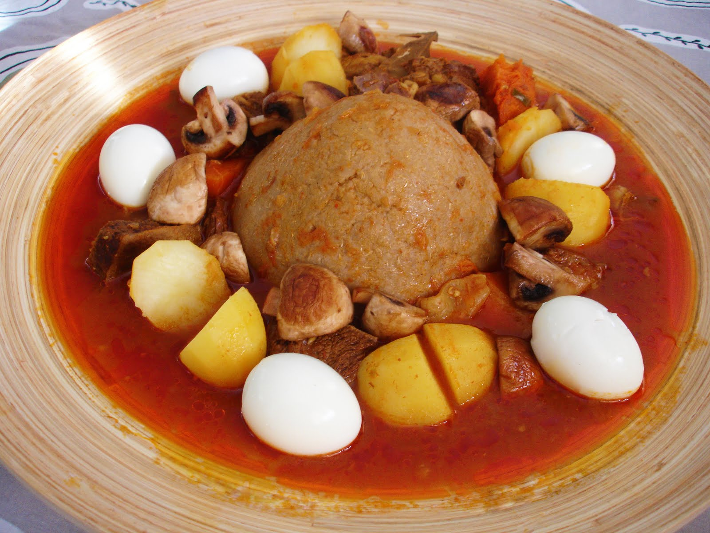

# Bazin

*The Libyan dome: a stiff barley-and-water dumpling shaped into a mound and ringed with lamb-and-tomato sauce, eaten by hand from a shared platter.*

**Serves:** 4

**Prep Time:** 10 minutes

**Cook Time:** 1 hour 15 minutes

## Overview
Bazin is the dish that makes a Libyan kitchen feel Libyan. A stiff dough of barley flour and water is worked by hand into a smooth firm dome, the kind a fist sinks into without breaking; it sits in the middle of a wide shallow platter, with a deeply tomato-and-paprika lamb sauce ringed around it. There is no spoon. The eater pinches a piece of the dome with the fingers of the right hand, dips it into the sauce, and pops it into the mouth, working from the outside of the dome inward until it is gone. The technique looks rustic; the texture and flavour are the point. The dough is firm but tender, slightly tangy from the barley; the sauce is concentrated, glossy, the long-cooked lamb falling apart.

## Ingredients

### Bazin dough
- 500 g barley flour (substitute: 400 g barley flour + 100 g semolina if barley alone is hard to source)
- 700 ml water
- 1 tsp salt

### Sauce
- 500 g lamb (shoulder), cut into 3 cm cubes
- 1 large onion, finely chopped
- 4 tbsp olive oil
- 3 tbsp tomato paste
- 400 g tinned chopped tomatoes
- 2 tsp sweet paprika
- 1 tsp ground cumin
- 1 tsp ground coriander
- 1 tbsp bisbas or harissa
- 1/2 tsp turmeric
- 1/4 tsp cinnamon
- 600 ml water
- 4 hard-boiled eggs, peeled
- 4 small potatoes, peeled and halved
- Salt and pepper

## Method

### Stage 1 - Start the sauce
1. Heat 2 tbsp olive oil in a heavy pot. Brown the lamb in two batches, 3 minutes per side. Set aside.
2. Add the remaining oil. Soften the onion 8 minutes.
3. Stir in tomato paste; cook 2 minutes. Add chopped tomatoes, paprika, cumin, coriander, bisbas, turmeric and cinnamon. Cook 5 minutes until the colour deepens and oil pools at the edges.
4. Return the lamb to the pot. Add water, salt and pepper. Simmer covered on low for 50 minutes.
5. Add the peeled potatoes and hard-boiled eggs to the sauce for the last 20 minutes of cooking. The eggs take on the sauce colour and flavour.

### Stage 2 - Make the dough
1. Bring the water to a rolling boil in a saucepan. Add the salt.
2. Tip in the barley flour all at once. Immediately stir hard with a strong wooden spoon for 2-3 minutes until the dough comes together into a thick paste that pulls away from the sides.
3. Reduce heat to very low. Cover the pan with a tight lid. Steam-cook 20 minutes; the dough firms and the floury raw taste disappears.

### Stage 3 - Shape the dome
1. Wet your hands. Turn the hot dough onto a wide shallow platter (the kind you would use for paella).
2. Working quickly while it is still hot and pliable, shape the dough into a smooth dome about 15 cm across at the base, narrowing to the top.
3. Spoon the sauce around the dome, arranging the lamb, eggs and potatoes on either side. The dome itself stays bare.

## Notes
- **Barley flour:** Libyan bazin is traditionally barley alone; some modern versions use semolina or whole wheat flour. Barley is the right grain; sub semolina only as the last resort.
- **The handful technique:** Eating with the right hand is the proper way. Pinch a piece of dough no bigger than a walnut, press it against the sauce to coat, and bring it to the mouth.
- **Why the dome:** Shaping into a dome maximises the dough's surface for dipping while letting it stay tender inside. A flat round dries out faster.

## Serving
- Serve at the table on the platter, family-style. Plain mint tea afterwards. No bread - the bazin is the bread.

## Storage
- Best the same day. Leftover dough hardens quickly; leftover sauce keeps 3 days refrigerated.
- The sauce reheats well; reshape the dough or use the leftover with bread instead.
