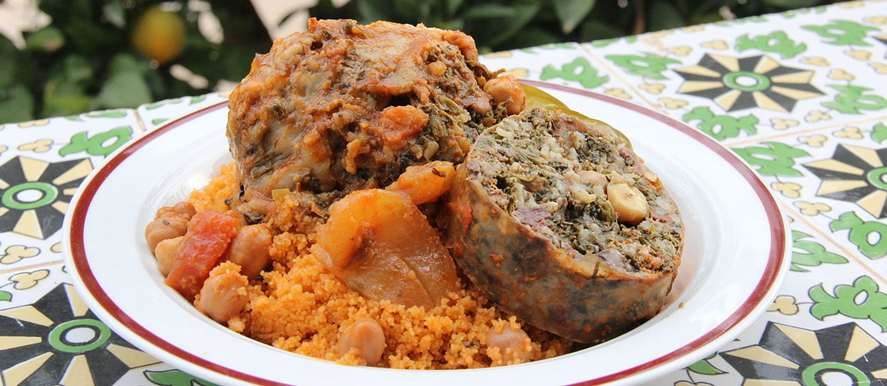

# Couscous bil Osban

*The Libyan special-occasion couscous: hand-rolled grain steamed three times over a tomato-and-lamb broth, served with osban (stuffed tripe sausages) coiled across the top.*

**Serves:** 6

**Prep Time:** 1 hour (including osban-making)

**Cook Time:** 2 hours

## Overview
Bil osban is the couscous that comes out for Eid, weddings and the visit-with-family Friday lunch. The couscous itself is steamed three separate times over a long-simmering tomato-and-lamb broth, fluffed and oiled between each pass; the osban (sheep tripe stuffed with minced lamb, rice, parsley and warming spices) coils in the broth alongside, soaking up colour and depth. At service the couscous is mounded onto a wide platter, the osban sausages sliced across the top, the broth-cooked lamb on the side, and a hot tomato-and-chilli sauce spooned over to taste. It is a whole-afternoon project that feeds six well.

## Ingredients

### Couscous
- 500 g medium-grain couscous
- 4 tbsp olive oil (split)
- 1 tsp salt
- 600 ml warm water (for hydrating)

### Broth
- 500 g lamb shoulder, on the bone if possible, cut into large chunks
- 1 large onion, finely chopped
- 4 tbsp olive oil
- 3 tbsp tomato paste
- 400 g tinned chopped tomatoes
- 2 tbsp sweet paprika
- 1 tbsp ground cumin
- 1 tsp ground coriander
- 1 tbsp bisbas or [harissa](../../base-ingredients/sauces/harissa.md)
- 1/2 tsp turmeric
- 1/2 tsp cinnamon
- 1.5 litres water
- 2 carrots, halved
- 2 small turnips, quartered
- 200 g chickpeas (cooked or tinned)
- Salt

### Osban (sheep-tripe sausage)
- 300 g lamb mince (substitute for the tripe-and-stuffing combination if working with what's available - see notes)
- 100 g cooked white rice
- 1 small onion, finely chopped
- 4 tbsp finely chopped parsley
- 4 tbsp finely chopped fresh mint
- 1 tsp paprika
- 1 tsp cumin
- 1/2 tsp cinnamon
- 1/4 tsp allspice
- Salt and pepper
- 200 g cleaned sheep tripe (caul fat or thick cellophane casings substitute)

## Method

### Stage 1 - Mix the osban filling
1. Combine the lamb mince, cooked rice, onion, parsley, mint and spices in a bowl. Mix with hands until evenly distributed. Salt to taste.
2. If using tripe, stuff small portions into rinsed lengths and tie at intervals to form 8 cm sausages. If using caul fat, wrap small balls of filling in caul to form parcels.

### Stage 2 - Build the broth
1. Heat olive oil in a couscoussier base (or large pot). Brown the lamb chunks 3 minutes per side; set aside.
2. Soften the onion 8 minutes. Stir in tomato paste; cook 2 minutes. Add spices and bisbas; cook 3 minutes.
3. Return lamb. Add water and salt. Bring to a simmer.
4. Add carrots, turnips, chickpeas. Lay the osban sausages gently in the broth.
5. Cover and simmer 45 minutes.

### Stage 3 - First steam
1. Hydrate the couscous in a wide bowl: drizzle 2 tbsp olive oil over the dry grain, rub through with the fingertips until every grain is oiled. Add 200 ml warm water and the salt; rub through again.
2. Tip into the top of the couscoussier (or a steamer over the broth pot).
3. Steam 20 minutes with the lid off.

### Stage 4 - Second steam
1. Return the couscous to the bowl. Add another 200 ml warm water; fluff and rub between the fingers to break up any clumps.
2. Steam another 20 minutes.

### Stage 5 - Third steam
1. Return again. Add the last 200 ml water and 2 tbsp olive oil. Fluff thoroughly.
2. Steam final 20 minutes. The grains should be tender, separate, and lightly glistening with oil.

### Stage 6 - Assemble
1. Mound the couscous on a wide platter.
2. Arrange the broth-cooked lamb chunks, vegetables and chickpeas around the rim.
3. Lift out the osban sausages, slice each into 2 cm rounds, and lay them across the top of the couscous mound.
4. Ladle some of the broth over the couscous to moisten; serve the rest on the side in a small jug.

## Notes
- **Osban substitution:** Authentic osban uses sheep tripe stuffed and steamed in the broth. Caul fat parcels are an accessible substitute; failing both, shape the filling into small meatballs and simmer in the broth for the last 20 minutes.
- **Three steams:** The triple-steam is what makes Libyan couscous loose and fluffy. Skipping it gives clumpy, gummy grain.
- **Couscoussier:** A two-piece pot with a perforated steamer top. A large metal sieve set over a saucepan works as a substitute - line with muslin to stop fine grains falling through.

## Serving
- Serve communally on the platter. Hot harissa or bisbas in a small bowl on the side for those who want more chilli. Mint tea after.

## Storage
- Leftover couscous: refrigerate 2 days; steam to reheat (a microwave dries it out).
- Leftover broth + meat: refrigerate 3 days; reheat gently.
- The osban does not freeze well; eat within 2 days.
