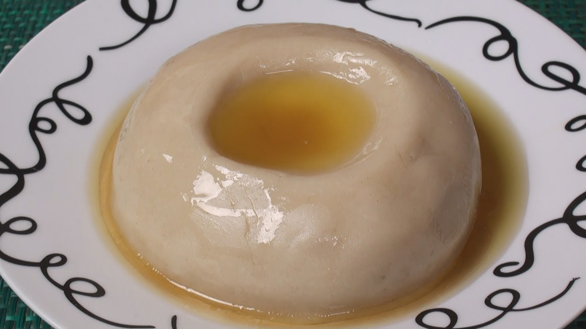

# Asida

*The Libyan dome of semolina pudding, topped with melted butter and date syrup. Eaten by hand from a shared platter for Eid, weddings and a newborn's seventh-day celebration.*

**Serves:** 6

**Prep Time:** 5 minutes

**Cook Time:** 25 minutes

## Overview
Asida is what Libyans bring to celebration. A simple semolina-and-water pudding is cooked to a firm spreadable mass, shaped into a smooth dome on a wide platter, and finished with a generous pour of melted butter and dark date syrup (dibs). The eater pinches a piece of the dome with the right hand, dips it into the pool of butter and syrup, and pops it into the mouth. The texture is firm-soft, almost like a cooked porridge gone gluey-firm; the butter and date together are deeply sweet and slightly fudgy. Same technique as the savoury bazin (which uses barley); asida uses fine semolina and a sweet finish.

## Ingredients

### Dough
- 300 g fine semolina
- 750 ml water
- 1/2 tsp salt

### Topping
- 100 g unsalted butter, melted
- 200 ml dibs (date syrup; or molasses if dibs is unavailable)
- 50 g toasted sesame seeds (optional)
- A few crushed roasted almonds (optional)

## Method

### Stage 1 - Cook the semolina
1. Bring the water and salt to a rolling boil in a heavy saucepan.
2. Reduce heat to medium. Sift in the semolina in a steady stream, whisking continuously to prevent lumps.
3. Switch to a strong wooden spoon. Stir vigorously 5 minutes - the mixture thickens fast.
4. Continue cooking over low heat 15 more minutes, stirring every minute, until the asida is thick, glossy and pulls cleanly from the sides of the pan.

### Stage 2 - Shape the dome
1. Wet a wide shallow serving platter with water (this stops the dough sticking).
2. Tip the hot asida onto the centre of the platter.
3. With wet hands, shape into a smooth dome about 12-15 cm across at the base. Work quickly while it's hot.
4. Use the back of a spoon to make a shallow well at the top.

### Stage 3 - Top
1. Pour the melted butter into the well so it spills down the sides of the dome.
2. Drizzle the date syrup over the top, letting it pool around the base.
3. Scatter sesame seeds and almonds if using.

## Notes
- **Semolina grind:** Fine semolina gives the smoothest asida. Coarse semolina works but the texture is more porridge-like.
- **Date syrup (dibs):** Available at Middle Eastern shops. Pomegranate molasses is wrong (too tart); golden syrup is wrong (too neutral); molasses is the closest mainstream sub.
- **The wet-hands technique:** Asida is very sticky when hot. Wet hands prevent dough sticking; wet platter same logic.

## Serving
- Serve hot or warm. Pinch from the dome with the right hand, dip into the butter-syrup pool, eat. No bread, no spoon - the dome is the bread.

## Storage
- Asida hardens dramatically as it cools. Best within 2-3 hours of cooking.
- Leftover hardened asida can be sliced and pan-fried in butter the next day with extra date syrup - a different but excellent dish.
