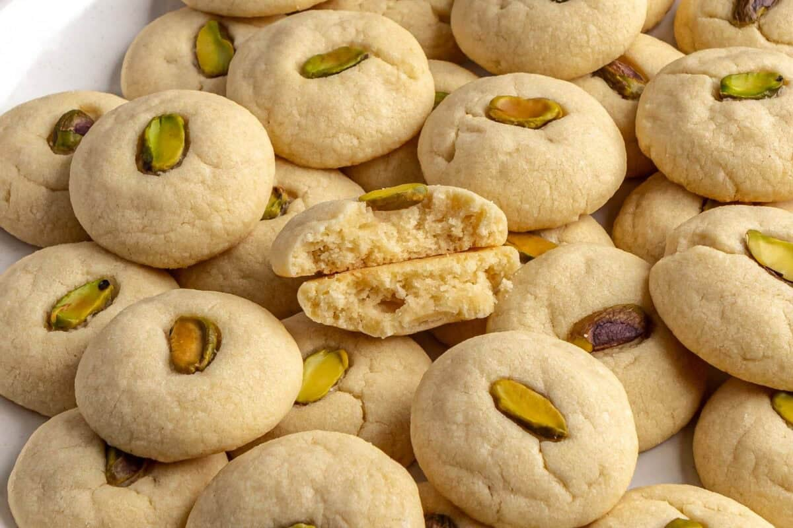

# Ghraybeh Libi

*Libyan shortbread: a melt-in-the-mouth butter biscuit with a blanched almond pressed into the top. The afternoon-tea companion across the Levant, with the Libyan version slightly chewier than the Lebanese.*

**Serves:** Makes about 30 biscuits

**Prep Time:** 25 minutes (plus 30 min rest)

**Cook Time:** 18 minutes

## Overview
Ghraybeh exists in every Levantine and Maghrebi tradition; the Libyan version uses olive oil alongside the butter, which gives a slightly firmer biscuit than the all-butter Syrian or Lebanese versions while keeping the signature dissolves-on-the-tongue texture. The dough is just butter, olive oil, icing sugar and flour, kneaded briefly so the gluten stays soft, shaped into small discs, topped with a blanched almond pressed into the centre, and baked pale gold. Served with mint tea or Libyan coffee.

## Ingredients
- 200 g unsalted butter, softened to room temperature
- 50 ml olive oil
- 100 g icing sugar
- 1/2 tsp ground cardamom (optional but traditional)
- 350 g plain flour
- A pinch of salt
- 30 blanched almonds (whole)

## Method

### Stage 1 - Cream the butter
1. Beat the softened butter, olive oil and icing sugar in a bowl with a wooden spoon for 5 minutes until pale and fluffy.
2. Add the cardamom and salt; mix.

### Stage 2 - Add flour
1. Sift in the flour gradually, mixing gently to combine.
2. Bring together with the hands into a soft dough. Do not overwork - just enough to combine.
3. Wrap; rest 30 minutes at room temperature (do not chill - chilled dough cracks when shaped).

### Stage 3 - Shape
1. Heat oven to 160 C (fan 140 C). Line two baking trays with parchment.
2. Roll the dough into small balls (about 20 g each, walnut-sized).
3. Place on the lined trays, spaced 3 cm apart.
4. Press the top gently with the side of your thumb to flatten slightly into a 3 cm disc.
5. Press an almond into the centre of each.

### Stage 4 - Bake
1. Bake 16-18 minutes. The biscuits should stay pale - the colour goes only to a pale ivory, not gold. Over-baking turns them dry and dusty.
2. Cool fully on the trays - they are extremely fragile when warm and firm up as they cool.

## Notes
- **The pale colour:** Ghraybeh should be almost white, not golden. The texture and flavour depend on minimal browning.
- **No baking powder:** The dough rises slightly from the air beaten in during creaming. Baking powder gives a more biscuit-cake texture, wrong for this.
- **Room-temperature butter:** Soft enough that it creams; not so soft that it's oily. Press a finger in - it should leave a mark but not melt away.

## Serving
- Serve at room temperature with mint tea, Libyan coffee, or alongside fresh dates and walnuts. They keep their texture for several days.

## Storage
- In an airtight tin at room temperature: 1-2 weeks.
- Do not refrigerate (humidity softens them) or freeze (texture suffers).
