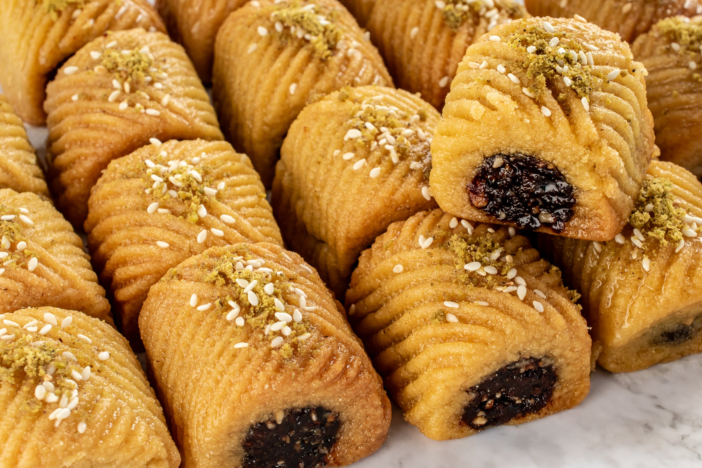

# Maqrood

*Libyan date-filled semolina diamonds: a semolina-and-olive-oil pastry rolled around a spiced date paste, cut into diamonds, fried and drenched in honey syrup.*

**Serves:** Makes about 30 diamonds

**Prep Time:** 40 minutes

**Cook Time:** 25 minutes

## Overview
Maqrood is shared across the Maghreb (Tunisia and Algeria have their own versions); the Libyan one tends toward a slightly oilier, more semolina-forward pastry and a dark spiced date filling heavy with cinnamon and orange zest. The pastry is rolled into a long flat strip, the date paste piped down the centre, the strip folded over and pressed flat, then cut into diamonds. The diamonds are deep-fried golden, then dipped warm into a thin honey-and-orange-blossom syrup so they soak it up. Served at Eid, weddings and with mint tea any afternoon.

## Ingredients

### Pastry
- 400 g fine semolina
- 100 g plain flour
- 1/2 tsp salt
- 1 tsp baking powder
- 150 ml olive oil
- 200 ml warm water (approximately)

### Date filling
- 400 g pitted dates (Medjool or similar soft variety)
- 50 g unsalted butter
- 1 tbsp olive oil
- Zest of 1 orange
- 1 tsp ground cinnamon
- 1/2 tsp ground cloves
- 1/2 tsp ground anise (optional)
- 50 ml water (if dates are dry)

### Syrup
- 200 g sugar
- 200 ml water
- 100 g honey
- 1 tbsp lemon juice
- 1 tbsp orange-blossom water

### To fry
- 500 ml vegetable oil

## Method

### Stage 1 - Make the date filling
1. Combine dates, butter, olive oil, orange zest and spices in a saucepan over low heat.
2. Cook 8-10 minutes, mashing with a wooden spoon, until the dates have broken down into a thick smooth paste. Add water if it gets too stiff.
3. Cool to room temperature.

### Stage 2 - Make the syrup
1. Combine sugar, water, honey and lemon juice in a saucepan.
2. Bring to a boil; reduce heat and simmer 8-10 minutes until lightly syrupy.
3. Off heat, stir in orange-blossom water. Set aside to cool to lukewarm.

### Stage 3 - Make the pastry
1. Combine semolina, flour, salt and baking powder in a bowl.
2. Drizzle in olive oil; rub through with the fingertips until evenly moistened.
3. Add warm water gradually, kneading, until a smooth firm dough forms (it should not be sticky).
4. Wrap and rest 20 minutes.

### Stage 4 - Shape and cut
1. Divide the pastry into 4 portions. Roll each into a long rectangle about 8 cm wide and 5 mm thick.
2. Pipe (or spoon) a 2 cm-wide log of date filling down the centre of each rectangle.
3. Fold the pastry over the filling to enclose; pinch the edges to seal. Roll gently to flatten into a strip about 4 cm wide.
4. Cut diagonally at 3 cm intervals to form diamonds.

### Stage 5 - Fry
1. Heat the frying oil to 170 C in a wide pan.
2. Fry the diamonds in batches, 3-4 minutes per side until deep golden.
3. Lift out with a slotted spoon and drop straight into the warm syrup.
4. Soak 30 seconds, then lift onto a wire rack to drain.

## Notes
- **Filling consistency:** The date paste should be thick enough to pipe but not stiff like clay. Too dry and it cracks the pastry; too wet and it leaks during frying.
- **Pastry resting:** The 20-minute rest hydrates the semolina; without it the dough is grainy.
- **Syrup temperature:** Warm syrup penetrates the hot pastry well; cold syrup sits on the surface; hot syrup over-soaks. Lukewarm is ideal.

## Serving
Serve at room temperature with mint tea or Libyan coffee. The flavour deepens overnight as the syrup penetrates further.

## Storage
- In an airtight tin at room temperature: 5-7 days. The pastry softens slightly as the syrup migrates through.
- Do not refrigerate (the texture goes hard) or freeze (the syrup separates).
