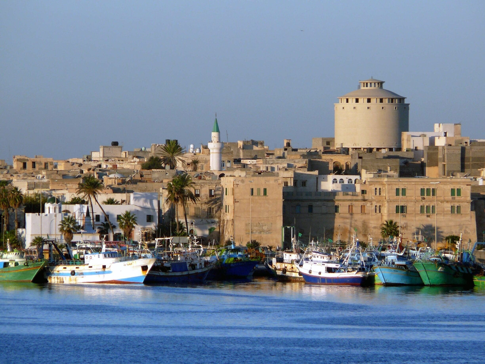

# Libyan Cuisine

A North African cuisine where Italian colonial pasta meets Maghrebi couscous, tied together by tomato, cumin, coriander, dried mint and a thick chilli paste called shatta. Hand-rolled bazin dumplings, long-simmered lamb stews, semolina-based desserts soaked in date syrup, and mint tea poured from height define the table.
