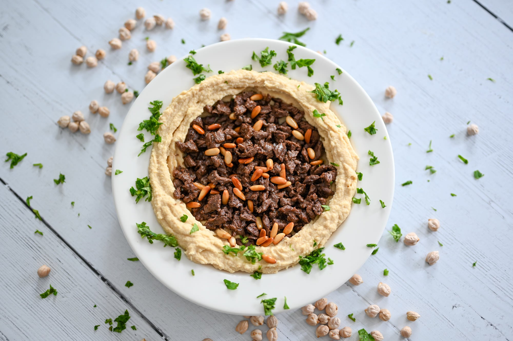

# Rishta bil Hummus

*Libyan noodle-and-chickpea stew: hand-cut pasta squares simmered with chickpeas, lamb and a generous hit of paprika and dried mint. Italian colonial pasta meets Maghrebi long-cooking.*

**Serves:** 6

**Prep Time:** 20 minutes (plus dough rest)

**Cook Time:** 1 hour 15 minutes

## Overview
Rishta is one of the dishes that gives away Libya's century of Italian colonial influence; a hand-rolled, hand-cut pasta square called rishta is dropped into a paprika-and-tomato-rich lamb broth, simmered with chickpeas, and finished with dried mint and a drizzle of olive oil. Italian pasta technique, Libyan everything else. The result is a thick, hearty noodle stew - not a soup with pasta in it, but a stew where the pasta has softened into a glossy thickening element while staying distinctly chewy. Eaten from a deep bowl with bread for dipping.

## Ingredients

### Rishta dough
- 200 g plain flour
- 100 g semolina (substitute another 100 g plain flour)
- 1 large egg
- 100 ml water (approximately)
- 1 tsp salt
- 1 tbsp olive oil

### Stew
- 300 g lamb shoulder, cut into 2 cm cubes
- 1 large onion, finely chopped
- 4 tbsp olive oil
- 2 tbsp tomato paste
- 400 g tinned chopped tomatoes
- 2 tbsp sweet paprika
- 1 tsp ground cumin
- 1 tsp ground coriander
- 1 tbsp bisbas or harissa
- 1/2 tsp turmeric
- 1.2 litres water
- 1 tin (400 g) chickpeas, drained
- 1 tbsp dried mint
- Salt and pepper
- Fresh mint and lemon to finish

## Method

### Stage 1 - Make the pasta dough
1. Combine the flour, semolina and salt in a bowl. Make a well in the centre.
2. Crack in the egg; add the olive oil and most of the water.
3. Mix with a fork, gradually drawing in the flour; add more water if needed to form a firm dough.
4. Knead 8-10 minutes until smooth. Wrap and rest 30 minutes.

### Stage 2 - Cut the rishta
1. Roll out the dough thinly (about 2 mm) on a lightly floured surface.
2. Cut into 2 cm squares with a sharp knife. Dust with flour to stop them sticking.
3. Set aside on a tray.

### Stage 3 - Start the stew
1. Heat 2 tbsp olive oil in a heavy pot. Brown the lamb in batches, 3 minutes per side. Set aside.
2. Add remaining olive oil. Soften the onion 8 minutes.
3. Stir in tomato paste; cook 2 minutes.
4. Add tomatoes, paprika, cumin, coriander, bisbas, turmeric. Cook 5 minutes until colour deepens.
5. Return lamb. Add water, salt and pepper. Simmer covered on low 45 minutes.

### Stage 4 - Add the chickpeas and rishta
1. Add the chickpeas to the simmering stew.
2. Drop in the pasta squares one at a time (so they don't clump). Stir gently.
3. Cook uncovered 12-15 minutes; the rishta cooks through, the stew thickens.

### Stage 5 - Finish
1. Off heat, stir in the dried mint.
2. Adjust salt and chilli.
3. Ladle into bowls; top with fresh mint, a drizzle of olive oil, and a squeeze of lemon.

## Notes
- **Pasta shape:** Squares are the Libyan tradition; tagliatelle or thick noodles work as a substitute. Avoid spaghetti - the strands tangle in the thick stew.
- **Cooking time:** Fresh pasta cooks in 8-12 minutes; if using dried, increase to 15-18.
- **Dried mint vs fresh:** Dried mint has the rounder, deeper flavour traditionally used to finish; fresh mint goes on top at the end as a garnish.

## Serving
- A bowl on its own is a full meal. Bread and a side of pickled chershi for crunch. Mint tea after.

## Storage
- Refrigerate 3 days. The pasta absorbs liquid as it sits; thin with stock or water on reheat.
- Freezing not recommended; the pasta texture suffers.
