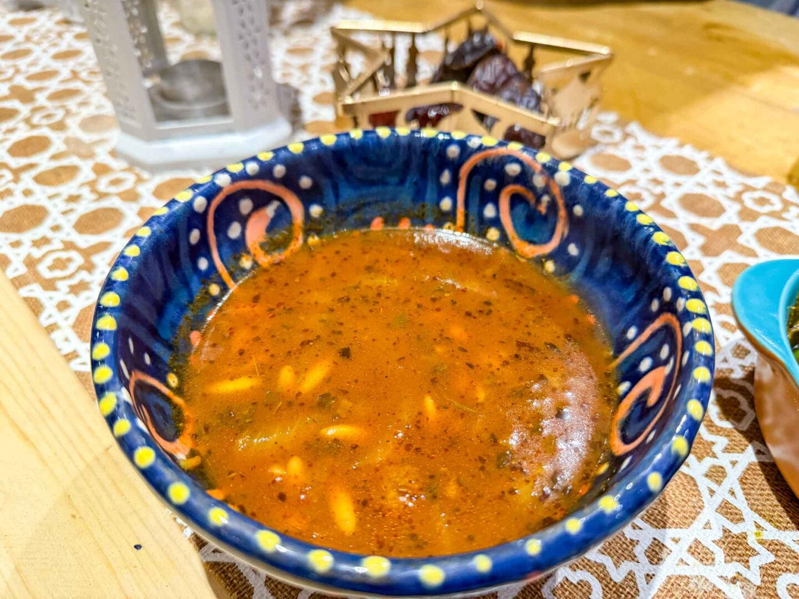

# Sharba Libiya

*The Libyan Ramadan soup: lamb simmered with tomato, chickpeas and orzo, finished with chopped mint and lemon. Eaten to break the fast at sundown across Tripoli and Benghazi.*

**Serves:** 6

**Prep Time:** 15 minutes

**Cook Time:** 1 hour 30 minutes

## Overview
Sharba is the daily evening soup in Ramadan and the everyday warm bowl outside it. Lamb on the bone goes into the pot first with onion and tomato; the broth thickens slowly over an hour, drawing colour from sweet paprika and bisbas (Libyan red chilli paste). Chickpeas and orzo (or short-cut macaroni) go in for the last fifteen minutes; the soup is finished off the heat with chopped mint and a squeeze of lemon. The bowl reads as deeply savoury, gently spiced and slightly tart, with the orzo softening into a thickened broth that coats the spoon. Serve with bread for tearing and dipping.

## Ingredients

- 500 g lamb (shoulder or neck), cut into 3 cm cubes
- 1 large onion, finely chopped
- 4 tbsp olive oil
- 2 tbsp tomato paste
- 400 g tinned chopped tomatoes
- 1 tbsp sweet paprika
- 1 tsp ground cumin
- 1 tsp ground coriander
- 1 tsp bisbas or [harissa](../../base-ingredients/sauces/harissa.md) (or 1/2 tsp chilli flakes)
- 1/2 tsp turmeric
- 1/4 tsp cinnamon
- 1.5 litres water or lamb stock
- 1 tin (400 g) chickpeas, drained
- 100 g orzo (or short-cut macaroni)
- 1 tbsp dried mint
- Salt and black pepper
- 1 lemon, juiced
- A handful of fresh mint and parsley, chopped, to finish

## Method

### Stage 1 - Brown the lamb
1. Heat 2 tbsp of the olive oil in a heavy pot over medium-high heat.
2. Brown the lamb in batches, about 3 minutes per side. Set aside.

### Stage 2 - Build the base
1. Add the remaining oil to the pot. Soften the onion for 8 minutes until pale gold.
2. Stir in the tomato paste; cook for 2 minutes until it darkens.
3. Add the chopped tomatoes, paprika, cumin, coriander, bisbas, turmeric and cinnamon. Cook 5 minutes, stirring, until the paste deepens in colour and the oil separates at the edges.

### Stage 3 - Simmer
1. Return the lamb to the pot with any juices. Pour in the water or stock.
2. Bring to a simmer; reduce heat to low. Cover and cook 1 hour, until the lamb is tender enough to break with a spoon.
3. Add the chickpeas and orzo. Stir well to stop the orzo clumping. Cook uncovered 12-15 minutes until the orzo is tender and the soup has thickened to a rich coating consistency.

### Stage 4 - Finish
1. Off the heat, stir in the dried mint, salt to taste, black pepper and lemon juice.
2. Ladle into bowls; scatter fresh mint and parsley over the top.

## Notes
- **The bisbas question:** Libyan bisbas is a slow-cooked red-chilli paste, similar in role to harissa but with a longer cook. Harissa is the closest substitute; for a milder soup, halve the amount or use chilli flakes.
- **The orzo timing:** Orzo cooks faster than the lamb wants to wait, so it goes in only at the end. Past 15 minutes it turns to mush.
- **Lemon at the end:** Acid brightens the deep tomato-lamb base. Without it the soup reads as one-dimensional.

## Serving
- Eat with crusty bread, ideally Libyan flatbread or French baguette. A small dish of fresh chilli paste or harissa for those wanting more heat.

## Storage
- Refrigerate 3 days. The orzo absorbs liquid as it sits; add a splash of water when reheating.
- Freeze the soup before adding the orzo, up to 2 months. Cook the orzo fresh on reheat.
