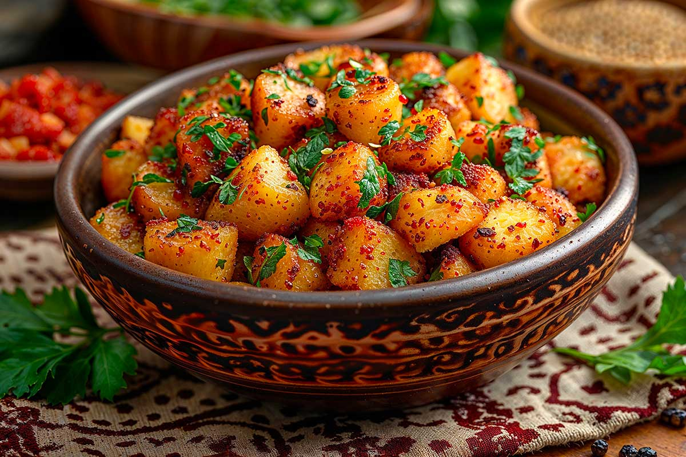

# Batata Harra

*Libyan spiced potatoes: cubed potatoes shallow-fried crisp, then tossed with garlic, coriander, paprika and harissa. The chilli-and-garlic-fragrant side that turns up alongside fish, eggs or just bread.*

**Serves:** 4

**Prep Time:** 10 minutes

**Cook Time:** 30 minutes

## Overview
Batata harra (literally "hot potatoes") shows up across the Levant and Maghreb in slight variants; the Libyan version leans on harissa or bisbas for heat and dried mint for the finish. Potatoes are cubed and shallow-fried until crisp-edged and tender inside, then tossed off the heat with a paste of garlic, paprika, harissa, coriander and olive oil so the spices stick to the hot surface without burning. The dish is best eaten warm, ideally with eggs, fish or grilled meat.

## Ingredients
- 800 g waxy potatoes (Charlotte, Cyprus, or similar), cut into 2 cm cubes
- 5 tbsp olive oil
- 6 cloves garlic, finely chopped
- 1 tbsp sweet paprika
- 1 tbsp harissa or bisbas (or 1 tsp chilli flakes)
- 2 tsp ground coriander
- 1 tsp ground cumin
- 1 tsp dried mint
- 1 tsp salt
- 1 lemon, juiced
- A handful of coriander leaves and parsley, chopped

## Method

### Stage 1 - Par-cook the potatoes
1. Place the cubed potatoes in a pot, cover with cold salted water.
2. Bring to a boil; reduce heat, simmer 6-8 minutes until a knife slides in with slight resistance.
3. Drain thoroughly. Pat dry with a tea towel.

### Stage 2 - Fry crisp
1. Heat 4 tbsp olive oil in a wide pan over medium-high heat.
2. Add the par-cooked potatoes in a single layer; do not crowd.
3. Fry 10-12 minutes, turning every 2-3 minutes, until deeply golden on most sides and crisp at the edges.

### Stage 3 - Toss with spice paste
1. Reduce heat to low. Push the potatoes to one side.
2. Add the remaining 1 tbsp olive oil to the empty space; tip in the garlic, paprika, harissa, coriander, cumin and dried mint. Stir 30 seconds until fragrant - do not let the garlic brown.
3. Sprinkle salt over the potatoes; pour the spice mixture across; toss thoroughly to coat every cube.
4. Off heat, squeeze lemon over. Toss again.

### Stage 4 - Finish
1. Tip onto a serving plate; scatter chopped coriander and parsley over.
2. Serve hot.

## Notes
- **Par-cook first:** Skipping the boil and frying raw cubes gives crisp outside but raw centres. Par-boiling guarantees a tender interior.
- **Spice paste off the heat:** Adding the garlic-spice paste directly to a hot pan with raw garlic risks burning. Push the potatoes aside, briefly cook the spices in their own oil, then toss together.
- **Lemon at the end:** Hot acid wilts the herbs and dulls the spice; add lemon off the heat, fresh herbs immediately before serving.

## Serving
- Eat warm with grilled fish, fried eggs, lamb chops, or simply with bread and a glass of mint tea. Cold or room temperature also good as part of a mezze spread.

## Storage
- Refrigerate 2 days. Reheat in a hot pan to recrisp - microwaved batata harra is soft and oily.
- Do not freeze.
