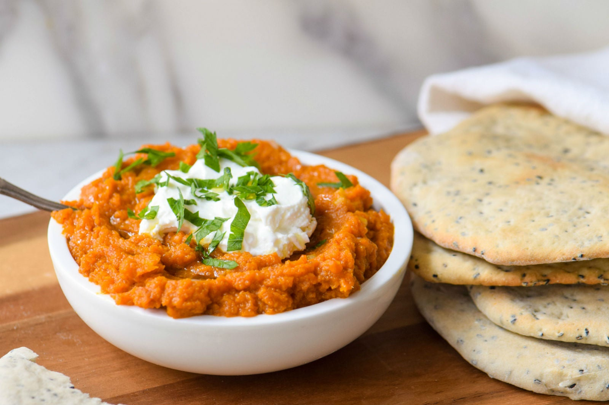

# Chershi

*Libyan pickled vegetables: turnip and carrot brined with garlic, beetroot for colour, vinegar and salt. The sharp crunchy pickle that sits beside every couscous and lamb stew.*

**Serves:** A 1-litre jar (8-10 portions)

**Prep Time:** 20 minutes

**Cook Time:** None (plus 5-7 day ferment)

## Overview
Chershi is the Libyan version of the pickled-vegetable tradition that runs across the Maghreb and the Levant. White turnip and carrot go in batons; a slice of raw beetroot tints the brine and the turnips pink-red; garlic, chilli and bay leaves season; vinegar and salt do the preserving. After 5-7 days at room temperature the vegetables have softened just enough to bend without breaking but kept a crisp bite. A small bowl sits on the table with every meal, the way pickles do at a Russian or Polish lunch.

## Ingredients
- 500 g white turnip, peeled and cut into batons
- 250 g carrot, peeled and cut into batons
- 1 small beetroot, peeled and sliced into 3 mm rounds
- 4 cloves garlic, peeled and smashed
- 1 small green chilli, halved
- 2 bay leaves
- 1 tbsp black peppercorns
- 250 ml white wine vinegar (or cider vinegar)
- 500 ml water
- 2 tbsp salt
- 1 tbsp sugar (optional, takes the harsh edge off the vinegar)

## Method

### Stage 1 - Prepare the jar
1. Sterilise a 1-litre clip-top jar by washing in hot soapy water, then briefly in boiling water.
2. Layer the turnip and carrot batons vertically; tuck in the beetroot slices, garlic, chilli and bay.
3. Sprinkle the peppercorns over the top.

### Stage 2 - Make the brine
1. Combine vinegar, water, salt and sugar in a small pan.
2. Bring to a simmer; stir until salt and sugar dissolve.
3. Cool to lukewarm (not hot - hot brine cooks the vegetables and softens them too much).

### Stage 3 - Pour and ferment
1. Pour the cooled brine over the vegetables until fully covered. Press the vegetables down if needed.
2. Seal the jar.
3. Leave at room temperature 5-7 days. Open daily to release any built-up gas (the brine slightly ferments).
4. After 5-7 days the vegetables are bright pink-red, softened slightly, sharply pickled. Transfer to the fridge.

## Notes
- **Beetroot for colour:** Without the beetroot the pickle is pale yellow; with it, the unmistakable pink-red that signals Libyan chershi at a glance.
- **Vinegar choice:** White wine vinegar is the classic; cider vinegar works; distilled white vinegar is too harsh.
- **Ferment vs straight pickle:** The 5-7 days at room temperature lightly ferments the brine, giving the chershi a slight tang that pure vinegar pickles don't have. For an instant pickle, skip the room-temperature phase and refrigerate immediately - the result is sharper, less complex.

## Serving
- A small dish on the table at every meal. Particularly good with couscous, rice dishes and grilled lamb.

## Storage
- Refrigerated in the brine: 2 months. The vegetables continue to soften slowly; eat within a month for the best texture.
- Do not freeze.
