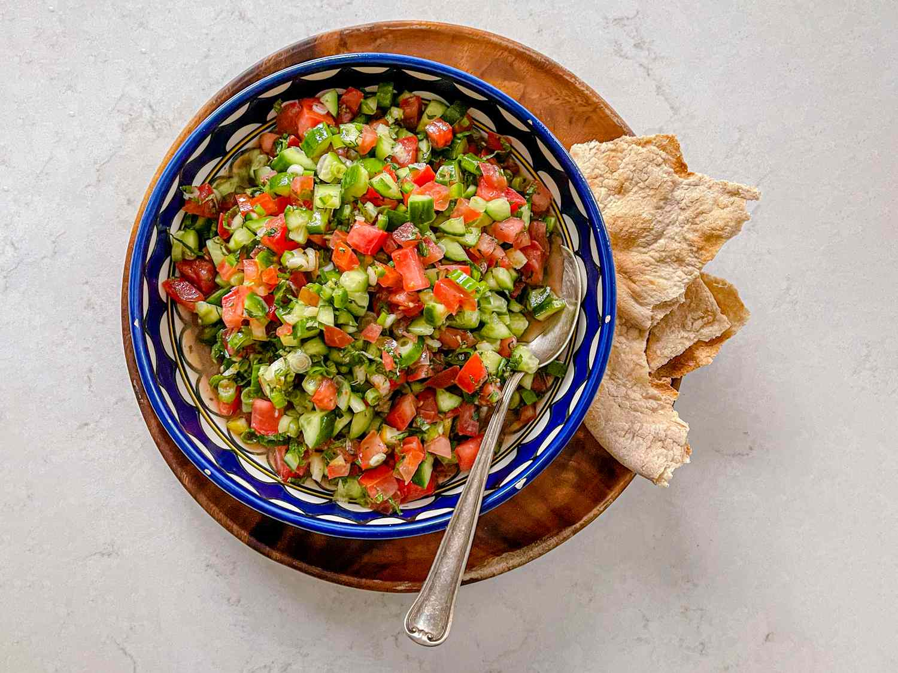

# Salata Mafrouma

*Libya's everyday chopped salad: ripe tomato, sweet onion and fresh chilli minced fine with cumin, lemon and parsley, the bright sharp counterpoint set out on every table from Tripoli to Benghazi.*

**Serves:** 4 as a side

**Prep Time:** 15 minutes

**Cook Time:** None

## Overview
Salata mafrouma is the chopped raw salad of Libyan home cooking, the bright lemony plate set down beside heavier dishes like bazin, couscous bil osban or sharba libiya. The name comes from the verb to mince or rub fine: the tomato, onion and chilli are chopped small enough that a spoon picks up all three at once, and the dressing is built into the bowl rather than poured on top. Cumin is the spine of the seasoning, parsley brings the green, and a long squeeze of lemon lifts the lot. There is no oil-heavy slick on the surface; this is a fresh sharp salad meant to cut through fat and starch on the rest of the table. Make it within an hour of eating so the tomato stays firm. Eat with bread or alongside any stew.

## Ingredients

- 4 ripe medium tomatoes (about 500 g), seeded
- 1 small red onion (about 80 g)
- 1 fresh green chilli, seeded (or to taste)
- 1 small bunch flat-leaf parsley (about 20 g leaves)
- 1 tsp ground cumin
- 1/2 tsp fine salt
- Juice of 1 lemon (about 30 ml)
- 2 tbsp extra virgin olive oil
- Black pepper, to taste

## Method

### Stage 1 - Chop fine
1. Halve the tomatoes, scoop out the watery seeds and discard.
2. Chop the tomato flesh into 5 mm dice.
3. Peel the onion and chop it the same size as the tomato.
4. Slit the chilli, scrape out the seeds, mince fine.
5. Strip the parsley leaves from the stems and chop fine.

### Stage 2 - Dress and rest
1. Tip everything into a wide bowl.
2. Scatter over the cumin, salt and a good twist of black pepper.
3. Squeeze the lemon juice across the surface.
4. Drizzle the olive oil over the top.
5. Toss gently with a spoon; taste and adjust salt and lemon.
6. Rest 10 minutes for the flavours to settle, then serve.

## Notes
- **Seed the tomatoes:** the watery seed pulp dilutes the dressing and turns the salad to soup within an hour.
- **Chop, do not blend:** the texture should pick up cleanly on a spoon, with each cube still visible.
- **Cumin is essential:** without it the salad reads as Italian rather than Libyan; toast a teaspoon of whole seeds and grind fresh if you can.
- **Heat to taste:** Libyan tables vary from gentle to fierce; one mild chilli is the everyday level.

## Variations
- Add half a green pepper, finely diced, for a sweeter version.
- Stir in a tablespoon of capers (popular in the Cyrenaican east).
- Finish with a dusting of sumac for extra tartness.
- Swap parsley for fresh coriander for a more North African profile.
- Add a small clove of crushed garlic for a sharper table salad.

## Serving
- Alongside bazin or couscous bil osban · with grilled fish or lamb · spooned over warm flatbread · with sharba libiya · as part of a wider mezze spread.

## Storage
- Best eaten within 2 hours of making.
- Refrigerate up to 1 day, but the tomato softens and the lemon dulls.
- Do not freeze.

