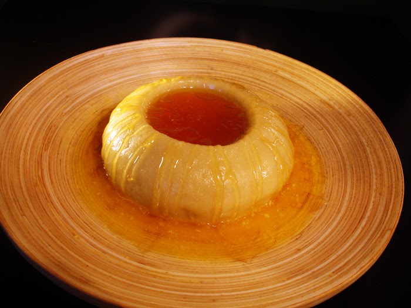

# Aseeda bil Bisbas

*A saucer of soft semolina porridge crowned with a fiery red fenugreek and pepper sauce, the Libyan morning snack that wakes you up faster than coffee.*

**Serves:** 4 small saucers

**Prep Time:** 10 minutes

**Cook Time:** 25 minutes

## Overview
Aseeda bil bisbas is the savoury morning version of the wider aseeda family, a smooth semolina porridge served not with date syrup but with bisbas, the Libyan fenugreek-and-pepper sauce that sits on the table from breakfast to dinner. The semolina is whisked into salted water and cooked until it pulls cleanly from the side of the pan, then spread thin in a shallow saucer with a hollow pressed into the middle. Into the hollow goes a ladleful of the red sauce: tomato, fenugreek seeds soaked overnight until they swell into a green jelly, paprika, garlic and hot chilli, slowly simmered until thick. You eat with a spoon from the outside in, dragging the soft porridge through the sauce. The dish is bracing, savoury and warming, perfect for a cold Tripoli winter morning before work.

## Ingredients

### Bisbas sauce
- 2 tbsp fenugreek seeds
- 4 ripe tomatoes (about 400 g), grated or finely chopped
- 2 tbsp tomato paste
- 1 small onion, finely chopped
- 4 cloves garlic, crushed
- 1 tbsp sweet paprika
- 1 tsp hot paprika or chilli powder
- 1 tsp ground caraway
- 1/2 tsp ground cumin
- 3 tbsp olive oil
- 1 tsp fine salt
- 200 ml water

### Aseeda porridge
- 250 g fine semolina
- 750 ml water
- 1 tsp fine salt
- 2 tbsp olive oil, plus extra to serve

## Method

### Stage 1 - Soak the fenugreek (the night before)
1. Put the fenugreek seeds in a small bowl.
2. Cover with cold water by 3 cm.
3. Leave overnight on the counter; by morning the seeds will have swelled and a green jelly will surround them.
4. Drain and rinse twice to wash off the bitter outer coating.

### Stage 2 - Cook the bisbas
1. Heat the olive oil in a saucepan over medium heat.
2. Add the onion; cook 5 minutes until soft and pale gold.
3. Stir in the garlic, sweet paprika, hot paprika, caraway and cumin; cook 30 seconds.
4. Add the tomato paste; stir 1 minute until it darkens.
5. Tip in the grated tomatoes, the soaked fenugreek and the salt.
6. Pour in the water; bring to a simmer.
7. Cook gently 15-20 minutes, stirring now and then, until the sauce thickens to a loose jam.
8. Taste; adjust salt and heat. Keep warm.

### Stage 3 - Cook the aseeda
1. Bring the water to the boil in a wide heavy pan.
2. Add the salt.
3. Pour in the semolina in a thin stream while whisking hard with the other hand.
4. Switch to a wooden spoon and stir constantly for 6-8 minutes until the porridge thickens and pulls cleanly from the side of the pan.
5. Beat in the olive oil for shine.

### Stage 4 - Assemble and serve
1. Spoon a portion of aseeda into each shallow saucer.
2. Press the back of a spoon into the centre to make a hollow.
3. Ladle a generous spoonful of hot bisbas into the hollow.
4. Drizzle a little extra olive oil around the edge.
5. Eat warm, with a spoon, from the outside in.

## Notes
- **Soak the fenugreek overnight:** unsoaked fenugreek is harshly bitter; the soak and double rinse removes the worst of it and gives the green jelly that thickens the sauce.
- **Whisk the semolina in fast:** a thin steady stream while whisking is the only way to avoid lumps. If lumps form, push the porridge through a sieve once cooked.
- **Adjust the heat to taste:** Libyan bisbas runs from gently warm to seriously fiery; one teaspoon of hot paprika is the middle ground.
- **Serve in shallow saucers:** the wide thin layer of porridge gives the right ratio of soft semolina to sauce in every spoonful.

## Variations
- Stir a tablespoon of melted ghee into the porridge for a richer base.
- Add a small lamb chop, grilled, on the side for a heartier breakfast.
- Top with crumbled feta or salted ricotta for a salty contrast.
- Mix the bisbas with a poached egg in the hollow.
- Use barley flour in place of half the semolina for an older country version.

## Serving
At breakfast on a cold morning before work · as a late-morning snack with strong mint tea · spread on a family plate to share with bread instead of saucers · alongside olives and labneh for a fuller breakfast spread · in the small hours after a long evening, as a warming finish.

## Storage
- Bisbas keeps 5 days refrigerated and freezes 2 months.
- The aseeda is best eaten fresh; if leftover, reheat with a splash of water over low heat.
- Do not freeze the cooked porridge (the texture turns grainy).
