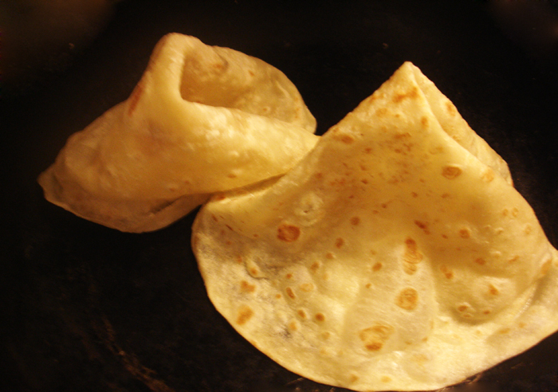

# Ftat

*Crisp golden squares of fried semolina dough, served warm with a generous drizzle of date molasses, the everyday Libyan street snack between morning chores and the midday meal.*

**Serves:** 4 (about 16 squares)

**Prep Time:** 20 minutes (plus 30 minutes resting)

**Cook Time:** 15 minutes

## Overview
Ftat is the simple semolina fry-bread of Libyan home and street cooking, made from a soft enriched dough that is rolled thin, cut into squares and shallow fried until the outside crackles and the inside stays tender. The dough is built around fine semolina rather than wheat flour, which gives ftat its slightly sandy bite and a deep golden colour after frying. A small amount of olive oil and a pinch of fenugreek work into the dough; nothing more is needed because the topping does the rest of the work. Hot from the pan, the squares are stacked on a plate and drowned in rub al-tamr, the thick dark date molasses that is the Libyan answer to syrup. Eat with the fingers, with strong sweet mint tea on the side, and expect sticky hands.

## Ingredients

### Dough
- 300 g fine semolina, plus extra for dusting
- 100 g plain flour
- 1/2 tsp fine salt
- 1/2 tsp ground fenugreek
- 1 tsp instant yeast
- 1 tbsp olive oil
- About 200 ml warm water

### To fry and serve
- 300 ml vegetable oil for shallow frying
- 150 ml date molasses (rub al-tamr)
- 2 tbsp toasted sesame seeds (optional)

## Method

### Stage 1 - Mix the dough
1. In a wide bowl combine the semolina, flour, salt, fenugreek and yeast.
2. Pour in the olive oil and most of the warm water.
3. Mix with one hand until a soft, slightly sticky dough comes together; add the rest of the water gradually if needed.
4. Turn out and knead 5 minutes until smooth and elastic.
5. Return to the bowl, cover with a damp cloth and rest 30 minutes at room temperature.

### Stage 2 - Roll and cut
1. Tip the rested dough onto a semolina-dusted surface.
2. Roll out to about 4 mm thick.
3. Cut into 6 cm squares with a knife or pastry wheel.
4. Lay the squares on a tray dusted with semolina; rest 5 minutes while the oil heats.

### Stage 3 - Fry
1. Heat the vegetable oil in a wide deep pan to 170 °C.
2. Slide in 4-5 squares at a time; do not crowd the pan.
3. Fry 60-90 seconds per side until puffed and deep golden.
4. Lift out with a slotted spoon, let the excess oil drip back into the pan, and rest on kitchen paper.

### Stage 4 - Serve
1. Stack the warm squares on a wide plate.
2. Pour the date molasses generously over the top so it pools at the base.
3. Scatter the toasted sesame seeds over if using.
4. Eat hot, with the fingers, with strong sweet tea on the side.

## Notes
- **Oil temperature matters:** too cool and the squares soak up oil and turn heavy; too hot and the outside darkens before the inside cooks. Test with a small scrap first: it should rise and colour within 30 seconds.
- **Fenugreek is the signature:** the small pinch in the dough gives Libyan ftat its distinctive savoury note under the sweet topping.
- **Rest the dough:** without the 30-minute rest the squares will be tough rather than tender.
- **Serve immediately:** ftat softens and goes leathery within an hour; fry to order.

## Notes Variations
## Variations
- Brush with melted butter instead of frying for a lighter griddle version.
- Top with honey instead of date molasses for a sweeter finish.
- Sprinkle ground cinnamon over the molasses for a warmer version.
- Add a tablespoon of ground anise to the dough for a perfumed take.
- Cut into rounds rather than squares for a festive look.

## Serving
With glasses of strong sweet mint tea (atay) · alongside Libyan qahwa at mid-morning · stacked at a family breakfast spread · as an after-school snack for children · with fresh dates and labneh for a fuller plate.

## Storage
- Best eaten within an hour of frying.
- Fried squares (without molasses) keep 1 day in a tin; revive in a 180 °C oven for 3 minutes.
- The raw dough refrigerates 1 day, well wrapped.
- Do not freeze the finished squares.
