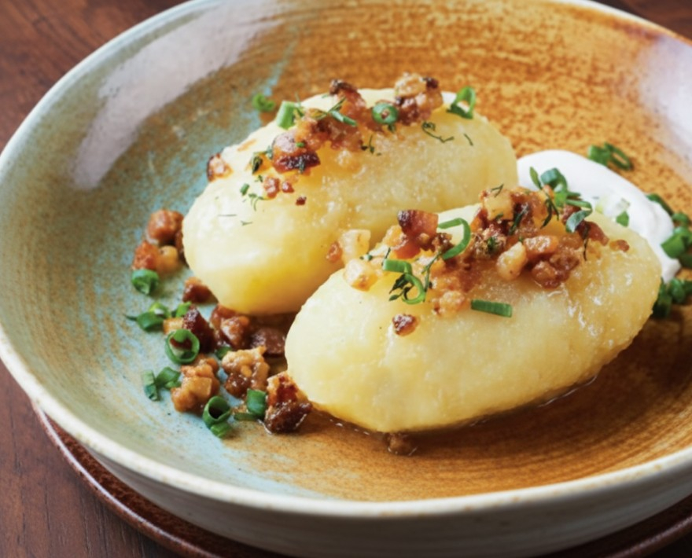

# Cepelinai

*Lithuania's national dish: large zeppelin-shaped potato dumplings stuffed with seasoned pork, boiled until translucent, and crowned with sour cream and a bacon-and-onion topping that runs glossy across the plate.*

**Serves:** 4 (8 dumplings)

**Prep Time:** 1 hour

**Cook Time:** 30 minutes

## Overview
Cepelinai (named for their resemblance to the Zeppelin airships of the early twentieth century) are the centrepiece of Lithuanian Sunday dinners. The dough is a clever half-and-half mix of raw grated potato (squeezed dry of its liquid) and boiled mashed potato, bound with starch reclaimed from the pressed-out water. Around a heart of seasoned minced pork, the dough is wrapped into smooth ovals roughly the size of a small fist, then gently boiled for twenty-five minutes until the outside turns glossy and translucent. The classic topping is spirgučiai: smoky pork-belly cubes fried until they release their fat, mixed with softened onion. A generous spoon of cold sour cream finishes the plate. The contrast of slick potato shell, savoury pork interior, hot bacon fat and cool dairy is the whole point.

## Ingredients

### For the filling
- 400 g minced pork shoulder (about 20% fat)
- 1 small onion, very finely chopped
- 1 clove garlic, grated
- 1 tsp salt
- 1/2 tsp black pepper
- 1/2 tsp marjoram

### For the dough
- 1.5 kg starchy potatoes (Maris Piper or similar), peeled
- 500 g floury potatoes for boiling, peeled and cubed
- 1 tsp salt
- 1 tbsp potato starch (if needed)

### For the topping (spirgučiai)
- 200 g smoked pork belly or streaky bacon, cubed
- 1 large onion, finely chopped
- 300 ml sour cream, to serve

## Method

### Stage 1 - Make the filling
1. Combine the minced pork, chopped onion, garlic, salt, pepper and marjoram in a bowl.
2. Mix well; roll into 8 oval balls roughly the size of a walnut.
3. Refrigerate while preparing the dough.

### Stage 2 - Boil half the potatoes
1. Boil the cubed potatoes in salted water for 15 minutes until tender.
2. Drain, mash smooth, and cool to lukewarm.

### Stage 3 - Grate and press the raw potatoes
1. Grate the remaining peeled potatoes finely (a fine box grater or food processor).
2. Tip the grated potato into a clean muslin cloth or sturdy tea towel.
3. Squeeze hard over a bowl to extract as much liquid as possible.
4. Let the pressed liquid sit for 5 minutes; a white starch settles at the bottom.
5. Pour off the clear liquid carefully, keep the starch at the bottom.

### Stage 4 - Combine the dough
1. Mix the squeezed grated potato, the reserved starch, the mashed potato and the salt.
2. The dough should be tacky but workable; add a spoon of potato starch if too wet.
3. Work fast, raw potato browns on contact with air.

### Stage 5 - Shape the dumplings
1. Wet your hands with cold water.
2. Take a large handful of dough (about 150 g), flatten on your palm.
3. Place a pork ball in the centre, fold the dough around to seal completely.
4. Shape into a smooth zeppelin oval; pinch any cracks closed.
5. Repeat for all 8 dumplings.

### Stage 6 - Boil
1. Bring a large wide pot of well-salted water to a gentle boil.
2. Slide the dumplings in carefully; stir once with a wooden spoon to stop them sticking.
3. Boil gently for 25 minutes; they should bob to the surface within 5 minutes.
4. Don't crowd the pot; cook in two batches if needed.

### Stage 7 - Make the topping
1. While the dumplings cook, fry the bacon cubes in a dry pan over medium heat.
2. As the fat renders, add the chopped onion.
3. Cook 8-10 minutes until the onion is golden and the bacon crisp.
4. Keep warm.

### Stage 8 - Serve
1. Lift the dumplings out with a slotted spoon; drain briefly.
2. Place 2 on each plate.
3. Spoon the hot bacon-onion topping with all its fat over the dumplings.
4. Add a generous dollop of cold sour cream alongside.

## Notes
- **Grate fine, press hard:** the wetter the dough, the more it falls apart in the water. A good squeeze is the key.
- **Don't let the boil rage:** a violent boil tears the dumplings open. A gentle bubble keeps them whole.
- **The translucent shell:** properly cooked cepelinai look slightly grey and translucent, not white. This is normal.
- **Make them big:** the traditional size is large, one or two fills a person. Small dumplings are not the right thing.

## Variations
- **Curd-cheese filling (varškės cepelinai):** swap the pork for 300 g fresh curd cheese mixed with an egg yolk and dill, the summer version, served with sour cream and chives.
- **Mushroom filling:** sauté 300 g chopped wild mushrooms with onion until dry; use in place of the pork.
- **Lighter topping:** skip the bacon, use butter-fried onion with crispy breadcrumbs.
- **Beef-and-pork mix:** half pork half beef makes a firmer, more savoury filling.
- **Sour-cream-and-cottage-cheese sauce:** mix sour cream with 100 g cottage cheese for a thicker topping.

## Serving
- Serve as Sunday lunch · with cold beet soup šaltibarščiai before · with sauerkraut alongside · with a glass of dark Lithuanian beer · at family gatherings and feast days · two per portion is the right amount.

## Storage
- Eat fresh from the pot.
- Cooked cepelinai keep 2 days refrigerated; reheat gently in simmering water or fry in butter.
- Uncooked dumplings can be frozen on a tray, then bagged; cook from frozen, adding 10 minutes to the boil.

