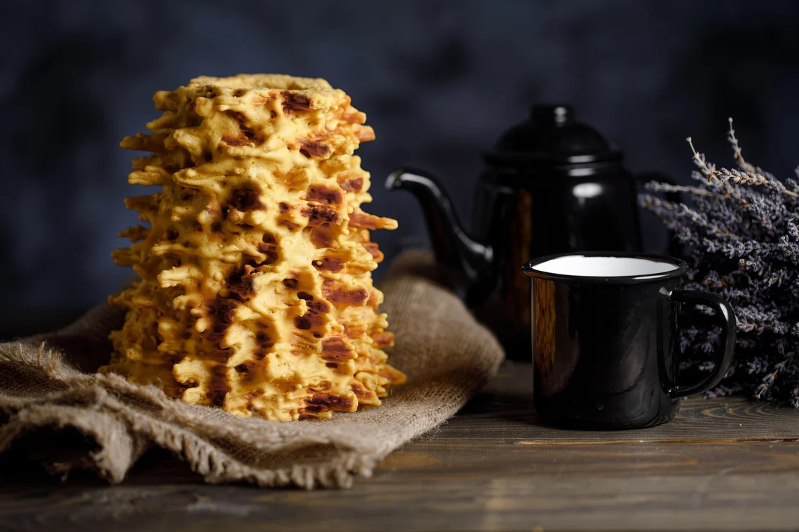

# Šakotis

*The Lithuanian "tree cake": a spit-roasted cake of egg-rich batter built up in layers around a rotating spit, baked into a tall pale-gold tower with jagged branch-like spikes, the centrepiece of every wedding table.*

**Serves:** 1 large cake (about 30 portions)

**Prep Time:** 30 minutes

**Cook Time:** 1 hour 30 minutes (over open heat or oven)

## Overview
Šakotis is the most spectacular cake in Lithuanian baking, a tall hollow tower of buttery egg-cake whose surface bristles with jagged spikes that resemble the branches of a pine tree (the name means "branched" in Lithuanian). The traditional method, still used at festival bakeries, is breathtaking: a wooden spit covered in baking paper is set turning slowly over an open flame, and a ladleful of rich batter is poured across the rotating spit; the heat sets it instantly into a thin shell, the next ladle is poured on top, and so on for an hour and a half until thirty or forty layers have built up into a foot-tall cake with dripping pointed branches. Sliced thin and stacked on a dish, šakotis appears at every Lithuanian wedding and Easter table, dry enough to keep for weeks, sweet enough to please children, dignified enough for any feast. The home version uses an oven and a wooden dowel turned by hand, less dramatic but still possible.

## Ingredients

- 12 large eggs, separated
- 400 g unsalted butter, very soft
- 350 g caster sugar
- 350 g plain flour, sifted
- 200 ml double cream
- 100 ml dry white wine or brandy
- 1 tbsp vanilla extract
- 1 tsp baking powder
- 1/4 tsp salt
- Icing sugar, to dust

## Method

### Stage 1 - Cream butter and yolks
1. Beat the soft butter with 200 g of the caster sugar in a stand mixer 8 minutes until very pale and fluffy.
2. Add the egg yolks one at a time, beating well between each.
3. Beat in the vanilla and the brandy or wine.

### Stage 2 - Whip the whites
1. In a separate scrupulously clean bowl, whisk the egg whites with a pinch of salt to soft peaks.
2. Add the remaining 150 g sugar a spoon at a time; whisk to stiff glossy peaks.

### Stage 3 - Combine
1. Sift the flour and baking powder together.
2. Fold the cream into the yolk mixture.
3. Fold in the flour in three additions; do not overmix.
4. Fold in the whipped whites in three additions; keep the batter light.

### Stage 4 - Set up the spit (home version)
1. Heat the oven to 200°C.
2. Wrap a clean wooden rolling pin or 4 cm wooden dowel in heavy-duty baking paper, taped at both ends.
3. Suspend it across a deep roasting tray, ends resting on the tray edges.
4. Place a sheet of foil under to catch drips.

### Stage 5 - Build the layers
1. Spoon a thin ladleful of batter across the top of the suspended dowel; let it run down the sides naturally, this creates the branches.
2. Slide the tray into the oven; bake 5-6 minutes until set and turning pale gold.
3. Pull out; rotate the dowel a quarter turn.
4. Add another thin layer of batter, letting it drip into points.
5. Bake another 5-6 minutes.
6. Repeat the rotate-ladle-bake cycle until all the batter is used (about 12-15 layers); the cake builds up gradually into its branched shape.

### Stage 6 - Cool and remove
1. Once the final layer is golden, let the šakotis cool on the dowel.
2. When fully cool, slide the cake off the dowel; carefully peel away the baking paper.
3. The interior is hollow; the exterior bristles with branches.

### Stage 7 - Dust and serve
1. Set the cake upright on a serving plate.
2. Dust heavily with icing sugar.
3. Slice in rounds 1 cm thick to serve.

## Notes
- **Thin layers:** each ladle must be just enough to coat, not pool. Thick layers go heavy and steamy inside.
- **Constant rotation:** between every layer, turn the dowel; this is what builds the spike-and-branch surface.
- **Patience pays:** the whole bake is 90 minutes minimum. Rushing produces a brick.
- **Real spit version:** for the authentic article, a turning rotisserie over flame is unmatched but home ovens give a credible result.

## Variations
**Festive icing:** drizzle with white chocolate or a glacé icing for celebrations.
**With saffron:** add a pinch of saffron infused in 1 tablespoon hot water to the batter for a deep gold colour.
**Mini šakotis:** bake the batter as a flat sheet in a Swiss-roll tin, cut and stack the strips for a layered cube version.
**With nuts:** scatter chopped almonds across each layer before baking.
**With brandy syrup:** brush the finished cake with a light brandy syrup for moisture.

## Serving
Serve as a wedding centrepiece · at Easter · at Christmas · sliced thin alongside coffee · with a glass of midus or krupnikas · kept whole on the table for decoration before slicing.

## Storage
- Keeps 3 weeks in a tin at room temperature, the dryness is the point.
- Wrap loosely; tight wrap traps moisture and the cake goes soft.
- Freezes for 3 months in slices, sealed.
- Stale šakotis is wonderful crumbled into trifle or soaked in warm milk.

