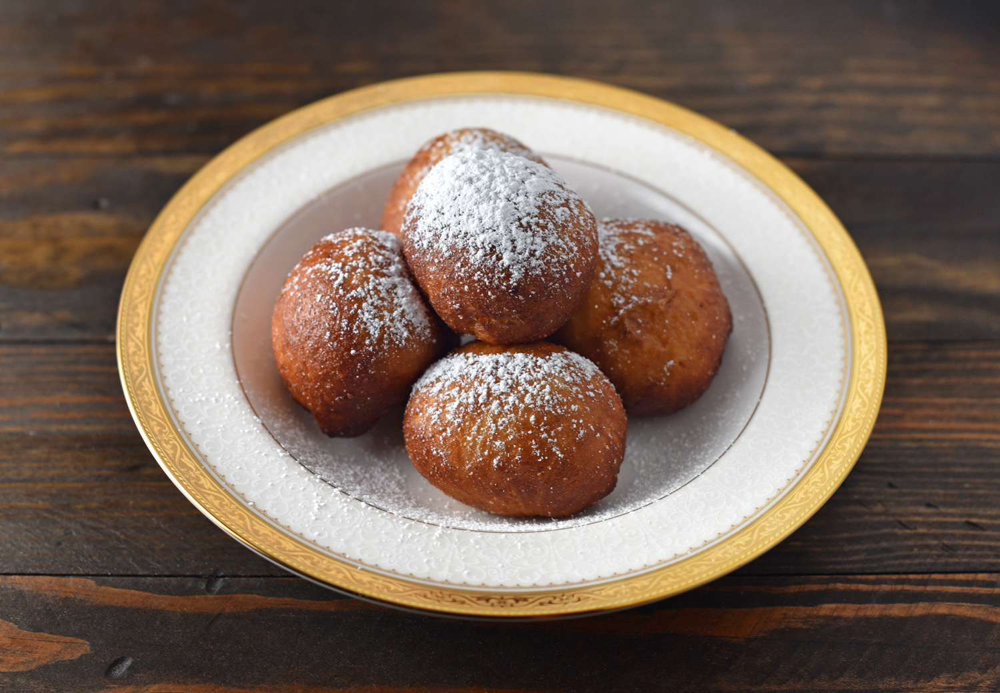

# Spurgos

*Lithuanian doughnuts: yeasted soft dough rounds filled with thick fruit jam, fried until golden, rolled in icing sugar, served warm by the heap at every village festival.*

**Serves:** Makes 16 doughnuts

**Prep Time:** 30 minutes (plus 2 hours rising)

**Cook Time:** 25 minutes

## Overview
Spurgos are the Lithuanian doughnut, sister to the Polish pączki and the German Berliner but with their own character, a lighter, more egg-rich dough, a slightly tangier jam filling (often plum or rose-hip), and the heaviest possible coating of icing sugar. They appear by the tray at Užgavėnės (the pre-Lent Mardi-Gras festival), at summer fairs, at every name-day breakfast where a treat is called for. The yeasted dough is enriched with butter, milk, egg yolks and a small splash of sour cream that gives it a soft pillowy crumb that stays tender for a day or two. Each ball is filled with a teaspoon of jam, sealed carefully, proved a second time, then fried in deep oil until they bob up dark gold. Rolled in icing sugar while still warm, they vanish standing in the kitchen, sticky-fingered, before they have cooled.

## Ingredients

### For the dough
- 500 g plain flour
- 70 g caster sugar
- 7 g instant dried yeast (1 sachet)
- 1/2 tsp salt
- 250 ml whole milk, warmed to body temperature
- 4 egg yolks
- 3 tbsp sour cream
- 80 g butter, melted and cooled
- 1 tbsp vanilla extract
- Zest of 1 lemon

### For filling and finishing
- 250 g thick plum or rose-hip jam (or apricot)
- 1.5 litres sunflower oil, for frying
- 200 g icing sugar, for dusting

## Method

### Stage 1 - Make the dough
1. Combine the flour, sugar, yeast and salt in a large bowl.
2. Whisk together the warm milk, egg yolks, sour cream, melted butter, vanilla and lemon zest.
3. Pour the wet into the dry; mix to a sticky dough.
4. Turn onto a lightly floured surface; knead 10 minutes until smooth and elastic (or 6 minutes in a stand mixer with dough hook).

### Stage 2 - First rise
1. Place the dough in an oiled bowl; cover.
2. Let rise in a warm spot 1 hour 30 minutes until doubled.

### Stage 3 - Shape and fill
1. Turn the dough onto a floured surface; press gently to deflate.
2. Divide into 16 equal pieces (about 60 g each).
3. Flatten each piece on your palm to a 7-8 cm disc.
4. Place a heaped teaspoon of jam in the centre.
5. Pinch the dough up around the jam; seal completely; roll between palms into a smooth ball.
6. Place sealed-side down on a floured tray.

### Stage 4 - Second rise
1. Cover the tray loosely with a cloth.
2. Let rise 30-45 minutes until puffy and lightly springy to the touch.

### Stage 5 - Fry
1. Heat the oil in a deep pan to 170°C (medium heat; a small piece of dough should bob and sizzle steadily).
2. Lower 3-4 doughnuts into the oil with a slotted spoon; do not crowd.
3. Fry 2-3 minutes per side until deep golden brown.
4. Lift out; drain on kitchen paper.
5. Repeat for the remaining batches.

### Stage 6 - Roll in icing sugar
1. While still warm but not hot, roll each doughnut in icing sugar.
2. Pile on a plate; the sugar will partly absorb into the warm crust, dust again before serving.

## Notes
- **Seal carefully:** any unsealed edge bursts in the oil and leaks jam. Pinch firmly.
- **170°C, not hotter:** too hot and the outside burns before the dough sets. Use a thermometer if you can.
- **Don't crowd:** the oil temperature drops with each addition; fry 3-4 at a time.
- **Dust warm, dust again:** the first dusting melts in; the second sits on top.

## Variations
**Custard-filled:** swap the jam for thick vanilla custard, the modern bakery version.
**Apple filling:** stewed apple cubes with cinnamon.
**Sweet curd filling:** 200 g sweetened curd cheese with raisins.
**Plain (no filling):** ring-shaped or solid balls, rolled in cinnamon sugar.
**Rose-hip jam:** the most Lithuanian of all the fillings; rosehip is the country's most beloved preserve fruit.

## Serving
Serve warm · piled on a plate dusted with icing sugar · at Užgavėnės · at name-day breakfasts · with strong coffee · with a glass of cold milk · at children's parties.

## Storage
- Best on the day; the texture stiffens by the second day.
- Day-old spurgos refresh in a 160°C oven for 4 minutes, re-dust with icing sugar.
- Freeze unfilled fried doughnuts up to 1 month; thaw, slit, and pipe jam in.
- Don't refrigerate, they go stale fast.
