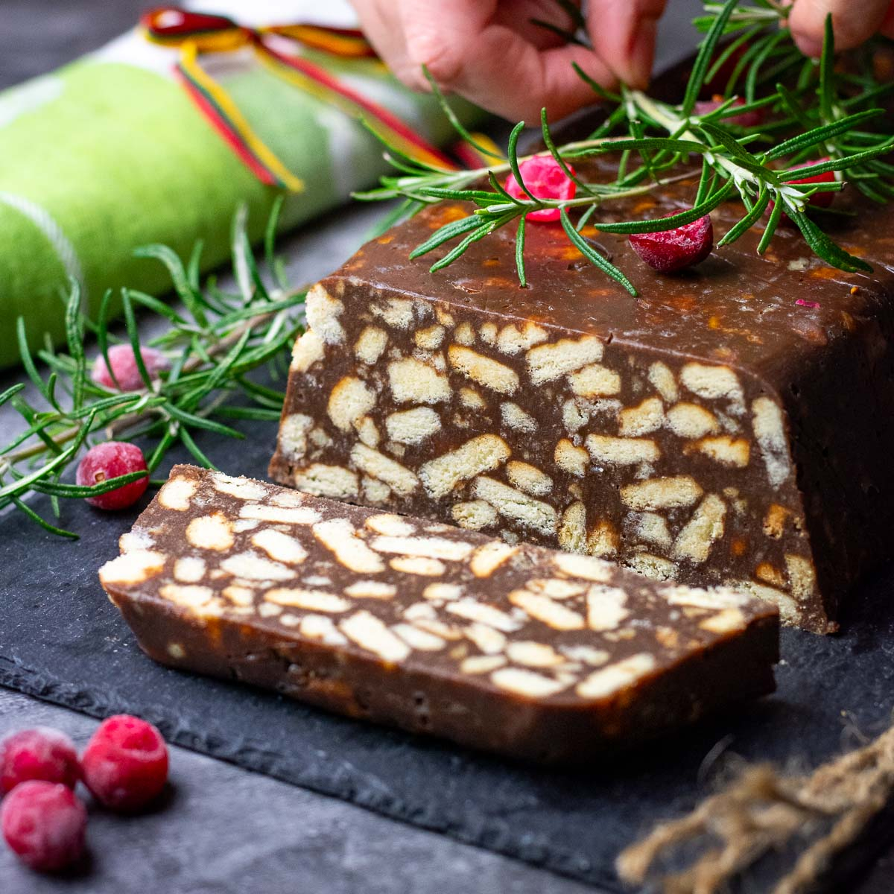

# Tinginys

*The famous Lithuanian "lazy cake": broken plain biscuits folded into a hot cocoa-butter-and-condensed-milk mixture, rolled into a log, chilled, and sliced to reveal a chocolate-tiled interior.*

**Serves:** 16 slices

**Prep Time:** 15 minutes

**Cook Time:** 5 minutes (plus 4 hours chilling)

## Overview
Tinginys (literally "lazy person" in Lithuanian) is the most beloved no-bake sweet in the country, the recipe that every Lithuanian child learns first, the dessert at every birthday party, every school bake sale, every late-night kitchen experiment. The recipe is almost too simple to be a recipe: melt butter with sweetened condensed milk and cocoa, stir in broken plain biscuits, tip onto a sheet of cling film, roll into a fat sausage, chill four hours, slice. The cross-section is the trick: pale biscuit chunks set into a dark chocolate matrix, the pattern looking like polished terrazzo. Slightly chewy, deeply chocolaty, sweet without being sickly, tinginys is impossible to ruin and entirely addictive. Every family adds something different: cherries, raisins, walnuts, marshmallows, but the base of biscuit-butter-condensed-milk-cocoa is set in stone. Serve cold straight from the fridge with coffee or tea.

## Ingredients

- 400 g plain dry biscuits (Maria, Rich Tea, digestives or shortbread)
- 200 g unsalted butter
- 1 tin (397 g) sweetened condensed milk
- 4 tbsp good cocoa powder (Dutch-process)
- 1 tsp vanilla extract
- Pinch salt
- Optional: 100 g chopped walnuts, dried cherries or chopped marshmallows

## Method

### Stage 1 - Break the biscuits
1. Place the biscuits in a large bowl.
2. Break them by hand into rough 1-2 cm chunks; do not crush to crumbs.
3. The varied chunk sizes are what give the cross-section its mosaic look.

### Stage 2 - Make the chocolate mixture
1. Melt the butter in a heavy saucepan over low heat.
2. Add the condensed milk; whisk together until smooth.
3. Sift in the cocoa powder; whisk to a glossy mixture.
4. Add the vanilla and salt.
5. Cook another 1 minute, stirring; do not let it boil. Remove from heat.

### Stage 3 - Combine
1. Pour the warm chocolate mixture over the biscuit chunks.
2. Add the walnuts, cherries or marshmallows if using.
3. Fold gently with a spatula; every chunk should get a coat.
4. Work fast; the mixture sets as it cools.

### Stage 4 - Shape into a log
1. Lay a large sheet of cling film on the counter (about 50 cm).
2. Tip the mixture along the centre of the cling film in a long ridge.
3. Use the cling film to roll into a tight log about 5-6 cm thick.
4. Twist the ends like a sweet-wrapper to compress.
5. Smooth the log with your hands.

### Stage 5 - Chill
1. Place the log on a tray (in case of leaks).
2. Refrigerate at least 4 hours, ideally overnight.
3. The log firms into a sliceable solid.

### Stage 6 - Slice and serve
1. Unwrap the chilled log.
2. Slice into 1.5 cm rounds with a sharp knife.
3. Arrange on a plate; serve cold.

## Notes
- **Don't crush to crumbs:** the visible biscuit chunks are the whole appearance. Break by hand, not in a processor.
- **Work warm, eat cold:** the butter-condensed-milk mix is liquid when warm and firm when cold; the trick is to shape before it sets.
- **Use plain biscuits:** chocolate digestives, cream-filled or coated biscuits muddy the look and overload the sweetness.
- **Sharp knife, slow cut:** the chunks resist; press straight down rather than sawing.

## Variations
**With nuts:** 100 g chopped walnuts, almonds or hazelnuts folded through.
**With dried cherries:** 100 g dried cherries soaked 10 minutes in hot water, drained, folded through.
**With marshmallows:** 100 g chopped small marshmallows, the children's-party version.
**With raisins and rum:** 80 g raisins soaked in 2 tablespoons rum, folded through; adult-only.
**Two-tone log:** make half the mixture without cocoa, layer in alternating spoons before rolling.

## Serving
Serve cold · with coffee · at a children's birthday · at a tea table · cut into rounds and displayed on a plain plate to show the cross-section · alongside a glass of cold milk.

## Storage
- Keeps 2 weeks refrigerated in cling film, the texture only improves.
- Freezes 2 months whole or in slices; thaw 30 minutes before serving.
- Eat cold straight from the fridge, the texture goes soft at room temperature.
