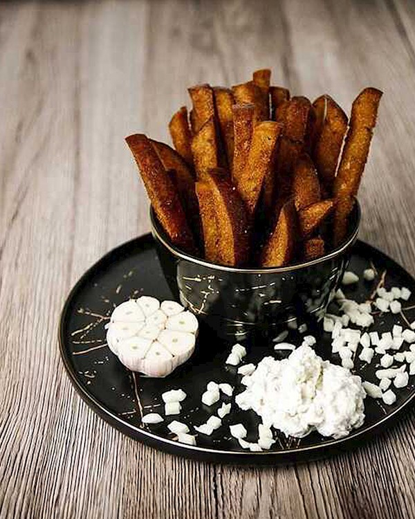

# Kepta Duona

*The famous Lithuanian beer-bar starter: sticks of dark rye bread fried in oil until shatteringly crisp, rubbed with raw garlic, salted hard, and served by the heaped plateful with a bowl of garlic-cheese dip.*

**Serves:** 4 as a meal portion (or 6-8 as a starter)

**Prep Time:** 10 minutes

**Cook Time:** 15 minutes

## Overview
Kepta duona is the most addictive bar food in Lithuania, and the reason no one ever orders just one beer. Thick batons of dense dark rye are deep-fried (or shallow-fried in good oil) until the outside shatters to a near-glass crunch, then rubbed all over with raw garlic the moment they leave the pan, hot bread acting as a microplane for the garlic. A heavy pinch of flake salt finishes them. The dip is a no-recipe affair: grated hard cheese, a spoon of mayonnaise, more raw garlic, a dab of sour cream, mixed and slathered. Eat as a meal portion with a big plate and a tall glass of dark unfiltered beer; nothing else is needed. The salt-garlic-rye-fat combination is one of those small national triumphs that translates badly on paper and perfectly at the table. Use real Lithuanian-style dark rye if you can find it, the dish stands or falls on the bread.

## Ingredients

### For the bread
- 500 g dense dark rye bread (Lithuanian, Russian or German-style sourdough), 1-2 days old
- 500 ml sunflower oil (for deep frying) OR 8 tbsp oil for shallow frying
- 4 large garlic cloves, peeled and halved
- 2 tsp flake salt

### For the dip
- 150 g hard mature cheese (Cheddar, Gouda or aged Lithuanian Džiugas), finely grated
- 3 tbsp mayonnaise
- 2 tbsp sour cream
- 2 garlic cloves, grated
- 1 tbsp chopped fresh dill
- Pinch black pepper

## Method

### Stage 1 - Cut the bread
1. Slice the rye bread 1.5 cm thick, then cut each slice into batons 1.5 cm wide and 8 cm long.
2. Day-old bread is firmer and fries crisper than fresh; if very fresh, lay the batons on a tray and air-dry 30 minutes.

### Stage 2 - Make the dip
1. Combine the grated cheese, mayonnaise, sour cream, grated garlic, dill and pepper in a bowl.
2. Mix until thick and spreadable; chill while you fry.

### Stage 3 - Fry the bread
1. Heat the oil in a wide deep pan to 180°C (or until a small piece of bread sizzles vigorously on contact).
2. Fry the rye batons in batches, 60-90 seconds per side, until very dark and shatteringly crisp.
3. Don't crowd the pan; the temperature drops and the bread goes greasy.
4. Lift out with a slotted spoon; drain on kitchen paper.

### Stage 4 - Garlic and salt
1. While the batons are still hot from the pan, rub each one all over with a halved garlic clove (the heat melts the garlic into the surface).
2. Use one clove for every 6-8 batons.
3. Scatter generously with flake salt.

### Stage 5 - Serve
1. Pile the hot kepta duona on a board.
2. Place the dip bowl in the middle.
3. Eat at once with cold beer.

## Notes
- **Real dark rye:** the dish only works with dense fermented sourdough rye. White bread, sandwich bread or light rye won't crisp the same way.
- **Garlic while hot:** rubbing cooled bread does not work, the hot crust is what melts the garlic in.
- **Fry hot and fast:** at 180°C the batons crisp before they soak up oil. Too cool and they turn greasy.
- **Salt is mandatory:** flake salt right out of the pan, not before. Saltless kepta duona is not kepta duona.

## Variations
**With cumin or caraway:** sprinkle ground caraway with the salt, the strong rye partner.
**With smoked paprika:** dust over after salting for a smokier note.
**With horseradish dip:** replace half the garlic in the dip with 1 tablespoon of grated fresh horseradish.
**Oven version:** toss the batons in 6 tablespoons oil, spread on a tray, bake at 220°C 12-15 minutes, less crisp but lighter.
**Pickled-cucumber dip:** swap dill for chopped gherkin and a splash of pickle brine.

## Serving
Serve hot as a beer-bar starter · as a meal-size pile with cold beer · with garlic-cheese dip · at a games-night plate · with sour cream alongside · the classic Vilnius pub plate.

## Storage
- Best straight from the pan; the crispness fades within an hour.
- Leftovers reheat in a hot dry pan or 200°C oven for 5 minutes to refresh.
- The dip keeps 3 days refrigerated.
