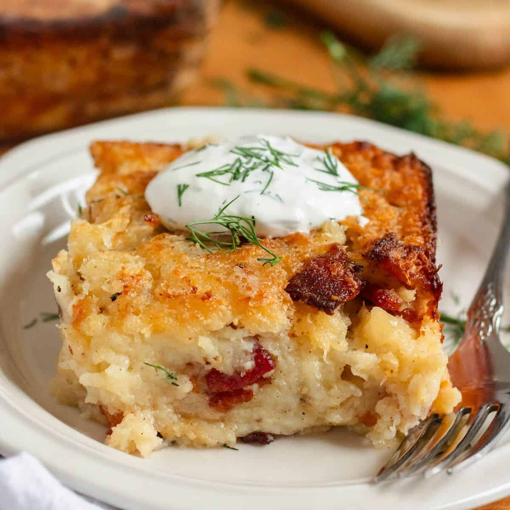

# Kugelis

*Lithuania's baked potato pudding: grated raw potato bound with bacon, onion, eggs and milk, baked until the top is dark crisp and the inside is silky, served in thick squares with sour cream.*

**Serves:** 6

**Prep Time:** 25 minutes

**Cook Time:** 1 hour 15 minutes

## Overview
Kugelis (the Lithuanian cousin of the Polish kugel and Jewish kugel) is the country's most beloved baked potato dish, a slab of grated potato lightened with eggs and milk, enriched with bacon fat and chopped onion, then baked slow and deep in a heavy roasting dish until the surface goes mahogany and the centre sets into something silky between a pudding and a gratin. The bacon flavour runs all the way through, the onion sweetness balances the starch, and a thick spoon of cold sour cream on top sends it home. Every Lithuanian family has its own version, some add carrot, some add a splash of cream, some swear by using only Maris Piper, but the architecture is always the same: grated raw potato, salty pork, dairy, eggs, slow oven. Cut into thick squares, kugelis eats well hot from the oven, lukewarm, or cold from the fridge the next morning.

## Ingredients

- 2 kg starchy potatoes (Maris Piper or similar), peeled
- 250 g smoked streaky bacon, finely chopped
- 2 large onions, finely chopped
- 4 large eggs
- 250 ml whole milk (warm)
- 2 tsp salt
- 1 tsp black pepper
- 1/2 tsp ground caraway (optional, traditional)
- 1 tbsp semolina or fine breadcrumbs (helps bind)
- 300 ml sour cream, to serve

## Method

### Stage 1 - Render the bacon and cook the onion
1. Heat a large frying pan over medium heat.
2. Add the chopped bacon; fry 6-8 minutes until the fat runs and the bacon crisps.
3. Add the chopped onion; cook 8 minutes until soft and golden.
4. Tip pan contents (bacon, onion and all the fat) into a large mixing bowl. Cool slightly.

### Stage 2 - Grate the potatoes
1. Grate the peeled potatoes finely (the fine side of a box grater, or a food processor).
2. Tip into a colander set over a bowl; press lightly to drain off some liquid.
3. Don't squeeze bone-dry, you want some moisture for tenderness.
4. Discard about half the drained liquid; the white starch at the bottom is good, keep it.

### Stage 3 - Mix the batter
1. Whisk the eggs in another bowl with the warm milk, salt, pepper and caraway.
2. Tip the grated potato (and the reserved starch) into the bacon bowl.
3. Pour the egg-milk mixture in; add the semolina.
4. Mix thoroughly, the texture is a thick wet batter.

### Stage 4 - Bake
1. Heat the oven to 200°C.
2. Grease a 25 x 30 cm baking dish well with a little bacon fat or butter.
3. Pour the kugelis batter in; level the top.
4. Bake for 1 hour 15 minutes until the top is dark golden brown and a knife slides cleanly out of the centre.
5. The colour wants to be deep, not pale. Don't pull it early.

### Stage 5 - Rest and serve
1. Let the kugelis rest 10 minutes before cutting.
2. Cut into thick squares.
3. Serve hot with a generous spoon of cold sour cream on top.
4. The hot-cold contrast is the whole point.

## Notes
- **Grate fine, drain light:** the right texture lives between gratin and pudding. Too dry equals brick; too wet equals soup.
- **Bacon fat is the soul:** don't skim it off after frying. The whole rendered fat goes into the mix.
- **Bake deep:** a deep dish gives the soft inside, a shallow dish gives more crust. Pick your side.
- **Eat warm with sour cream:** the cold dairy against the hot potato is the traditional pairing, not optional.

## Variations
**Mushroom kugelis:** add 200 g sautéed dried-mushroom-soaked porcini, a forest-region version.
**Carrot kugelis:** add 1 grated carrot for sweetness and colour.
**Vegetarian:** skip the bacon, use 4 tbsp butter and an extra onion; add 1 tsp smoked paprika for the smoke note.
**With cracklings on top:** scatter fried pork crackling over the surface in the last 15 minutes.
**Heavy-cream version:** swap the milk for double cream for a richer set.

## Serving
Serve hot from the oven · with cold sour cream alongside · with mushroom sauce poured over · with a fresh cucumber salad · as a Sunday lunch · cold the next morning straight from the fridge.

## Storage
- Keeps 4 days refrigerated.
- Reheat slices in a dry pan until the cut sides crisp.
- Freezes well in portions for 2 months; thaw and reheat in the oven.
- Cold leftover kugelis is a beloved breakfast.
