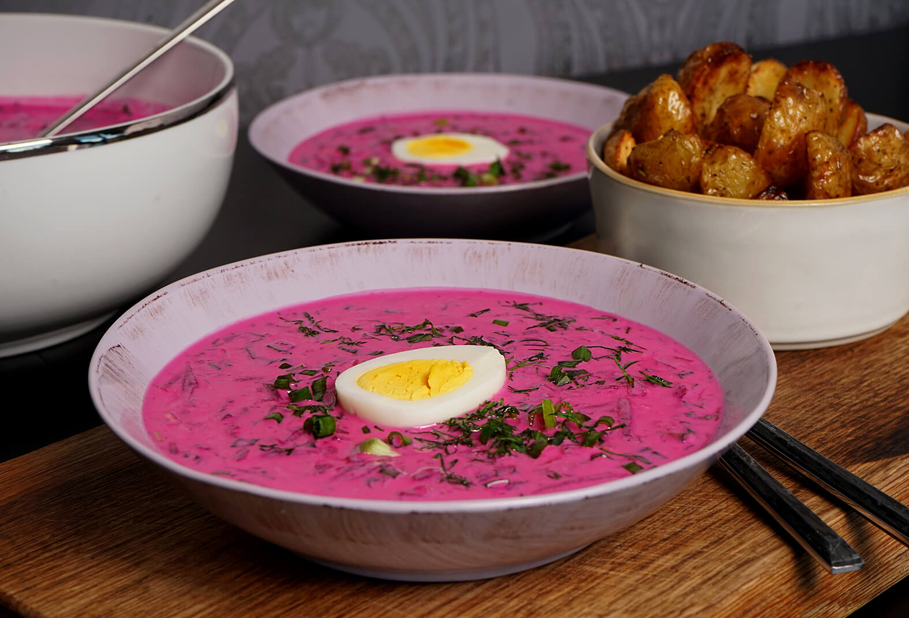

# Šaltibarščiai

*The famous bright-pink cold beet soup of Lithuanian summers: kefir, grated boiled beets, cucumber, hard-boiled egg and dill, ladled over ice and served with hot boiled potatoes on the side.*

**Serves:** 4

**Prep Time:** 20 minutes (plus beet cooking)

**Cook Time:** 10 minutes (for potatoes)

## Overview
Šaltibarščiai is the Lithuanian sound of summer: a fluorescent-pink cold soup of kefir and grated beets that arrives on every café table from May to September. The colour shocks first-timers, the beets stain the kefir into something close to electric magenta, but the flavour is gentle and refreshing, sour from the kefir, sweet from the beets, herbal from a small mountain of fresh dill. Crunch comes from finely diced cucumber and chopped hard-boiled egg, with a few sliced spring onions for sharpness. The soup is always served cold, often with an ice cube, and always alongside a plate of hot boiled new potatoes dressed simply with butter and dill. The hot-cold contrast is the trick: a spoon of icy soup, a forkful of steaming buttery potato, repeat. Nothing else tastes like a Lithuanian July.

## Ingredients

### For the soup
- 1 litre kefir (full-fat, well shaken)
- 200 ml cold water (or buttermilk for a richer version)
- 400 g cooked beets (boiled or roasted, peeled), coarsely grated
- 1 large cucumber, finely diced
- 4 hard-boiled eggs, peeled
- 4 spring onions, thinly sliced
- 1 large handful fresh dill, chopped
- 1 tbsp lemon juice or white-wine vinegar
- 1 tsp salt
- 1/2 tsp white pepper
- Ice cubes, to serve

### For the side
- 600 g small new potatoes, scrubbed
- 1 tsp salt
- 30 g butter
- 2 tbsp chopped dill

## Method

### Stage 1 - Boil the potatoes
1. Place the potatoes in a pot of cold salted water.
2. Bring to a boil and cook 15-20 minutes until tender to a knife tip.
3. Drain; toss with the butter and chopped dill.
4. Keep warm.

### Stage 2 - Mix the soup base
1. In a large bowl, whisk the kefir with the cold water until smooth.
2. Add the lemon juice, salt and white pepper; whisk again.

### Stage 3 - Add the vegetables
1. Stir in the grated beets; the soup turns bright pink immediately.
2. Add the diced cucumber and sliced spring onions.
3. Chop 2 of the hard-boiled eggs and stir in; reserve the other 2 for garnish.
4. Stir through most of the chopped dill, save a handful for the top.

### Stage 4 - Chill
1. Refrigerate at least 30 minutes; the flavour deepens as it sits.
2. The soup should be very cold when served.

### Stage 5 - Serve
1. Ladle into bowls; add an ice cube to each.
2. Halve the reserved eggs; place half an egg in each bowl.
3. Scatter with the reserved dill.
4. Serve at once with the hot buttery potatoes on a separate plate.

## Notes
- **Use real kefir:** thin live-culture kefir is the right base. Buttermilk is the nearest substitute; thinned plain yoghurt also works.
- **Beets must be cool:** if the beets are warm they curdle the kefir. Always cool them fully before mixing.
- **Hot potatoes on the side:** the temperature contrast is the dish, do not skip the steaming potato plate.
- **Acid balance:** kefir varies in sourness. Taste and add lemon juice gradually.

## Variations
- **With smoked fish:** add 100 g flaked smoked trout or mackerel on top, a lake-region twist.
- **Radish version:** add 100 g finely diced pink radish for extra crunch.
- **Vegan šaltibarščiai:** swap kefir for unsweetened almond or cashew yoghurt thinned with water and lemon.
- **With raw grated beet:** half raw, half cooked, gives more bite and a deeper pink.
- **Without potatoes:** serve with rye bread instead, the urban quick lunch version.

## Serving
- Serve as a summer lunch · with hot buttered potatoes alongside · in a glass bowl to show the colour · at outdoor tables on hot days · alongside dark rye bread · cold beer (an unfiltered lager) cuts the kefir beautifully.

## Storage
- Best within a day, the kefir keeps fermenting and grows sourer.
- Refrigerate up to 2 days; whisk again before serving.
- Don't freeze, the kefir splits.

