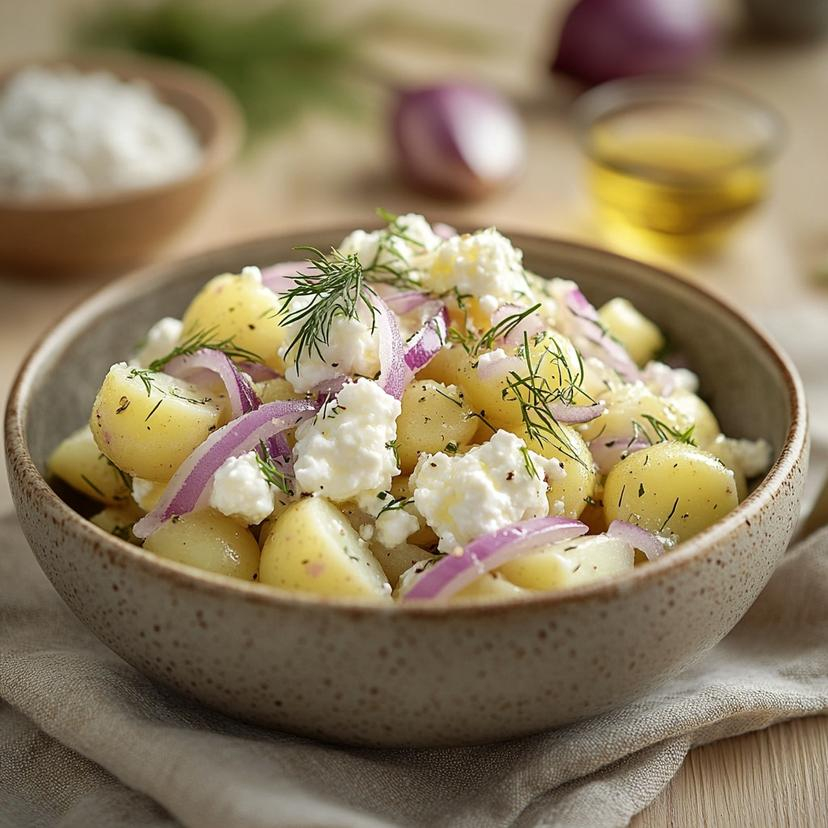

# Bulvių Salotos

*The traditional Lithuanian potato salad: cubed boiled potato folded with chopped gherkin, hard-boiled egg, dill and a creamy mayonnaise-and-sour-cream dressing, the centrepiece of every celebration table.*

**Serves:** 6

**Prep Time:** 25 minutes

**Cook Time:** 20 minutes

## Overview
Bulvių salotos is the Lithuanian potato salad that turns up at every wedding, christening, name-day and Christmas Eve table, almost always made the day before and improved by an overnight rest in the fridge. The architecture is steadfast: well-boiled waxy potatoes diced small, plenty of chopped dill pickles for sour crunch, hard-boiled eggs for richness, a small grated onion for bite, and a dressing that is half mayonnaise, half sour cream so it stays lighter than the heavy Western potato-salad you might know. Some versions add green peas, some add diced ham, some add a little mustard, all are valid. The dish is the textural opposite of cepelinai (chunky, fresh, sharp) and balances any rich main course on the plate. Serve cold from the fridge in a deep bowl with a scattering of dill across the top.

## Ingredients

- 800 g waxy potatoes (Charlotte, Anya or similar)
- 4 hard-boiled eggs, peeled
- 200 g dill pickles (gherkins), finely diced
- 1 small onion, finely chopped
- 100 g cooked peas (optional, traditional)
- 1 small carrot, boiled and finely diced (optional, traditional)
- 1 large handful fresh dill, chopped
- 3 tbsp chopped chives
- 4 tbsp mayonnaise
- 4 tbsp sour cream
- 1 tsp Dijon mustard
- 1 tsp white-wine vinegar
- 1 tsp salt
- 1/2 tsp black pepper

## Method

### Stage 1 - Boil the potatoes
1. Scrub the potatoes; boil whole in salted water 15-20 minutes until just tender to a knife tip.
2. Drain; cool fully (uncovered).
3. Peel (the skins slip off easily once cool) and dice into 1 cm cubes.

### Stage 2 - Soften the onion
1. Place the chopped onion in a small bowl.
2. Pour over the vinegar; let stand 5 minutes (this knocks out the raw bite).
3. Drain.

### Stage 3 - Mix the dressing
1. Whisk the mayonnaise, sour cream, mustard, salt and pepper in a small bowl.
2. Taste; adjust seasoning.

### Stage 4 - Combine
1. Tip the diced potato into a large bowl.
2. Add the diced gherkins, drained onion, peas and carrot (if using), most of the dill and chives.
3. Chop 3 of the hard-boiled eggs and add; reserve the last egg for garnish.
4. Pour the dressing over; fold gently with a spatula to coat without mashing the potato.

### Stage 5 - Rest and serve
1. Cover and refrigerate at least 2 hours, ideally overnight; the flavours marry.
2. Slice the reserved egg into rounds.
3. Transfer the salad to a serving bowl; arrange the egg slices on top.
4. Scatter with the reserved dill and chives.

## Notes
- **Waxy potatoes only:** floury potatoes break down into mush. Charlotte, Anya or similar hold their shape.
- **Cool the potato fully before dressing:** warm potato thins the dressing and turns the salad sloppy.
- **Overnight rest:** this salad genuinely improves after 12 hours in the fridge.
- **Half mayonnaise half sour cream:** the Lithuanian touch, never all mayo.

## Variations
- **With ham:** add 150 g diced cooked ham or smoked bologna for a meatier celebration plate.
- **With apple:** add 1 diced tart apple, the autumn version.
- **With herring:** add 100 g diced pickled herring fillets for a Baltic-coast twist.
- **With horseradish:** add 1 tbsp grated fresh horseradish to the dressing for sharpness.
- **Spring version:** add 6 chopped radishes and skip the carrot, fresher and lighter.

## Serving
- Serve cold · as a centrepiece for Christmas Eve · alongside roast pork · with smoked herring · at a christening or name-day table · with rye bread and butter.

## Storage
- Keeps 3 days refrigerated, the flavour deepens.
- Don't freeze, the mayonnaise splits and the potato turns grainy.
- Stir gently before serving leftovers.

