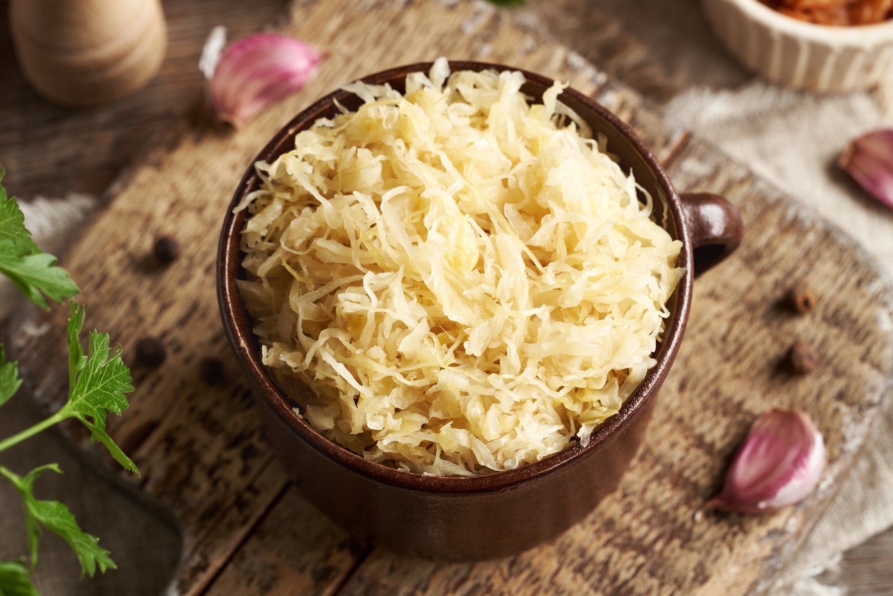

# Rūgštus Kopūstas

*Lithuanian sauerkraut: white cabbage shredded with salt, caraway and grated carrot, then left to ferment slowly in a stone crock for several weeks until it turns golden, sour and softly crunchy.*

**Serves:** Makes about 2 kg (20 side portions)

**Prep Time:** 40 minutes

**Cook Time:** None (3-4 weeks fermentation)

## Overview
Rūgštus kopūstas is the cornerstone of the Lithuanian winter pantry, a vat of properly-fermented sauerkraut put down in late autumn and pulled out right through to spring, alongside cepelinai, vedarai, sausages and roast pork. The Lithuanian version differs from German sauerkraut in three small but defining ways: caraway seeds (not always present in German versions), grated carrot for sweetness and colour, and a longer ferment that produces a softer, gentler-sour kraut, less mouth-puckering than its Bavarian cousin. The work is simple but the timing matters: cabbage is shredded fine, weighed, salted at precisely 2% of its weight, massaged hard until it weeps its own brine, then packed tight under a weight in a crock and forgotten for three to four weeks. The first week it bubbles vigorously; thereafter it slows and matures. The reward is a year's worth of crunchy gold-pink kraut.

## Ingredients

- 2 kg white cabbage (1 large head)
- 40 g coarse non-iodised salt (2% of the cabbage weight)
- 2 medium carrots (about 200 g), peeled and coarsely grated
- 2 tbsp caraway seeds
- 1 tbsp juniper berries (optional, traditional)
- 2 bay leaves (optional)

## Method

### Stage 1 - Prepare the cabbage
1. Remove the outer leaves; reserve 2-3 whole leaves for the top.
2. Quarter the cabbage; cut out the core.
3. Shred very finely (3-4 mm wide) with a sharp knife or mandoline.

### Stage 2 - Weigh and salt
1. Weigh the shredded cabbage and grated carrot together.
2. Calculate salt at exactly 2% of the total weight (for 2 kg of cabbage and carrot, that is 40 g salt).
3. Place everything in a very large bowl; scatter the salt, caraway and juniper across.

### Stage 3 - Massage
1. With clean hands, massage and squeeze the salted cabbage hard for 10-15 minutes.
2. The cabbage softens, shrinks visibly, and releases its own liquid (brine).
3. Keep going until you can squeeze a handful and see water running between your fingers.

### Stage 4 - Pack the crock
1. Transfer the cabbage and all its brine into a clean stone crock or wide jar.
2. Press down hard layer by layer with a clean fist or a wooden tamper to expel air.
3. Tuck the bay leaves in halfway through.
4. The brine should rise above the cabbage by 1 cm; if not, add a brine of 2% salted water to cover.

### Stage 5 - Weight and cover
1. Lay the reserved whole cabbage leaves flat on the surface, tucking under the brine.
2. Place a clean plate or wooden disc on top.
3. Weight it down with a clean scrubbed stone or a sealed bag of water; the cabbage must stay submerged.
4. Cover with a clean cloth, secured with string, to keep flies out but let gas escape.

### Stage 6 - Ferment
1. Stand the crock at 18-22°C for the first 3-4 days; bubbles rise steadily.
2. Skim any white surface scum daily, this is harmless yeast.
3. After day 4, move to a cool place (12-16°C, a cellar or unheated room).
4. Ferment 3-4 weeks total.
5. Taste from week 2: when sour, golden-pink and softly crunchy, it is ready.

### Stage 7 - Transfer and store
1. Pack the finished kraut into clean jars, pressing down to keep brine over.
2. Seal and refrigerate.
3. Use as needed.

## Notes
- **Salt at 2% exactly:** under-salting risks rot, over-salting halts the fermentation. Weigh carefully.
- **Keep it submerged:** any cabbage above the brine line turns slimy or moulds. Press down daily.
- **Skim the scum:** harmless yeasts form a white film. Skim and clean the edges every few days.
- **Cool slow:** the second-stage cool fermentation is what gives the Lithuanian softness. Hot ferments come out aggressive.

## Variations
- **With apple:** layer in a peeled sliced tart apple for a sweet edge, the Aukštaitija version.
- **With cranberry:** stir 100 g fresh cranberries through for autumn colour and tang.
- **With dill seeds:** swap caraway for dill seeds, a lighter herbal note.
- **Quick refrigerator version:** salt-massage the cabbage, pack into jars, refrigerate, eat after 5 days, less sour but quick.
- **Spiced:** add 1 tsp black peppercorns and 4 cloves to the crock.

## Serving
- Serve cold or warmed · alongside cepelinai · with roast pork · as part of a Christmas Eve plate · stewed with onion and bacon for a hot side · with rye bread and butter.

## Storage
- Refrigerated in brine, keeps 6 months.
- Always submerge any leftover kraut under its brine after taking some out.
- Can be canned in sterilised jars for longer storage.
- Freezes acceptably for 6 months, the crunch softens but the flavour holds.

