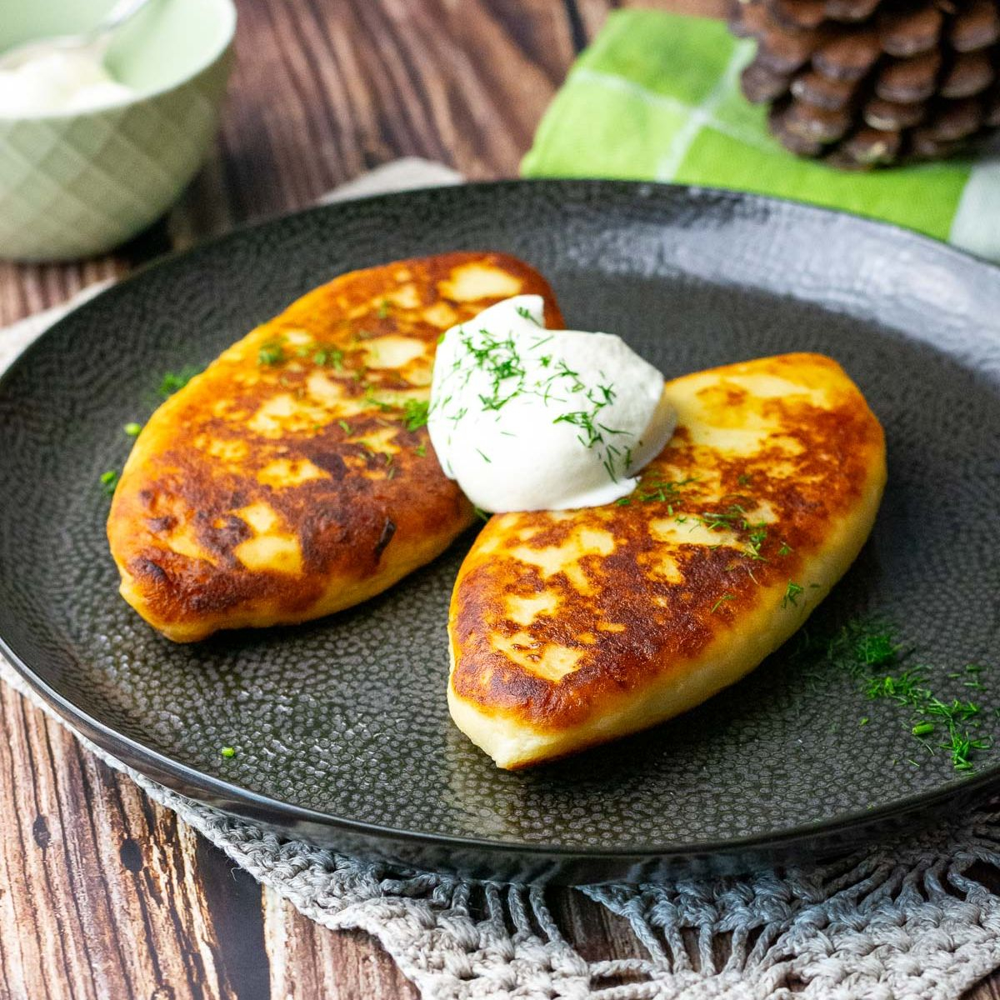

# Žemaitiški Blynai

*Savoury potato pancakes from the Žemaitija region of western Lithuania: a layer of mashed potato dough wrapped around a curd-cheese filling, pan-fried until golden on both sides, served with sour cream.*

**Serves:** 4 (8 pancakes)

**Prep Time:** 30 minutes

**Cook Time:** 25 minutes

## Overview
Žemaitiški blynai (Samogitian pancakes) come from the western Žemaitija region and are the country cousins of the more famous bulviniai blynai, larger, denser, and built around a hidden filling of fresh curd cheese. Here, the dough is not a batter but a pliable mash: boiled potatoes worked smooth with egg and flour into something close to a soft potato pasta, which is then flattened on the palm, filled with seasoned varškė (a fresh curd cheese close to dry-style cottage cheese or quark), pinched closed and shaped into thick ovals. The pancakes are pan-fried in butter until the outside crisps to gold and the curd warms inside. They sit somewhere between a pierogi, a krokiet and a thick potato pancake, properly hearty, properly Lithuanian, and properly served with cold sour cream and a scattering of chives. Old Žemaitija farmsteads also make a meat-filled version, but the curd is the everyday classic.

## Ingredients

### For the dough
- 1 kg starchy potatoes (Maris Piper or similar), peeled
- 1 tsp salt
- 1 large egg
- 80 g plain flour (plus extra for dusting)

### For the filling
- 300 g fresh curd cheese (varškė, quark or well-drained ricotta)
- 1 egg yolk
- 2 tbsp chopped dill
- 2 tbsp chopped chives
- 1/2 tsp salt
- 1/4 tsp white pepper

### For frying and serving
- 60 g butter
- 2 tbsp sunflower oil
- 300 ml sour cream
- 2 tbsp chopped chives

## Method

### Stage 1 - Boil the potatoes
1. Cube the peeled potatoes; boil in salted water 15-18 minutes until tender.
2. Drain very well; let steam dry 5 minutes.
3. Mash smooth (or pass through a ricer); cool 10 minutes.

### Stage 2 - Make the dough
1. Tip the cooled mash into a wide bowl; add the salt, egg and flour.
2. Mix to a soft pliable dough; if very sticky, add 1 more tablespoon flour.
3. Don't over-work; the dough should be soft but holdable.

### Stage 3 - Mix the filling
1. Combine the curd cheese, egg yolk, dill, chives, salt and pepper.
2. Mix well; the filling should be firm enough to scoop into a small ball.

### Stage 4 - Shape
1. Lightly flour the work surface.
2. Divide the dough into 8 equal pieces; flour your hands.
3. Flatten each piece on your palm into a 10-12 cm disc.
4. Place a heaped tablespoon of filling in the centre.
5. Fold the dough around to enclose; pinch closed firmly.
6. Shape into a smooth flat oval roughly 8 x 5 cm; smooth any cracks.

### Stage 5 - Fry
1. Heat half the butter and half the oil in a wide pan over medium heat.
2. Place 4 pancakes in the pan; fry 3-4 minutes per side until deep golden.
3. Reduce heat to medium-low if browning too fast; the inside needs time to warm.
4. Repeat with the remaining butter and oil for the second batch.

### Stage 6 - Serve
1. Lift onto a warm plate.
2. Top each pancake with a generous spoon of sour cream.
3. Scatter chopped chives over.
4. Eat hot.

## Notes
- **Drain the curd hard:** wet curd leaks during frying. Press it through muslin for 30 minutes first if very wet.
- **Hot fat, medium heat:** too hot and the outside burns before the filling warms.
- **Seal well:** any cracks let the filling escape into the pan. Pinch carefully.
- **The dough sticks:** keep your hands floured; work fast.

## Variations
- **Meat filling:** swap the curd for 250 g cooked seasoned minced pork mixed with sautéed onion.
- **Mushroom filling:** chopped sautéed wild mushrooms with onion and dill, the autumn version.
- **Sweet version:** add 1 tablespoon sugar and the zest of half a lemon to the curd; serve with jam, not sour cream.
- **With sauerkraut filling:** sautéed sauerkraut with caraway, a winter Žemaitija staple.
- **Berry-topped sweet pancakes:** sweet filling above, topped with warm lingonberry jam.

## Serving
- Serve hot · with cold sour cream · scattered with chives · alongside a green salad · two per plate is a side, three to four a meal · with a glass of buttermilk or kefir.

## Storage
- Best fresh from the pan.
- Cooked pancakes keep 2 days refrigerated; re-fry in butter to revive.
- Uncooked filled pancakes freeze well on a tray, then bagged; fry from frozen, adding 2 minutes per side.

