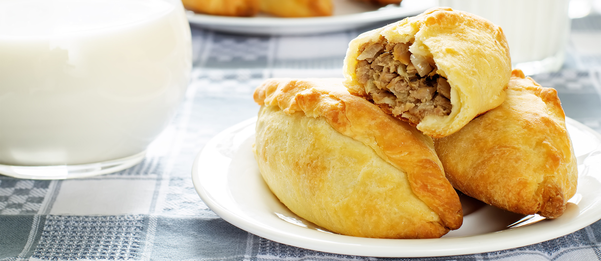

# Kibinai

*The Karaim-Lithuanian half-moon pastries of Trakai: tender sour-cream pastry wrapped around a juicy filling of seasoned lamb and onion, baked golden, served warm in two bites with a clear meat broth on the side.*

**Serves:** Makes 10 pastries

**Prep Time:** 1 hour (plus 30 minutes resting)

**Cook Time:** 25 minutes

## Overview
Kibinai are the signature dish of the Karaim community, a small Turkic-Jewish minority brought to Lithuania in the fourteenth century by Grand Duke Vytautas as guards for the lakeside Trakai Castle, where their descendants still bake these pastries from family recipes guarded for centuries. The shape is unmistakable, half-moons with a thick rope-twisted seal along one curved side, the size of a large pasty, the filling steaming when broken open. The dough is a tender enriched pastry made with sour cream and butter; the filling is finely diced (not minced) lamb mixed with raw chopped onion, plenty of pepper, and a little broth that turns into a juicy sauce inside as the pastry bakes. The right way to eat them, in the Karaim restaurants of Trakai, is with a small bowl of clear meat broth on the side, sipped between bites. Pierogi-cousins, samosa-cousins, empanada-cousins, but their own thing entirely.

## Ingredients

### For the dough
- 500 g plain flour
- 1 tsp salt
- 200 g cold unsalted butter, cubed
- 200 ml sour cream
- 1 large egg
- 1 egg yolk plus 1 tbsp milk, for glazing

### For the filling
- 500 g lamb shoulder (a small amount of fat), finely diced (not minced) into 5 mm cubes
- 2 large onions, finely chopped
- 1.5 tsp salt
- 1 tsp black pepper (generous)
- 1/2 tsp ground caraway
- 80 ml lamb or beef broth (or water)
- 2 tbsp chopped parsley

## Method

### Stage 1 - Make the dough
1. Tip the flour and salt into a wide bowl.
2. Rub in the cold butter with fingertips until breadcrumb-like.
3. Make a well; add the sour cream and the whole egg.
4. Mix to a soft dough; bring together but do not over-knead.
5. Wrap in cling film; refrigerate 30 minutes.

### Stage 2 - Mix the filling
1. Finely dice the lamb by hand into 5 mm cubes; this is non-negotiable, minced lamb gives the wrong texture.
2. Combine with the chopped onion, salt, pepper, caraway, broth and parsley.
3. Mix well; the filling should look loose and wet.

### Stage 3 - Roll and cut
1. Heat the oven to 200°C.
2. Roll out the dough on a floured surface to 4 mm thick.
3. Cut into 10 discs about 13 cm wide (use a small plate or saucer as a template).
4. Re-roll the trimmings as needed.

### Stage 4 - Fill and shape
1. Place a heaped tablespoon of filling on one half of each disc, leaving a 1.5 cm border.
2. Brush the border with a little water.
3. Fold the empty half over to make a half-moon; press the edges firmly to seal.
4. Crimp the curved seam with a rope-twist (fold a small piece of edge over, press, repeat along the curve) or with a fork.

### Stage 5 - Glaze and bake
1. Line a baking sheet with parchment.
2. Arrange the kibinai well apart on the sheet.
3. Whisk the egg yolk with the milk; brush each kibinas all over.
4. Bake 20-25 minutes until deep gold and the seams are firm.

### Stage 6 - Rest and serve
1. Let rest 5 minutes; the filling settles and the juice redistributes.
2. Eat warm; the right pair is a small bowl of clear lamb or beef broth on the side.

## Notes
- **Dice the lamb by hand:** the texture of small lamb cubes is the whole experience. A food processor or grinder destroys it.
- **Seal hard:** any open seam leaks juice during baking and stains the pastry brown.
- **The juice is the point:** the small splash of broth in the filling turns into a sauce inside. Don't skip it.
- **Eat warm, not hot:** straight from the oven the juice burns the mouth; wait 5 minutes.

## Variations
**Beef filling:** swap lamb for finely diced beef chuck; equally good.
**Chicken filling:** finely diced chicken thigh with onion, white pepper and dill.
**Mushroom kibinai:** chopped sautéed wild mushrooms with onion, the vegetarian Trakai version.
**Curd-cheese kibinai:** filled with sweetened curd, dill and raisin; the sweet Karaim option.
**Spiced version:** add a pinch of cumin and allspice to the lamb, closer to the Crimean Karaim roots.

## Serving
Serve warm · with a small bowl of clear meat broth on the side · at lunch · with sauerkraut salad · with cold beer · the Trakai lakeside classic · two per person as a snack, three as a meal.

## Storage
- Best the day they are baked.
- Keep 2 days refrigerated in an airtight box; reheat at 180°C for 8 minutes.
- Freeze cooked kibinai for 2 months; reheat from frozen at 180°C for 25 minutes.
- Uncooked filled kibinai can be frozen on a tray then bagged; bake from frozen, adding 8 minutes.
