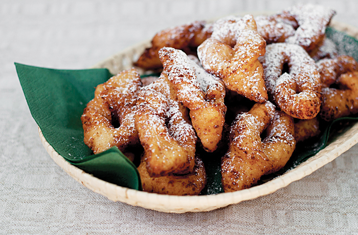

# Žagarėliai

*Lithuanian "twigs": thin strips of egg-yolk-rich pastry slashed and twisted into knotted shapes, deep-fried until crisp and blistered, dusted heavily with icing sugar, the everyday treat at every name-day table.*

**Serves:** Makes about 40 twigs

**Prep Time:** 30 minutes (plus 30 minutes resting)

**Cook Time:** 20 minutes

## Overview
Žagarėliai (literally "twigs" or "small branches" in Lithuanian) are the country cousins of Polish chruściki, Italian crostoli and Scandinavian klenäter, all the same idea: a rich egg-yolk dough rolled paper-thin, cut into strips, slit in the middle and pulled through to make a knotted ribbon, deep-fried in moments, blistered and bubbled, dusted with snow-drifts of icing sugar. The Lithuanian version uses sour cream and a splash of brandy or vodka in the dough (the alcohol evaporates in the hot oil and creates the famous bubbled blistered texture), and is rolled thinner than its neighbours' versions. The result shatters when bitten, melts on the tongue, and disappears off the plate alarmingly fast. Stacked on a plate at every Užgavėnės pre-Lent feast, at every wedding, at every name-day breakfast where someone has had time the night before, they are the simplest possible celebration sweet.

## Ingredients

- 6 large egg yolks
- 2 tbsp caster sugar
- 1/4 tsp salt
- 2 tbsp sour cream
- 2 tbsp brandy or vodka
- 1 tsp vanilla extract
- 1 tbsp melted butter
- 250-280 g plain flour (plus more for rolling)
- 1.5 litres sunflower oil, for frying
- 150 g icing sugar, for dusting

## Method

### Stage 1 - Make the dough
1. In a large bowl, whisk the egg yolks with the sugar and salt until pale and thick (about 3 minutes).
2. Whisk in the sour cream, brandy, vanilla and melted butter.
3. Add the flour a tablespoon at a time, mixing, until you have a soft slightly sticky dough.
4. Turn onto a floured surface; knead 5 minutes until smooth.
5. The dough should be slightly firmer than pasta dough.

### Stage 2 - Rest
1. Wrap in cling film; rest 30 minutes at room temperature.
2. The rest relaxes the gluten and makes the dough roll thinner.

### Stage 3 - Roll thin
1. Divide the dough into 4 pieces.
2. Working with one piece at a time (keep the rest covered), roll on a floured surface as thin as you can manage, ideally 1-2 mm thick; you should see your hand through it.
3. A pasta machine to its second-thinnest setting also works well.

### Stage 4 - Cut and shape
1. With a knife or pizza cutter, cut the sheet into strips 10 cm long and 3 cm wide; cut the ends at a slight angle for a diamond shape.
2. In the centre of each strip, cut a slit 4 cm long lengthwise.
3. Push one end of the strip through the slit; this twists the strip into a knot shape.
4. Place the shaped twigs on a floured tray.

### Stage 5 - Fry
1. Heat the oil in a deep pan to 180°C.
2. Drop 4-5 twigs in at a time; do not crowd.
3. Fry 30-40 seconds, turning once, until pale gold and blistered.
4. Twigs cook fast; do not look away.
5. Lift out with a slotted spoon; drain briefly on kitchen paper.

### Stage 6 - Dust and serve
1. While still warm, dust thickly with icing sugar through a sieve.
2. Stack on a plate; dust again before serving.

## Notes
- **Roll thinner than feels reasonable:** the žagarėliai must be paper-thin. A thicker twig is heavy and chewy.
- **Hot oil, fast fry:** 30-40 seconds is the whole time. Hesitation gives a brown bitter twig.
- **Brandy or vodka helps the bubble:** the alcohol evaporates in the hot oil and creates the blistered surface; small but important.
- **Eat warm:** the texture is best within an hour of frying.

## Variations
**With lemon zest:** add the zest of 1 lemon to the dough for a citrus version.
**With anise:** add 1 teaspoon ground anise to the dough.
**With orange-blossom:** 1 teaspoon orange-blossom water replaces the brandy for an alcohol-free version.
**With cinnamon sugar:** roll the warm fried twigs in cinnamon sugar instead of icing sugar.
**Diamond shape:** skip the knot-pull; just cut and fry as plain diamonds.

## Serving
Serve warm dusted with icing sugar · at Užgavėnės · at name-days · at weddings · with strong coffee · with a glass of tea · piled high on a plain plate to show the height.

## Storage
- Keep 4 days in an airtight tin at room temperature, do not refrigerate.
- The icing sugar absorbs; re-dust before serving leftovers.
- Don't freeze, the crispness goes.
- The dough can be made a day ahead, wrapped and refrigerated.

