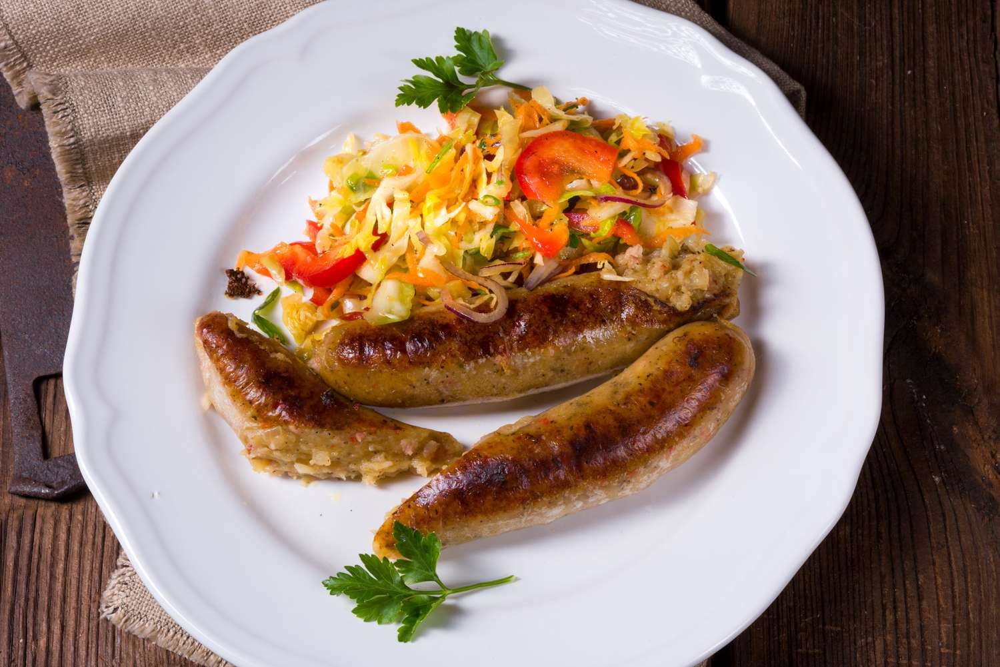

# Vedarai

*Lithuanian potato-stuffed sausages: pork-intestine casings packed with grated potato, bacon and onion, then oven-roasted in bacon fat until the skin crackles and the inside turns golden.*

**Serves:** 4

**Prep Time:** 40 minutes

**Cook Time:** 1 hour 30 minutes

## Overview
Vedarai are the cold-weather star of the Aukštaitija region in north-eastern Lithuania, a stuffed-sausage dish where pork-intestine casings are filled not with meat but with seasoned grated potato, then slowly roasted in their own bacon fat until the casings tighten and gloss and the filling cooks through into something halfway between kugelis and dumpling. The contrast is striking: a thin chewy skin that crackles when cut, a tender potato heart shot through with onion and bacon. Traditionally served at autumn slaughtering time when fresh casings were plentiful, vedarai now appear on the menus of country restaurants year-round, baked in long coils across the tray and brought out whole for the table. The classic pairing is a spoon of sour cream and a fresh cucumber salad to cut the richness. Allow time, the prep is patient work, the reward is worth it.

## Ingredients

- 1.5 kg starchy potatoes (Maris Piper or similar), peeled
- 200 g smoked streaky bacon, finely chopped
- 2 large onions, finely chopped
- 2 tsp salt
- 1 tsp black pepper
- 1/2 tsp ground caraway
- 1/2 tsp marjoram
- 2 m natural pork-intestine sausage casings (from a butcher; rinsed)
- 100 g lard or bacon fat (for roasting)
- 300 ml sour cream, to serve

## Method

### Stage 1 - Prepare the casings
1. Soak the casings in cold water 30 minutes; rinse inside by running cold water through them with a funnel.
2. Drain on a clean cloth.
3. Cut into manageable 50-60 cm lengths; tie a knot at one end of each.

### Stage 2 - Cook the bacon and onion
1. Fry the chopped bacon in a pan over medium heat 6 minutes until the fat runs.
2. Add the onion; cook 8 minutes until soft and golden.
3. Tip the bacon, onion and all the fat into a large bowl.

### Stage 3 - Grate the potatoes
1. Grate the peeled potatoes finely.
2. Tip into a muslin cloth; squeeze out about half the liquid (not bone dry).
3. Let the squeezed-off liquid settle 5 minutes; pour off the clear water, keep the starch.
4. Add the grated potato and the reserved starch to the bacon bowl.

### Stage 4 - Mix the filling
1. Add salt, pepper, caraway and marjoram to the potato.
2. Mix thoroughly; the texture should be loose and wet, not dough.

### Stage 5 - Stuff the casings
1. Attach a wide funnel (or sausage-stuffer nozzle) to the open end of a casing.
2. Spoon the potato mixture in, pushing it down with a wooden spoon handle.
3. Fill loosely, leave room for expansion, the filling swells in the oven.
4. Tie off the open end with kitchen string.
5. Repeat for the remaining lengths.

### Stage 6 - Pre-prick and arrange
1. Prick each sausage 8-10 times with a fine needle, this stops them bursting.
2. Heat the oven to 180°C.
3. Coil the sausages into a deep roasting tray; dot with the lard.

### Stage 7 - Roast
1. Roast 1 hour 30 minutes, basting every 20 minutes with the pan fat.
2. The skin tightens, browns and crackles; the filling firms.
3. Test with a skewer, it should slide easily through the potato heart.

### Stage 8 - Serve
1. Lift onto a board; let rest 5 minutes.
2. Slice into 4-5 cm rounds.
3. Serve hot with a generous spoon of sour cream on top.

## Notes
- **Fill loosely:** overfilled casings burst. Aim for roughly two-thirds full.
- **Prick before roasting:** small holes let steam escape and keep the skins intact.
- **Baste often:** the fat in the pan is the cooking medium; spoon it back over every 20 minutes.
- **Dry casings make tough skins:** keep moist with regular basting.

## Variations
**With minced pork (1:1):** mix 250 g minced pork shoulder into the filling for a richer richer Žemaitija-style version.
**With grated apple:** add 1 grated tart apple to the filling, a sweet north-region twist.
**Forest-mushroom vedarai:** stir 50 g rehydrated and chopped dried porcini into the filling.
**Without casings (kepti):** bake the filling in a greased loaf tin for 1 hour at 180°C, the easy weeknight cheat.
**With sauerkraut on the side:** the classic Aukštaitija plate.

## Variations note
The hard-to-find sausage casings can be ordered from any butcher who makes their own sausages; many supermarkets near Eastern European communities also stock them frozen.

## Serving
Serve hot from the roasting tray · with cold sour cream · alongside sauerkraut or a fresh cucumber-dill salad · at an autumn dinner · with dark Lithuanian beer · two thick slices is a portion.

## Storage
- Cooked vedarai keep 3 days refrigerated.
- Reheat slices in a hot dry pan until the casing recrisps.
- Freeze whole sausages for 2 months; thaw fully then reheat in a 180°C oven for 25 minutes.

