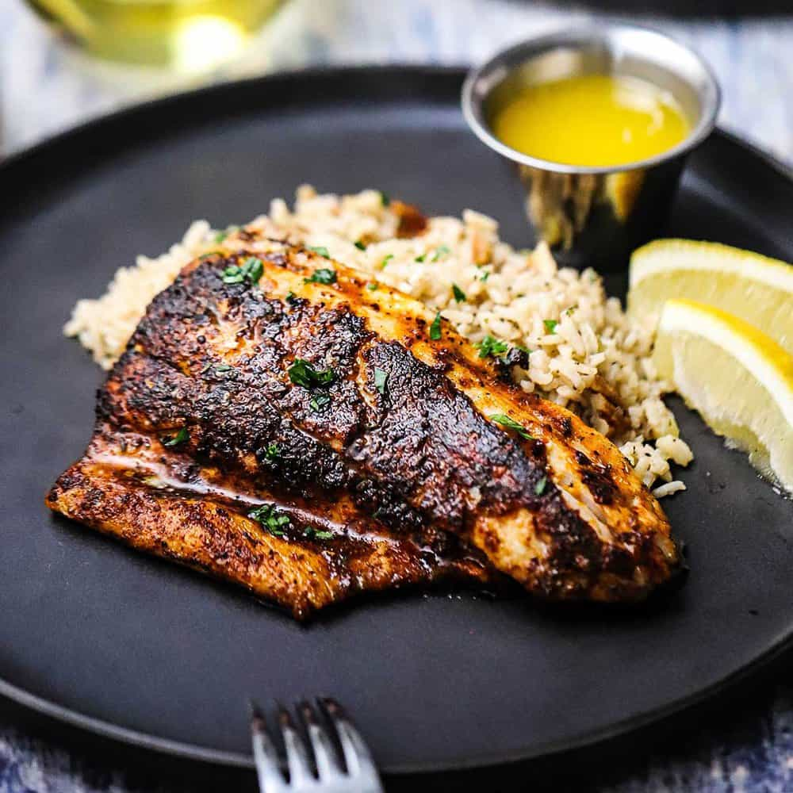

# Blackened Redfish

*The dish that put New Orleans on the world food map: redfish fillets buttered, pressed into a Cajun spice rub, and seared in a screaming-hot cast-iron skillet until the surface chars to deep mahogany. Paul Prudhomme, K-Paul's Louisiana Kitchen, 1980.*

**Serves:** 4

**Prep Time:** 10 minutes

**Cook Time:** 6 minutes

## Overview
The recipe that made Cajun cooking famous outside Louisiana. Paul Prudhomme invented it at K-Paul's Louisiana Kitchen on Chartres Street in 1980, looking for a way to cook redfish that captured the smoky charred edge of an old-school barbecue without an actual fire. His answer was a cast-iron skillet heated white-hot (smoking, dangerous, a fire-extinguisher-on-the-counter kind of heat), fish dipped in butter and slapped onto a thick layer of his Cajun spice rub. The butter caramelises, the spices toast, the surface blackens to deep mahogany within 90 seconds, and the inside stays moist. The dish was so popular through the 1980s that Gulf redfish stocks collapsed and a moratorium was imposed in 1986. Most blackened redfish today uses substituted fish (drum, snapper, grouper, black sea bass; anything firm-fleshed and white). This is a high-smoke method; open every window, run the extractor flat out, and ideally cook outside on a side-burner.

## Ingredients

### Spice rub (makes a generous quantity; keeps 3 months in a jar)
- 1 tbsp sweet paprika
- 2 tsp Hungarian or smoked paprika
- 1 tsp salt
- 1 tsp garlic powder
- 1 tsp onion powder
- 1 tsp cayenne pepper (more for a hotter result)
- ½ tsp dried thyme
- ½ tsp dried oregano
- ½ tsp ground black pepper
- ½ tsp ground white pepper

### Fish
- 4 redfish fillets (about 175 g each, skin off; substitute drum, snapper, grouper or black sea bass if redfish is unavailable)
- 100 g unsalted butter (melted)
- 4 lemon wedges, to serve

## Method

### Stage 1 - Mix the spice rub
1. Combine all the spice rub ingredients in a wide shallow plate. Mix thoroughly with a fork until uniform.

### Stage 2 - Heat the pan
1. Set a heavy cast-iron skillet (the heaviest you own) on the highest heat your hob will provide.
1. Wait 8-10 minutes. The pan should be smoking heavily and the surface should look pale grey-white. If you flick a drop of water in, it should evaporate instantly with a sharp hiss. This is non-negotiable; an under-heated pan steams the fish instead of blackening it.
1. Open every window. Turn the extractor fan to maximum. Make sure you have a clear path to the smoke alarm.

### Stage 3 - Coat the fish
1. Pour the melted butter into a wide shallow bowl.
1. Dip each fillet in the butter, turning to coat both sides thoroughly.
1. Press each buttered fillet into the spice rub on both sides, pushing the spice into the flesh until the fillet is uniformly coated. You want a thick layer of spice that you can see; not a light dusting.

### Stage 4 - Blacken
1. Lay the first fillet flat in the smoking-hot dry pan. It will hiss violently and produce a great deal of smoke. Do not move it.
1. Drizzle a teaspoon of the remaining melted butter over the top of the fillet.
1. Cook 90 seconds to 2 minutes, depending on thickness. The underside should be deeply blackened (look at the edges; if they are dark, lift gently to check).
1. Flip with a fish slice. Drizzle another teaspoon of butter over the now-upper side.
1. Cook another 60-90 seconds. The fillet should feel firm but not hard when pressed in the centre.
1. Lift onto a warm plate.
1. Repeat with the rest, working through the fillets one or two at a time so the pan stays at temperature.

### Stage 5 - Serve
1. Plate each fillet with a lemon wedge. Squeeze just before eating.
1. The crust should be deep mahogany verging on black, the inside white and moist.

## Notes
- **The pan must be smoking white-hot.** Most cooks under-heat the pan and end up with grey-brown spice fish rather than blackened. White-hot means actually smoking visibly and looking dry. Eight to ten minutes preheat is correct.
- **Cast iron only.** Nothing else will hold the temperature through the cooking time. Carbon steel works as a second choice. Non-stick will be destroyed by the heat (and the coating may flake off into the food).
- **Spice rub is uniform thickness.** Patchy coverage gives uneven char; a thick even layer turns mahogany simultaneously across the whole surface.
- **Butter, not oil.** The butter is what produces the deep colour and caramelised character; oil burns at this temperature and tastes of nothing.
- **Open the windows and warn the household.** A serious indoor smoke session is part of the experience.

## Variations
- **Blackened grouper, snapper, drum, sea bass:** any firm-fleshed white fish works. Cooking times scale with thickness.
- **Blackened chicken:** see [Blackened Chicken](../cajun/blackened-chicken.md) for the version that drove the technique into the 1980s mainstream.
- **Blackened pork loin:** trim a pork loin into 2 cm steaks, blacken the same way, finish in a 180°C oven for 5 minutes to bring the internal temperature up.

## Serving
The classic NOLA service is on a plate with [Dirty Rice](../cajun/dirty-rice.md) and a hot-sauce-bright remoulade. The fillet can also go into a hot sandwich with crisp lettuce, sliced tomato and remoulade - effectively a blackened po'boy. Squeeze fresh lemon over everything; the citrus cuts the spice perfectly.

## Storage
- Best straight from the pan. The crust softens on resting; ten minutes is the outer limit.
- Leftover blackened fish is excellent flaked into a salad the next day. The spice keeps doing its work cold.
