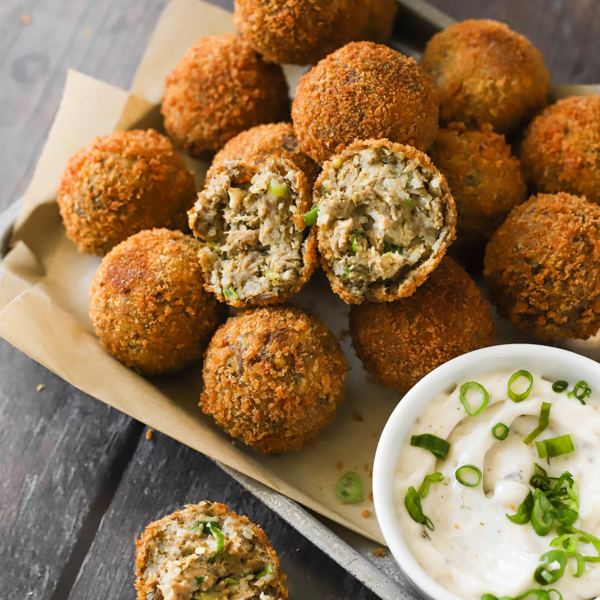

# Boudin Balls

*Louisiana's pork-and-rice fritters: Cajun boudin sausage (cooked pork, rice, trinity and Cajun spices) shaped into balls, coated in seasoned breadcrumbs and deep-fried till golden and crispy outside, soft and savoury inside. The Cajun gas-station snack and Sunday tailgate appetiser.*

**Serves:** Makes 24 boudin balls

**Prep Time:** 1.5 hours (most of the time is making boudin filling)

**Cook Time:** 15 minutes

## Overview
Boudin balls are a Cajun-Louisiana speciality: the classic boudin sausage filling (slow-cooked pork shoulder + cooked long-grain rice + the trinity + garlic + Cajun spices + parsley + spring onion, all ground or finely chopped together into a moist mixture) shaped into golf-ball-sized balls, coated in seasoned flour, beaten egg, and seasoned panko breadcrumbs, then deep-fried till deep golden and crispy outside while staying soft and savoury inside. Sold at every Cajun gas station, deli, and convenience store in southern Louisiana; standard tailgate and family-gathering appetiser. Three details: proper boudin filling (rice + pork + trinity), three-stage coating, deep-fry not bake.

## Ingredients

### Boudin filling
- 600 g pork shoulder (cubed)
- 200 g pork liver (optional; very traditional)
- 1 large onion (chopped)
- 3 sticks celery (chopped)
- 1 green bell pepper (chopped)
- 8 garlic cloves
- 1 litre water
- 2 bay leaves
- 1 tablespoon Cajun seasoning
- 1 teaspoon cayenne
- 1 ½ teaspoons fine sea salt
- 1 teaspoon ground black pepper
- 400 g cooked long-grain rice (about 200 g uncooked)
- 1 bunch spring onions (sliced)
- 1 small bunch fresh parsley (chopped)

### Coating
- 200 g plain flour
- 3 large eggs (beaten with 2 tablespoons milk)
- 300 g panko breadcrumbs
- 2 tablespoons Cajun seasoning

### Frying
- Vegetable oil for deep-frying (about 1 litre)

### To serve
- Creole mustard
- Remoulade sauce
- Hot sauce
- Pickled vegetables

## Method

### Stage 1 - Make boudin filling
1. In heavy pot, combine pork shoulder, pork liver (if using), onion, celery, bell pepper, garlic, water, bay leaves, Cajun seasoning, cayenne, salt, pepper.
2. Simmer 90 min till pork is very tender.
3. Strain; reserve some liquid.
4. Coarse-chop or pulse pork and vegetables in food processor.
5. Mix with cooked rice, spring onions, parsley, and enough reserved liquid to make a moist mixture (not soupy).
6. Taste; adjust salt and cayenne.
7. Chill 30 min.

### Stage 2 - Shape balls
1. Roll into golf-ball-sized balls (about 30g each).

### Stage 3 - Three-stage coating
1. Set up 3 bowls: flour, beaten egg, panko + Cajun seasoning.
2. Roll each ball in flour.
3. Dip in egg.
4. Roll in seasoned panko.

### Stage 4 - Fry
1. Heat oil to 175°C (350°F).
2. Fry in batches 3-4 min till deep golden.
3. Don't overcrowd.
4. Drain on paper towels.

### Stage 5 - Serve hot
1. With Creole mustard, remoulade, hot sauce.

## Notes
- **Proper boudin filling:** rice + pork + trinity essential.
- **Three-stage coating:** flour, egg, panko.
- **Deep-fry at 175°C.**

## Variations
**With shrimp:** add chopped cooked shrimp to filling.
**Crawfish boudin balls:** swap pork for cooked crawfish.
**Baked (less authentic):** brush with oil; bake at 200°C 25 min.
**Spicier:** double cayenne.

## Serving
At tailgates, gas-station counters, gatherings.

## Storage
- Cooked: best immediately; reheat in oven at 180°C for 10 min.
- Uncooked breaded balls freeze 2 months; cook from frozen.
- Boudin filling alone keeps refrigerated 3 days.
