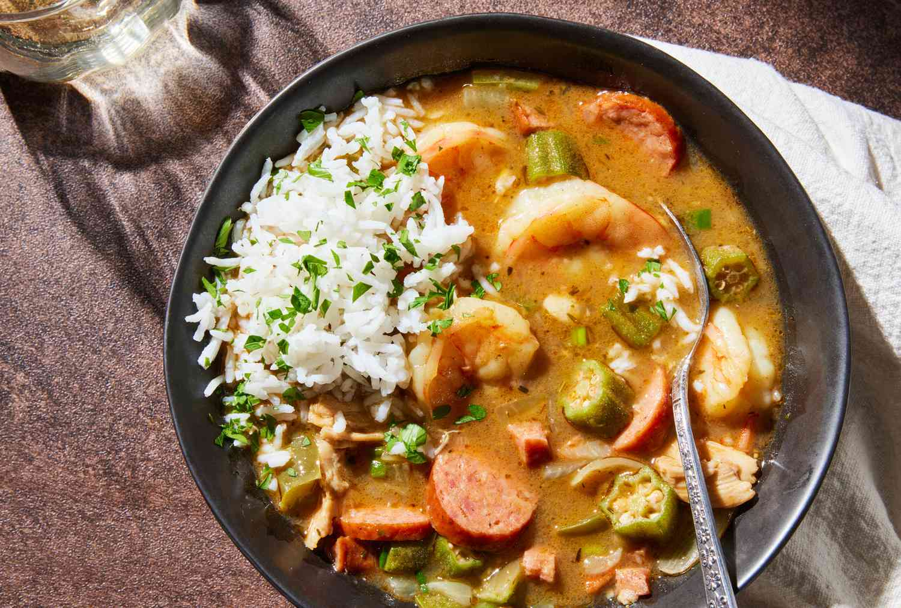

# Chicken and Andouille Gumbo

*Louisiana's quintessential gumbo: dark roux base built slow and patiently, chicken thigh and smoky andouille sausage simmered with the Cajun-Creole holy trinity (onion, celery, green pepper), filé powder and bay, served over white rice. The Cajun home Sunday classic; the gumbo every Louisiana family argues about.*

**Serves:** 8

**Prep Time:** 30 minutes

**Cook Time:** 2 hours

## Overview
Chicken and andouille gumbo is the most foundational Louisiana gumbo (alongside seafood gumbo): the dish that defines Cajun and Creole cooking, the meal on Louisiana family Sundays for generations. The base is a dark roux (flour + oil cooked over patient medium-low heat for 25-40 minutes till the colour of dark chocolate; this is the soul of the dish, and rushing it ruins it). The trinity (onion + celery + green pepper) is sweated into the roux. Chicken stock is whisked in to make a deep brown broth; chicken thighs and andouille sausage simmer for an hour; filé powder (ground sassafras leaves) thickens at the end. Served over fluffy white rice, topped with chopped spring onion.

## Ingredients

### The roux
- 200 ml vegetable oil
- 200 g plain flour

### Trinity and aromatics
- 2 large onions (chopped)
- 6 sticks celery (chopped)
- 2 large green bell peppers (chopped)
- 12 garlic cloves (crushed)

### Meat
- 1.2 kg chicken thighs (boneless skinless; cut into chunks)
- 500 g andouille sausage (sliced into rounds)

### Liquid and seasoning
- 2 litres hot chicken stock
- 2 bay leaves
- 1 tablespoon dried thyme
- 1 tablespoon paprika
- 1 tablespoon Cajun seasoning
- 1 teaspoon cayenne (or more)
- 2 teaspoons fine sea salt
- 1 teaspoon ground black pepper
- 1 tablespoon Worcestershire sauce
- 1 ½ tablespoons filé powder (added at end)

### To finish
- 1 bunch spring onions (sliced)
- 1 small bunch fresh parsley (chopped)
- Tabasco or other hot sauce

### To serve
- Steamed long-grain rice
- Sliced French bread
- Pickled okra

## Method

### Stage 1 - Make the dark roux
1. In a heavy pot, heat oil over medium-low heat.
2. Whisk in flour till smooth.
3. Cook slow, whisking constantly, 25-40 min till deep mahogany/chocolate brown.
4. Do not let it burn (black flecks ruin the dish); reduce heat if needed.
5. Patience here; this is the soul of the dish.

### Stage 2 - Add trinity
1. Add chopped onion, celery, bell pepper to the dark roux.
2. Stir; cook 8 min till softened.
3. Add garlic; cook 30 sec.

### Stage 3 - Add stock
1. Slowly whisk in hot chicken stock.
2. Bring to simmer.

### Stage 4 - Add meat and seasoning
1. Add chicken thighs and andouille.
2. Add bay leaves, thyme, paprika, Cajun seasoning, cayenne, salt, pepper, Worcestershire.
3. Simmer 60 min.

### Stage 5 - Skim and finish
1. Skim off any oil that rises to the top.
2. Adjust seasoning; the gumbo should be deeply seasoned.

### Stage 6 - Add filé
1. Just before serving, stir in filé powder.
2. Don't boil after adding filé (turns stringy).

### Stage 7 - Serve
1. Mound rice in deep bowls.
2. Ladle gumbo around the rice.
3. Top with spring onion, parsley, hot sauce.

## Notes
- **The roux is everything:** dark mahogany, not burnt.
- **Patience:** 25-40 min.
- **Filé at the end:** don't boil after.
- **Andouille smoked sausage:** canonical.

## Variations
**Seafood gumbo:** swap chicken for shrimp + crab + oysters; use seafood stock; add okra.
**With okra:** add 500 g sliced okra; thickens the gumbo.
**Spicier:** double cayenne; add chopped jalapeños.
**Add file at the table:** each diner stirs their own in.

## Serving
Over rice with French bread. Cold beer. Tabasco.

## Storage
- Keeps refrigerated 5 days; better day 2.
- Freezes 3 months.
- Reheat gently; don't boil after filé added.
