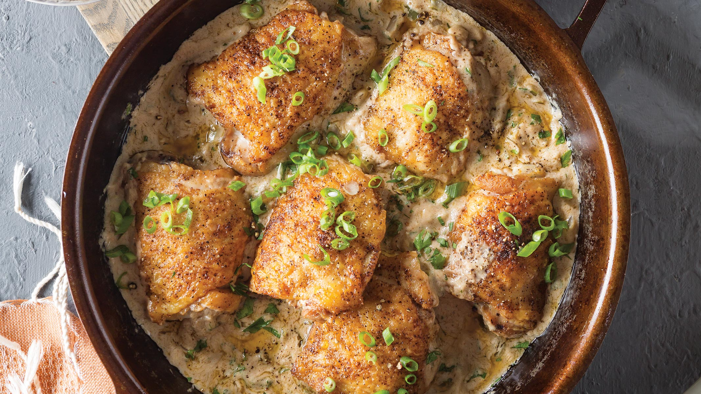

# Creole Chicken Fricassee

*Louisiana's Creole chicken stew: bone-in chicken thighs browned, then simmered in a blond roux gravy with the trinity, garlic, mushrooms, white wine, herbs and a touch of cream till tender, served over rice. The French-Creole comfort dish; the Louisiana fricassee distinct from the French original.*

**Serves:** 6

**Prep Time:** 25 minutes

**Cook Time:** 1 hour

## Overview
Creole chicken fricassee is the Louisiana Creole adaptation of the classic French fricassee: bone-in chicken thighs browned in oil, set aside; a blond roux made in the same pan; the trinity (onion, celery, green pepper) sweated in; garlic, mushrooms, white wine, hot chicken stock, bay, thyme and Cajun seasoning whisked in to make a creamy savoury gravy; the chicken returned and simmered till tender. Served over rice or with French bread. The Creole signature touches (the trinity, the Cajun seasoning, the slightly thicker gravy) distinguish it from the French original. Three details: brown the chicken first, blond roux (not dark), French wine + stock combination.

## Ingredients

### Chicken
- 8 chicken thighs (bone-in, skin-on)
- 2 tablespoons Cajun seasoning
- 4 tablespoons vegetable oil

### Roux
- 60 g butter
- 60 g plain flour

### Trinity and aromatics
- 1 large onion (chopped)
- 4 sticks celery (chopped)
- 1 green bell pepper (chopped)
- 10 garlic cloves (crushed)
- 250 g button mushrooms (sliced)

### Liquid and seasoning
- 200 ml dry white wine
- 800 ml hot chicken stock
- 2 bay leaves
- 1 tablespoon dried thyme
- 1 tablespoon paprika
- 1 tablespoon Cajun seasoning
- 1 teaspoon cayenne
- 1 ½ teaspoons fine sea salt
- 1 teaspoon ground black pepper
- 1 tablespoon Worcestershire sauce
- 100 ml double cream

### To finish
- 1 bunch spring onions
- 1 small bunch fresh parsley
- Juice of 1 lemon

### To serve
- Steamed long-grain rice
- French bread
- Cole slaw

## Method

### Stage 1 - Season and brown chicken
1. Season chicken with Cajun seasoning.
2. Heat oil in heavy pot.
3. Brown chicken in batches 5 min per side.
4. Set aside.

### Stage 2 - Make blond roux
1. Pour off all but 3 tablespoons of fat.
2. Add butter; melt.
3. Whisk in flour.
4. Cook 6-8 min till peanut-butter colour.

### Stage 3 - Add trinity and mushrooms
1. Add onion, celery, green pepper, mushrooms.
2. Cook 8 min.
3. Add garlic; cook 30 sec.

### Stage 4 - Deglaze and add stock
1. Pour in wine; reduce 4 min.
2. Whisk in hot chicken stock.
3. Add bay leaves, thyme, paprika, Cajun seasoning, cayenne, salt, pepper, Worcestershire.

### Stage 5 - Braise
1. Return chicken pieces; turn to coat in gravy.
2. Cover; simmer 35-40 min.
3. Turn chicken halfway.

### Stage 6 - Finish
1. Stir in cream.
2. Add lemon juice.
3. Taste; adjust seasoning.

### Stage 7 - Serve
1. Spoon rice into bowls.
2. Top with chicken and gravy.
3. Scatter spring onion and parsley.

## Notes
- **Brown chicken first.**
- **Blond roux:** lighter than gumbo.
- **Cream at the end:** doesn't curdle.

## Variations
**With white meat:** swap thighs for breasts (cook 25 min only).
**With andouille:** add sliced andouille for smokiness.
**Without cream:** more rustic.
**With dumplings:** drop biscuit dough on top in last 20 min.

## Serving
Over rice with French bread. Sunday dinner.

## Storage
- Keeps refrigerated 4 days.
- Freezes 2 months.
- Reheat gently; don't boil.
