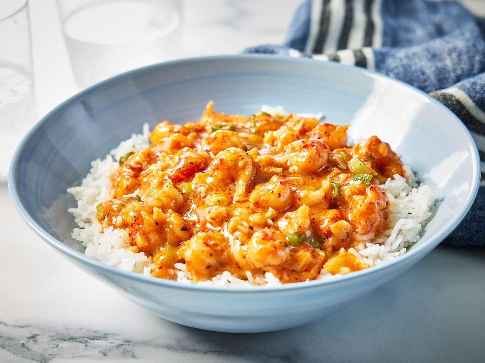

# Crawfish Étouffée

*Louisiana's smothered crawfish: peeled crawfish tails simmered in a buttery blond roux gravy with the trinity, garlic and Cajun spices, served over fluffy white rice. The Cajun Lent and Holy Week classic; the traditional Louisiana crawfish dish.*

**Serves:** 6

**Prep Time:** 20 minutes

**Cook Time:** 35 minutes

## Overview
Crawfish étouffée is one of Louisiana's most iconic Cajun-Creole dishes: peeled crawfish tails (fresh during the spring crawfish season; or frozen otherwise) simmered in a buttery gravy built on a blond roux (not the dark chocolate roux of gumbo; étouffée uses a lighter peanut-butter coloured roux), the trinity (onion, celery, green pepper), garlic, bay, thyme, Cajun seasoning, and a touch of seafood or chicken stock. The word "étouffée" means "smothered" in French, referring to the technique of smothering the crawfish in the gravy. Served over fluffy white rice with chopped spring onion and parsley.

## Ingredients

### Roux
- 100 g butter
- 80 g plain flour

### Trinity
- 1 large onion (chopped)
- 3 sticks celery (chopped)
- 1 large green bell pepper (chopped)
- 8 garlic cloves (crushed)

### Crawfish
- 800 g peeled crawfish tails (fresh or frozen; with their fat if available)

### Liquid and seasoning
- 600 ml hot seafood or chicken stock
- 2 tablespoons tomato paste (optional; some recipes use it for colour)
- 2 bay leaves
- 1 tablespoon dried thyme
- 1 tablespoon paprika
- 1 tablespoon Cajun seasoning
- 1 teaspoon cayenne
- 1 ½ teaspoons fine sea salt
- 1 teaspoon ground black pepper
- 1 tablespoon Worcestershire sauce
- 1 tablespoon hot sauce
- Juice of 1 lemon

### To finish
- 50 g butter
- 1 bunch spring onions (sliced)
- 1 small bunch fresh parsley (chopped)

### To serve
- Steamed long-grain rice
- French bread
- Hot sauce
- Lemon wedges

## Method

### Stage 1 - Make blond roux
1. Melt butter in heavy pot.
2. Whisk in flour.
3. Cook over medium 8-10 min, stirring, till the colour of peanut butter (not dark like gumbo).

### Stage 2 - Add trinity
1. Add onion, celery, green pepper.
2. Cook 8 min till soft.
3. Add garlic; cook 30 sec.

### Stage 3 - Add tomato (optional) and seasoning
1. Stir in tomato paste (if using); cook 1 min.
2. Add bay leaves, thyme, paprika, Cajun seasoning, cayenne, salt, pepper, Worcestershire, hot sauce.

### Stage 4 - Add stock
1. Slowly whisk in hot stock.
2. Bring to simmer.
3. Cook 15 min till thickened to gravy consistency.

### Stage 5 - Add crawfish
1. Stir in crawfish tails (and their fat if available).
2. Simmer gently 4-5 min.
3. Don't boil hard; crawfish toughen quickly.

### Stage 6 - Finish
1. Add lemon juice.
2. Stir in finishing butter off heat.

### Stage 7 - Serve
1. Spoon rice into bowls.
2. Ladle étouffée over.
3. Top with spring onion, parsley.
4. French bread alongside for mopping.

## Notes
- **Blond roux:** lighter than gumbo.
- **Don't overcook crawfish:** 4-5 min only.
- **Finishing butter:** for silky texture.

## Variations
**Shrimp étouffée:** swap crawfish for shrimp.
**Crab étouffée:** swap crawfish for lump crab meat.
**Spicier:** double cayenne + extra hot sauce.
**Mixed seafood:** crawfish + shrimp + crab.

## Serving
Over rice with French bread. Cold beer.

## Storage
- Best fresh.
- Keeps refrigerated 2 days; crawfish dishes don't age as well as gumbo.
- Don't freeze; the sauce can break.
