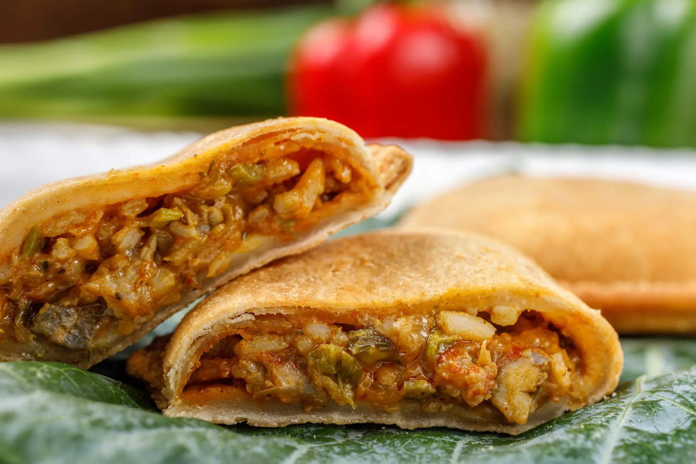

# Crawfish Pie

*Louisiana's savoury seafood pie: peeled crawfish tails in a buttery trinity-flavoured gravy, baked in a buttery pie crust till the crust is golden and the filling is bubbling. The Cajun classic; the dish Hank Williams sang about in "Jambalaya".*

**Serves:** 8

**Prep Time:** 40 minutes

**Cook Time:** 50 minutes

## Overview
Crawfish pie is one of Louisiana's most iconic Cajun home dishes (famously immortalised in Hank Williams' song "Jambalaya": "Jambalaya, crawfish pie, filé gumbo"): peeled crawfish tails cooked in a buttery savoury gravy made with the trinity (onion, celery, green pepper), garlic, Cajun spices, hot sauce, seafood stock and a touch of cream; the filling poured into a buttery shortcrust pastry shell, topped with a second pastry sheet, sealed and slashed, baked till deep golden and bubbling. Often made as one large pie for family dinners, or smaller individual pies for parties. Three details: buttery shortcrust pastry (homemade or storebought), crawfish gravy made first, double-crust enclosed.

## Ingredients

### Pastry
- 500 g plain flour
- 250 g cold butter (cubed)
- 1 teaspoon fine sea salt
- 1 teaspoon paprika
- 2 large egg yolks
- 6-8 tablespoons ice-cold water

### Filling
- 800 g peeled crawfish tails (with their fat if available)
- 80 g butter
- 1 large onion (chopped)
- 4 sticks celery (chopped)
- 1 green bell pepper (chopped)
- 10 garlic cloves (crushed)
- 60 g plain flour
- 400 ml hot seafood or chicken stock
- 100 ml double cream
- 2 tablespoons tomato paste
- 1 tablespoon paprika
- 1 tablespoon Cajun seasoning
- 1 teaspoon cayenne
- 1 ½ teaspoons fine sea salt
- 1 teaspoon ground black pepper
- 1 tablespoon Worcestershire sauce
- 1 tablespoon hot sauce
- 1 bunch spring onions (sliced)
- 1 small bunch fresh parsley (chopped)
- Juice of 1 lemon

### Egg wash
- 1 egg (beaten with 1 tablespoon milk)

## Method

### Stage 1 - Make pastry
1. Whisk flour, salt, paprika.
2. Rub in cold butter to crumbs.
3. Add egg yolks and water; mix to dough.
4. Wrap; chill 30 min.

### Stage 2 - Make filling
1. Melt butter in heavy pot.
2. Add onion, celery, green pepper; cook 8 min.
3. Add garlic; cook 30 sec.
4. Stir in flour; cook 2 min.
5. Whisk in stock and cream slowly.
6. Stir in tomato paste, paprika, Cajun seasoning, cayenne, salt, pepper, Worcestershire, hot sauce.
7. Simmer 8 min till thickened.
8. Add crawfish; simmer 4 min only.
9. Stir in spring onions, parsley, lemon juice.
10. Cool slightly.

### Stage 3 - Assemble
1. Preheat oven to 200°C (400°F).
2. Roll out two-thirds of pastry; line a 25cm pie dish.
3. Pour in crawfish filling.
4. Roll out remaining pastry; place over.
5. Trim, seal, and crimp edges.
6. Slash steam vents.
7. Brush with egg wash.

### Stage 4 - Bake
1. Bake 45-50 min till deeply golden.

### Stage 5 - Rest and serve
1. Rest 10 min.
2. Slice into wedges.

## Notes
- **Buttery shortcrust pastry:** the dish character.
- **Don't overcook crawfish:** 4 min only.
- **Cool filling slightly before assembly.**

## Variations
**Individual pies:** make 8 small ones.
**With shrimp:** swap crawfish for shrimp.
**Spicier:** double cayenne + extra hot sauce.
**Without top crust:** open-faced pie.

## Serving
With cole slaw, French bread. Cold beer.

## Storage
- Best fresh.
- Keeps refrigerated 3 days.
- Reheat in oven at 180°C 15 min.
- Freezes 2 months unbaked; bake from frozen + 15 min.
