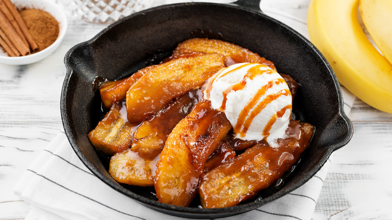

# Bananas Foster

*New Orleans' flambéed banana dessert: ripe bananas sautéed in butter and brown sugar caramel, flambéed dramatically with rum and banana liqueur, served over vanilla ice cream. The Brennan's Restaurant Quarter classic, invented 1951; the dessert with the showpiece flame at the table.*

**Serves:** 4

**Prep Time:** 10 minutes

**Cook Time:** 10 minutes

## Overview
Bananas Foster is the iconic New Orleans dessert, invented in 1951 at Brennan's Restaurant in the French Quarter by chef Paul Blangé (named after Richard Foster, a friend of restaurant owner Owen Brennan): ripe bananas (halved lengthwise then crosswise) sautéed in butter and brown sugar to make a caramel sauce, then dramatically flambéed at the table with dark rum and banana liqueur, the flaming sauce poured over vanilla ice cream. The drama of the flambé at the table is the dish's signature; it's traditionally prepared tableside in a chafing dish.

## Ingredients

- 4 ripe bananas (halved lengthwise then crosswise; 16 pieces total)
- 80 g butter
- 200 g dark brown sugar
- 1 teaspoon ground cinnamon
- ¼ teaspoon ground nutmeg
- 4 tablespoons banana liqueur (Crème de Banane)
- 60 ml dark rum
- Pinch of salt
- 1 teaspoon vanilla extract

### To serve
- 600 ml good vanilla ice cream
- Toasted chopped pecans (optional)
- Fresh mint sprigs

## Method

### Stage 1 - Make caramel
1. Melt butter in a wide pan over medium heat.
2. Add brown sugar; stir till dissolved.
3. Add cinnamon, nutmeg, salt.
4. Bubble 2 min till the sauce darkens.

### Stage 2 - Add bananas
1. Add bananas cut-side-down.
2. Cook 90 sec per side.
3. The bananas should be softened but still hold shape.

### Stage 3 - Add banana liqueur
1. Pour in banana liqueur.
2. Tilt pan toward flame to ignite (or use long match if electric).

### Stage 4 - Add rum and flambé
1. Pour in dark rum.
2. Tilt to ignite (the flame is the showpiece).
3. Let flame burn off 20-30 sec.
4. Stir in vanilla.

### Stage 5 - Serve immediately
1. Scoop vanilla ice cream into bowls.
2. Spoon flaming bananas and sauce over the ice cream.
3. Top with pecans, mint sprig.
4. The contrast of hot sauce + cold ice cream is the point.

## Notes
- **Flambé safety:** keep face/hair away; have lid nearby.
- **Tip of pan to ignite:** professional way.
- **Hot sauce + cold ice cream:** essential contrast.

## Variations
**Without alcohol:** skip rum/liqueur; sauce is still good without the flambé.
**With pecans:** add toasted chopped pecans to the sauce.
**Bananas Foster pancakes:** spoon sauce over pancakes.
**Bananas Foster French toast:** spoon over French toast.

## Serving
At the table with showmanship. Sunday brunch; dinner finale.

## Storage
- Best immediately.
- Sauce keeps refrigerated 3 days; reheat and toss with fresh bananas.
- Don't freeze.
