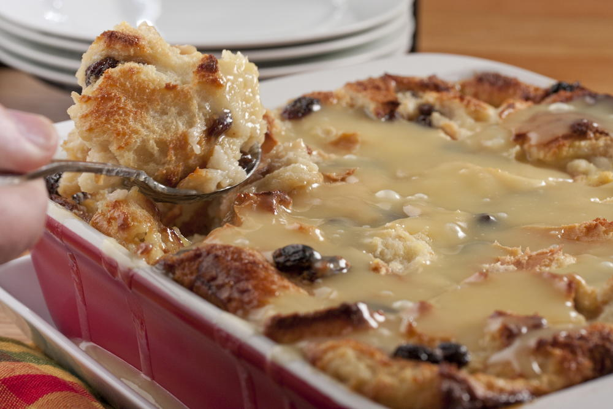

# Louisiana Bread Pudding with Whiskey Sauce

*Louisiana's iconic dessert: stale French bread soaked in egg-and-milk custard with cinnamon, vanilla and raisins, baked till the top is golden and the inside is creamy, served warm with a hot bourbon-butter whiskey sauce poured over. The New Orleans classic; the dessert that defines Creole sweets.*

**Serves:** 8

**Prep Time:** 25 minutes (plus 1 hour bread soaking)

**Cook Time:** 50 minutes

## Overview
Louisiana bread pudding is the most iconic Creole dessert and the signature finale of every classic New Orleans Creole restaurant (Commander's Palace, Antoine's, Brennan's, Dooky Chase's all serve their canonical versions): stale French bread (canonical; baguette, leftover muffuletta loaves, or day-old French bread) torn into chunks, soaked in a rich custard of whole milk, double cream, eggs, sugar, vanilla, cinnamon, nutmeg and raisins, baked in a buttered dish till the top is deeply golden and the inside is creamy-soft. Served warm with a hot whiskey sauce (butter + sugar + cream + egg + bourbon) poured generously over each serving.

## Ingredients

### Bread pudding
- 600 g stale French bread (or baguette; torn into 3cm chunks)
- 600 ml whole milk
- 400 ml double cream
- 6 large eggs
- 250 g caster sugar
- 100 g brown sugar
- 2 tablespoons vanilla extract
- 1 tablespoon ground cinnamon
- 1 teaspoon ground nutmeg
- ½ teaspoon ground allspice
- ½ teaspoon fine sea salt
- 200 g raisins (or sultanas)
- 80 g butter (for the dish + drizzling)
- Zest of 1 orange

### Whiskey sauce
- 200 g butter
- 250 g caster sugar
- 1 large egg
- 200 ml double cream
- 80 ml bourbon whiskey
- 1 teaspoon vanilla extract
- Pinch of salt

## Method

### Stage 1 - Soak bread
1. Place torn bread in a large bowl.

### Stage 2 - Make custard
1. Whisk milk, cream, eggs, both sugars, vanilla, cinnamon, nutmeg, allspice, salt, orange zest.

### Stage 3 - Soak
1. Pour custard over bread.
2. Stir in raisins.
3. Press bread down to submerge.
4. Soak 1 hour minimum.

### Stage 4 - Bake
1. Preheat oven to 175°C (350°F).
2. Butter a deep 25cm baking dish.
3. Pour soaked bread mixture in.
4. Drizzle with melted butter on top.
5. Bake 50-55 min till deep golden on top and just-set in centre.
6. Rest 10 min before serving.

### Stage 5 - Make whiskey sauce
1. In a saucepan, melt butter.
2. Stir in sugar; cook 3 min till dissolved and slightly thickened.
3. Whisk in cream.
4. Cool 3 min.
5. Whisk beaten egg into the warm sauce (don't boil; eggs will curdle).
6. Whisk in bourbon and vanilla.
7. Strain through fine sieve.

### Stage 6 - Serve
1. Spoon warm bread pudding into bowls.
2. Pour hot whiskey sauce generously over.

## Notes
- **Stale French bread canonical.**
- **Soak 1 hour:** for proper texture.
- **Whiskey sauce essential.**
- **Serve warm with hot sauce.**

## Variations
**With pecans:** add 200 g toasted chopped pecans.
**Chocolate bread pudding:** add 200 g dark chocolate chips.
**With apples:** add 2 chopped apples.
**Praline sauce (instead of whiskey):** caramel + pecan version.

## Serving
After Creole dinners; Sunday brunch; New Orleans restaurant finale.

## Storage
- Refrigerated 4 days.
- Reheat in oven at 160°C, covered, 15 min.
- Sauce keeps separately 1 week refrigerated.
- Freezes (without sauce) 2 months.
