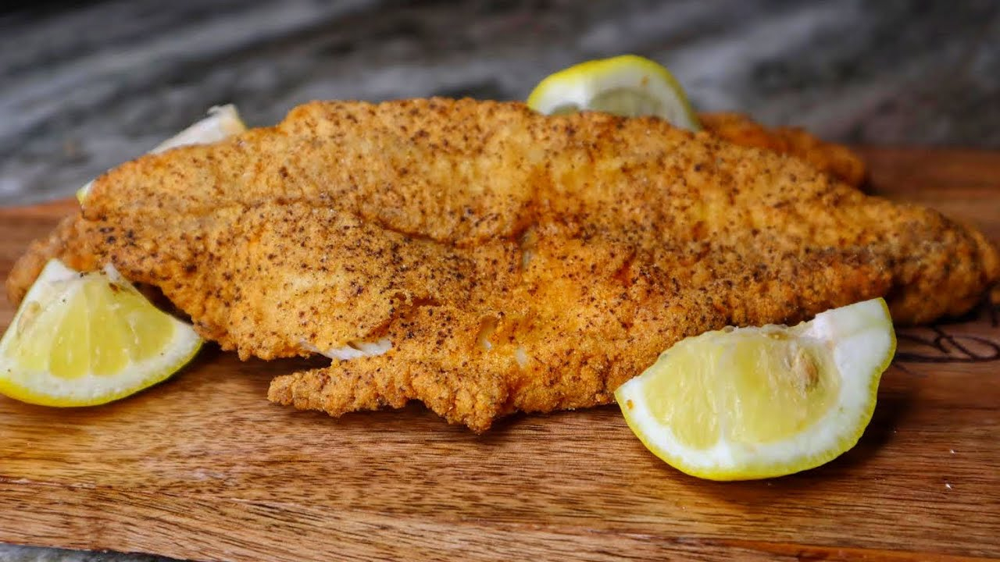

# Louisiana Fried Catfish

*Louisiana's classic fried fish: catfish fillets coated in seasoned cornmeal, deep-fried in lard or oil till the crust is golden and crispy and the flesh inside flakes white and tender. Served with hush puppies, cole slaw, French fries and remoulade. The Cajun-Creole fish fry favourite.*

**Serves:** 4

**Prep Time:** 15 minutes

**Cook Time:** 15 minutes

## Overview
Louisiana fried catfish is one of the South's most iconic fish dishes and the centrepiece of Cajun-Creole Friday fish fries (and Lent meals): farm-raised or wild catfish fillets dipped in buttermilk, dredged in a seasoned cornmeal-and-flour mixture (cornmeal is traditional and gives the proper crackly texture; flour alone or panko gives the wrong result), then deep-fried in lard or oil till the crust is deeply golden and crispy. Served with hush puppies (the traditional fried cornbread balls), cole slaw, French fries, lemon wedges, and remoulade sauce or tartar sauce.

## Ingredients

### Fish
- 4 catfish fillets (about 200 g each)
- 600 ml buttermilk
- 1 tablespoon hot sauce
- 1 tablespoon Cajun seasoning

### Coating
- 250 g coarse yellow cornmeal
- 100 g plain flour
- 2 tablespoons Cajun seasoning
- 1 tablespoon paprika
- 1 ½ teaspoons fine sea salt
- 1 teaspoon cayenne
- 1 teaspoon ground black pepper
- 1 teaspoon garlic powder
- 1 teaspoon onion powder

### Frying
- Vegetable oil or lard for deep-frying (about 1 litre)

### To serve
- Hush puppies (see hush puppies recipe)
- Cole slaw
- French fries
- Remoulade or tartar sauce
- Lemon wedges
- Hot sauce
- Crystal hot sauce or Tabasco

## Method

### Stage 1 - Buttermilk soak
1. Whisk buttermilk with hot sauce and Cajun seasoning.
2. Add catfish; turn to coat.
3. Refrigerate 30 min minimum (or up to 2 hours).

### Stage 2 - Mix coating
1. Whisk cornmeal, flour, Cajun seasoning, paprika, salt, cayenne, pepper, garlic and onion powder.

### Stage 3 - Coat fish
1. Lift fish from buttermilk; let excess drip.
2. Press into cornmeal mixture, coating thoroughly.

### Stage 4 - Heat oil
1. Heat oil to 180°C (360°F) in heavy deep pan or Dutch oven.

### Stage 5 - Fry
1. Lower 2 fillets at a time into hot oil.
2. Fry 4-5 min till deep golden brown.
3. Turn once if needed for even colour.
4. Drain on paper towels.

### Stage 6 - Season immediately
1. Sprinkle with a little extra Cajun seasoning while hot.

### Stage 7 - Serve immediately
1. With hush puppies, cole slaw, fries.
2. Remoulade alongside; lemon wedges.

## Notes
- **Cornmeal essential:** the traditional crust.
- **180°C oil:** crucial for proper crust.
- **Eat immediately:** crust softens.

## Variations
**Blackened version:** coat in Cajun spice mix; pan-sear in cast iron (not deep-fried).
**Air-fried:** lighter; not as crispy.
**With panko:** less traditional; non-traditional.
**Whole catfish:** scale and gut; fry whole.

## Serving
On platters with sides. Friday fish fries; Lent meals; family gatherings. Cold beer.

## Storage
- Best immediately.
- Don't refrigerate cooked; goes soggy.
- Coated raw fish keeps refrigerated 1 day; fry just before serving.
