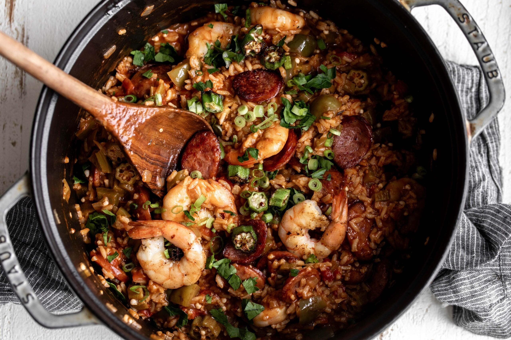

# Creole Jambalaya

*Louisiana's red one-pot rice dish: chicken, andouille, shrimp and rice cooked together with the trinity, tomato, Cajun spices and chicken stock till the rice absorbs everything. The Creole (tomato) version distinct from the Cajun (no tomato) "brown jambalaya". The Sunday family dish and crawfish-boil leftover hero.*

**Serves:** 8

**Prep Time:** 25 minutes

**Cook Time:** 50 minutes

## Overview
Jambalaya is Louisiana's famous one-pot rice dish, often described as the Cajun-Creole cousin of Spanish paella. There are two regional styles: Creole (also called "red jambalaya"; uses tomato; common in New Orleans and around) and Cajun (also called "brown jambalaya"; no tomato; common in rural southwest Louisiana). This is the Creole version: long-grain rice cooked together with diced chicken thigh, sliced andouille sausage, peeled shrimp, the trinity (onion, celery, green pepper), garlic, tomato (canned or fresh), Cajun seasoning, thyme, bay, and chicken stock; all cooked in one pot, the rice absorbing all the flavours. Three details: brown the meat first (development of fond), tomato is the Creole signature, don't stir too much during the rice cook (keeps grains intact).

## Ingredients

### Meat
- 600 g chicken thighs (boneless skinless; diced)
- 400 g andouille sausage (sliced)
- 500 g raw peeled shrimp

### Trinity
- 2 large onions (chopped)
- 6 sticks celery (chopped)
- 2 green bell peppers (chopped)
- 10 garlic cloves (crushed)

### Tomato
- 1 tin (400 g) chopped tomatoes
- 2 tablespoons tomato paste

### Rice
- 500 g long-grain white rice (uncooked)

### Liquid and seasoning
- 1 litre hot chicken stock
- 2 bay leaves
- 1 tablespoon dried thyme
- 1 tablespoon paprika
- 1 tablespoon Cajun seasoning
- 1 teaspoon cayenne (or more)
- 1 ½ teaspoons fine sea salt
- 1 teaspoon ground black pepper
- 1 tablespoon Worcestershire sauce
- 1 tablespoon hot sauce

### To finish
- 1 bunch spring onions
- 1 small bunch fresh parsley
- Lemon wedges
- Tabasco

### To serve
- Sliced French bread
- Pickled okra

## Method

### Stage 1 - Brown meats
1. Heat 3 tablespoons oil in heavy wide pot.
2. Brown chicken in batches 4 min; remove.
3. Brown andouille 3 min; remove.

### Stage 2 - Add trinity
1. In the same pot, sauté onion, celery, green pepper 8 min.
2. Add garlic; cook 30 sec.

### Stage 3 - Add tomato and spice
1. Add tomato paste; cook 1 min.
2. Add chopped tomatoes.
3. Stir in bay leaves, thyme, paprika, Cajun seasoning, cayenne, salt, pepper, Worcestershire, hot sauce.
4. Cook 3 min.

### Stage 4 - Add rice
1. Add uncooked rice; stir to coat 2 min.

### Stage 5 - Combine
1. Return chicken and andouille.
2. Pour in hot chicken stock.
3. Bring to simmer.

### Stage 6 - Cook covered
1. Reduce heat to lowest.
2. Cover tightly.
3. Cook 18-20 min without stirring.

### Stage 7 - Add shrimp
1. Stir in raw shrimp; replace lid.
2. Cook 5 min off heat (residual heat cooks shrimp).

### Stage 8 - Rest and serve
1. Rest 5 min covered.
2. Fluff gently with fork.
3. Top with spring onion, parsley, lemon wedges.
4. Hot sauce alongside.

## Notes
- **Brown meats first:** for fond.
- **Don't stir during rice cook:** breaks grains.
- **Add shrimp at the end:** cook through residual heat.

## Variations
**Cajun (brown) jambalaya:** skip the tomato; gives a brown, more rustic version.
**With pork shoulder:** add cubed pork shoulder (cook 60 min before rice).
**Crawfish jambalaya:** swap shrimp for crawfish tails.
**Vegetarian:** skip meats; double the vegetables; use vegetable stock.

## Serving
In big bowls with French bread. Cold beer. Hot sauce.

## Storage
- Keeps refrigerated 4 days; flavour deepens.
- Freezes 2 months.
- Reheat with splash of stock.
