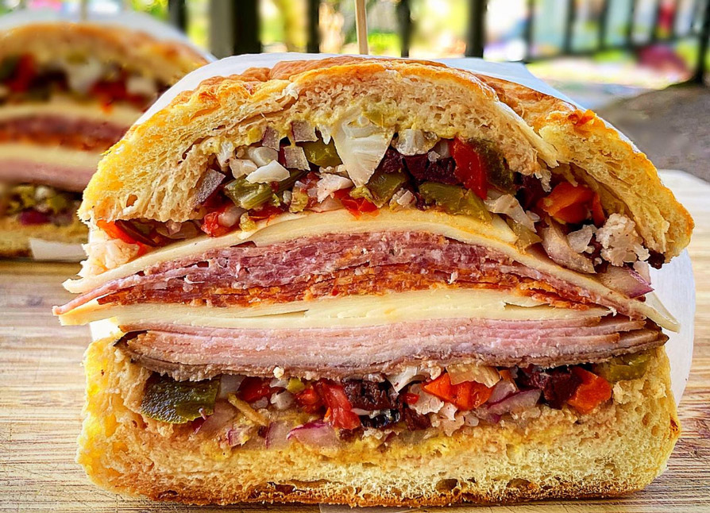

# Muffuletta

*The Sicilian-American sandwich of New Orleans: round seeded loaf, layered cured meats and cheese, and a thick olive salad that soaks into the bread overnight. Invented at Central Grocery, 1906.*

**Serves:** 4 (one whole muffuletta cut into quarters)

**Prep Time:** 25 minutes (plus 6 hours, preferably overnight, for the olive salad to marinate)

**Cook Time:** 0 minutes

## Overview
The muffuletta is the great Sicilian contribution to New Orleans, invented at Central Grocery on Decatur Street in 1906 for the Sicilian dockworkers and farmers who wanted lunch they could eat standing up. The architecture is fixed: a round seeded loaf (the muffuletta loaf, sometimes called muffaletta bread), split horizontally, layered with capicola, mortadella, salami and provolone, and crowned with a thick olive salad whose oil seeps into the bread until the whole sandwich is pungent, salty and faintly damp in the best possible way. It is eaten quartered, by hand, with a tall glass of something cold.

The olive salad is the soul of the dish. Made even a few hours ahead, it is acceptable; made the day before, it is transcendent. Most New Orleans households make a big jar and use it across a fortnight on sandwiches, salads, baked potatoes and over scrambled eggs.

## Ingredients

### Olive salad
- 150 g pitted green olives (chopped roughly)
- 100 g pitted Kalamata or other black olives (chopped roughly)
- 100 g giardiniera (mixed pickled vegetables; cauliflower, carrot, celery; drained and chopped)
- 50 g sun-dried tomatoes (oil-packed; chopped)
- 50 g roasted red pepper (chopped)
- 30 g capers (rinsed)
- 3 garlic cloves (minced)
- 2 tbsp finely chopped fresh parsley
- 1 tsp dried oregano
- 1 tsp dried basil
- ½ tsp black pepper
- 2 tbsp red wine vinegar
- 120 ml extra-virgin olive oil

### Sandwich
- 1 round seeded muffuletta loaf (or a 20-25 cm round Italian loaf with sesame seeds)
- 150 g sliced capicola (also called coppa)
- 150 g sliced mortadella (the Italian original, not the American bologna)
- 150 g sliced Genoa salami
- 200 g sliced provolone cheese
- 150 g sliced low-moisture mozzarella (optional, for additional richness)

## Method

### Stage 1 - Make the olive salad (the day before)
1. Combine all the olive salad ingredients in a wide bowl. Stir thoroughly.
1. Transfer to a clean glass jar with a tight lid. Press down so the oil rises above the solids.
1. Refrigerate at least 6 hours, ideally overnight, and up to a week. The flavours mature dramatically; do not skip this step.

### Stage 2 - Prepare the bread
1. Slice the loaf horizontally into a top half and bottom half. If the loaf is very thick, hollow out a small amount of the soft interior crumb from each half to create a shallow recess (this gives the olive salad room to settle without overflowing).
1. Drizzle a generous spoonful of the olive salad's oil onto each cut surface and brush across the bread. The oil should soak in slightly. This is the foundation.

### Stage 3 - Layer the sandwich
1. Spoon half the olive salad onto the bottom half of the bread, spreading evenly to the edges.
1. Lay the provolone cheese over the olive salad in overlapping slices.
1. Lay the capicola over the cheese.
1. Lay the mortadella over the capicola.
1. Lay the salami over the mortadella.
1. If using, lay the mozzarella over the salami.
1. Spoon the remaining olive salad over the top of the meat stack.
1. Crown with the top half of the loaf. Press down gently.

### Stage 4 - Press and rest
1. Wrap the entire sandwich tightly in cling film, then again in foil.
1. Press: set a heavy plate or chopping board on top, weighted with a couple of tins or a heavy book. Leave at room temperature for 30 minutes, or refrigerate 2-4 hours for a firmer, more compact sandwich.
1. Unwrap, cut into quarters with a sharp serrated knife (sawing motion, don't press), and serve.

## Notes
- **Make the olive salad first.** This recipe is sometimes given without the rest period; you will end up with a coarsely chopped salad on a sandwich rather than the deeply melded relish a real muffuletta has. Six hours minimum. Overnight is better.
- **Round seeded bread is the marker.** A standard Italian loaf works in a pinch; a baguette is wrong. The round shape is structural, it lets the sandwich press flat and quarter neatly.
- **Press the sandwich.** The pressing step is what makes a muffuletta a muffuletta: the olive salad oil migrates into the bread, the layers compact, the structure becomes one thing rather than several. Skipping it gives you a perfectly good but distinctly less interesting sandwich.
- **Eat at room temperature or slightly warmer.** Cold muffuletta loses the open quality of the olive salad oil; piping hot melts the cheese unattractively. The middle is the sweet spot.

## Variations
- **Vegetarian muffuletta:** triple the giardiniera, double the provolone, add a layer of sliced grilled aubergine and another of marinated artichoke hearts. The structure is identical.
- **Warm muffuletta:** wrap in foil and warm at 180°C for 15 minutes before unwrapping and slicing. The cheese softens; the bread crisps on the outside. A point of debate among NOLA locals; Central Grocery serves it cold.

## Serving
A quarter muffuletta is a generous lunch. Serve with a glass of iced tea, lemon water, or one of the lighter Italian table wines (Frascati, Soave). Cold pickle on the side; nothing else needed.

## Storage
- Wrapped tightly, the assembled muffuletta improves for a further 24 hours in the fridge and keeps 3 days.
- Leftover olive salad keeps a week in the fridge, longer if topped up with oil; it is excellent stirred into pasta, spooned over scrambled eggs, or stuffed into chicken breasts before grilling.
